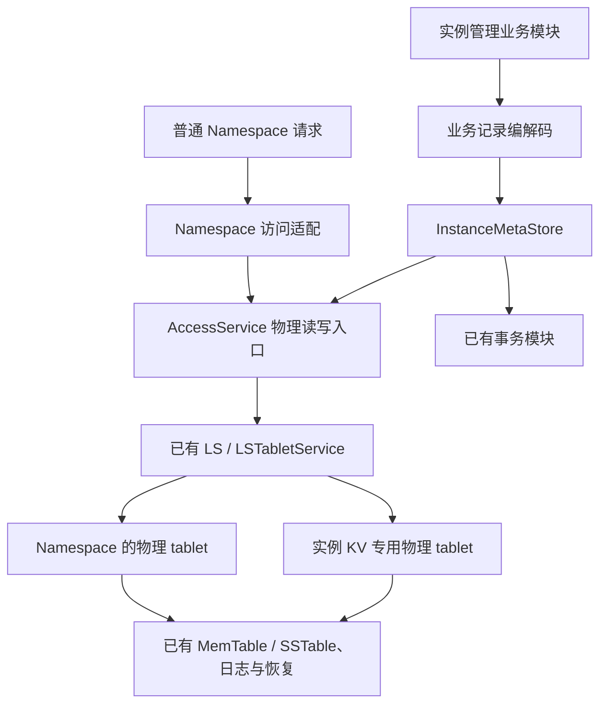

# 实例元数据事务型 KV 设计

2026-09-29。状态：用户已认可架构、三列结构和二进制格式；原生 KV 基础读写/事务与强制退出恢复已通过；业务接入和完整后台维护验证尚未完成。设计与测试留在本地，不提交代码分支。

## 1. 目标与约束

提供共用的 `InstanceMetaStore`，保存不应属于任何 Namespace、也不应被 fork 继承的实例管理数据。首批覆盖 Namespace 成员、名称映射、父链、tablet exception、catalog page，以及 fork 所依赖的 snapshot pin、引用和登记水位等协调状态。

- 实例管理模块直接使用原生存取接口，绕过 SQL 解析、优化、执行和 SQL 附带元数据写入。
- 复用现有 AccessService 物理能力、LS、事务、MVCC、锁、日志和恢复。
- 不新增 NamespaceRuntime、实例 SQL 环境、SchemaService、计划缓存、独立 KV 缓存或线程组。
- schema/table ID 不编码 Namespace；存储层不解释 Namespace 语义。
- 第一版限制能力；不提供普通 SQL 建表、任意 SQL 查询、生成列、触发器、自动二级索引、自动增长列或 LOB。
- 本版本不要求旧格式升级兼容，不引入旧 SQL 存储的双写、回退或自动迁移框架。

### 背景与已撤回方案

当前 `__fork_proto_meta` 由普通 SQL 创建，记录进入 Namespace 目录；后续按名称过滤 schema 无法消除已经混入的目录事实。只给目标表标记实例归属，也不能统一约束 SQL 执行过程中其他 `__all_*` 状态的同步写入和异步刷写。

精简实例 SQL 环境会引入另一份持续维护的依赖清单；完整内部 Runtime 资源成本不可接受；复用 Namespace 1 SQL 加静态表路由不能解决附带状态。因此采用原生 KV，旧设计均不作为实施依据。

## 2. 架构与职责



图表达目标分层，不表示当前已经实现。seekdb 使用现有唯一 LS，第一版所有 collection 共用一个实例 KV tablet。

| 模块 | 职责 |
| --- | --- |
| 业务模块 | 定义记录、编码业务 key/value，维护名称映射、引用关系及操作原子性 |
| InstanceMetaStore | 三列到存储参数的转换、读写与扫描、错误转换、迭代器和缓冲区生命周期 |
| Namespace 访问适配 | Namespace 访问保护、父链解析、写入实体化、继承快照上限计算 |
| AccessService 物理入口 | 使用确定的物理 tablet、事务和有效快照，保留物理访问检查与锁保护 |
| 既有存储与事务模块 | 行锁、MVCC、提交/回滚、持久化和恢复 |

### 当前 AccessService 的改造点

`ObAccessService::check_read_allowed_` 仍调用 Namespace 访问检查和父链解析；`check_write_allowed_` 仍调用 Namespace 访问检查和 tablet 实体化。目标是将这些职责放到上层，再进入共享物理入口。Namespace 访问保护必须覆盖完整访问生命周期，不能解析完成即释放。

保留 AccessService 中的内存限额、存储上下文、tablet 锁和锁后获取 tablet handle 等保护。实例 KV 直接使用物理入口；不通过 `if (instance_kv_tablet)` 或隐式 Namespace 1 回退选择路径，也不直接绕到 MemTable 复制一套保护逻辑。

### 已有能力与实际缺口

已核实 AccessService / ObIDmlService 的 scan、insert、put、delete、lock 等原语，以及固定 ObTableSchema 到 DML 存储参数的转换入口；它们仍需要事务、快照、列 ID、行迭代器等，并非开箱即用的 KV。

ObInnerTableOperator、ObInnerKVTableOperator 和 ObTableAccessHelper 仍构造 SQL。已有 SQLite 模块使用另一事务后端，不适合承担这里与 LS 事务共用的原子性要求。

## 3. 物理存储与不可继承性

固定业务列：

```text
collection_id  整数，非空
key            VARBINARY，非空
value          VARBINARY，非空
PRIMARY KEY (collection_id, key)
```

这是存储格式示意，不执行 CREATE TABLE。底层 MVCC 隐藏列由引擎处理。

- collection_id 表示逻辑记录集合，采用代码中集中定义的固定编号，与 schema table_id 无关。
- 全部 collection 共用一份物理定义和一个 tablet，不创建各自的 SQL 表、Runtime 或缓存。
- 相同 collection 内 key 唯一；不同 collection 可使用相同 key。
- 按 collection_id、key 排序，支持集合内点查与范围扫描。
- collection 不提供独立物理隔离、资源配额或独立存储参数。

固定物理定义由 store/bootstrap 路径维护，不登记到任一 Namespace 的 __all_database / __all_table 等 schema 目录；tablet 仍持有引擎所需的物理存储定义。

实例 tablet 的物理地址必须与 Namespace 编码/父链探测地址集合不相交。Namespace 不存在该逻辑对象的 schema，父链也不能生成其地址，因此 fork 不会继承它。当前选用保留的 LS 内部 tablet ID 49404；不创建 Namespace 0 Runtime 或借用 Namespace 1 执行环境。

后台合并、checkpoint、恢复和物理回收能否完全使用这份固定定义，仍需验证，不能仅凭 SQL 不可见推断已完成隔离。

## 4. K/V 格式

### K：集合内业务身份的有序二进制编码

collection_id 已是独立主键列，不再重复编码到 K。K 按二进制字节比较，不执行字符集归一化或大小写转换。

| collection | 业务 key | value |
| --- | --- | --- |
| NAMESPACES | u64be(namespace_id) | name、parent、fork_cap、state 等记录 |
| NAMESPACE_NAMES | name 原始字节 | namespace_id |
| SNAPSHOTS | u64be(snapshot_id) | parent_ref、ref_count、schema_version 等 |
| EXCEPTIONS | u64be(namespace_id) + u64be(local_tablet_id) | kind、table_id 等 |
| PAGES | u64be(page_id) | 页面 payload |
| COUNTERS | 固定 counter 编号 | 已分配高水位 |
| SNAPSHOT_COORDINATION | 固定项目编号 | 快照登记水位等 |
| SNAPSHOT_PINS | 保留记录的完整唯一身份，字段需核对现有协议 | 快照保留信息 |

u64be 是固定 8 字节无符号大端整数，数值顺序与字节顺序一致。复合 key 使用明确字段边界；第一版所需固定整数序列及末尾变长字节由公共 helper 编码，不手工拼含歧义的分隔符。

例如在 EXCEPTIONS 集合内，以 u64be(ns_id) 为前缀扫描该 Namespace 的全部 exception。扫描上下界由 helper 统一生成，接口限制结果在指定 collection 内。

Namespace ID 出现在记录身份中，只表示这条管理记录描述哪个 Namespace，不是 KV 的执行上下文。存储引擎只比较字节。

### V：业务结构的二进制序列化

- 业务模块复用项目既有的逐字段序列化机制，不直接复制含指针或填充的 C++ 结构体内存。
- Namespace、Snapshot 等结构由各自业务模块编码；页面直接保存已有页面字节；名称映射保存 ID。
- Store 不理解 parent/ref_count 等字段，不按 V 内字段筛选。
- 更新字段采用事务内锁定读取、解码、修改、整体写回。
- 第一版不用 JSON。需要诊断时可解码为可读输出，不改变持久化格式。
- 不引入动态 schema 注册或旧格式兼容框架；解码错误、非法枚举和长度越界明确报错。

K 上限 512 字节，V 上限 65536 字节；原生 MemTable 边界读写已验证，60000 字节页面已验证 SSTable 刷盘/合并/恢复。K 覆盖当前 128 字节名称和复合身份；V 覆盖当前 60000 字节页面及必要封装。要求内联存储，不支持 LOB 或透明拆块。整体更新大 V 有写放大，适用范围限定实例管理元数据。

## 5. 最小接口与事务约定

下表为概念接口，未确定最终 C++ 类型：

| 操作 | 语义 |
| --- | --- |
| get(tx, collection, key) | 按事务快照读取；缺失返回 NOT_FOUND |
| get_for_update(tx, collection, key) | 对已有记录锁定读取，供读改写；不能把缺失当作已锁住不存在的 key |
| insert(tx, collection, key, value) | 仅新增，已存在返回 DUPLICATE；底层联合主键保证并发唯一性 |
| put(tx, collection, key, value) | 插入或整体替换；读改写必须使用配套锁定读取 |
| erase(tx, collection, key) | 删除并返回是否存在 |
| scan(tx, collection, range) | 集合内有界扫描；迭代器有明确的关闭和生命周期约定 |
| begin / commit / rollback | 复用既有事务能力；单次数据操作不隐式提交 |

- 同一事务可以跨 collection，读到自身写入。
- get/scan 使用明确的事务快照；不把快照扫描承诺为自动防止所有业务幻读。
- get_for_update 必须读取与行锁匹配的最新可写版本；不能锁后继续使用锁前旧值。
- Namespace 名称映射与成员记录同事务 insert，依靠重复键检测保证名称唯一，不能用先 get 再 put 替代。
- 引用计数、ID 高水位等使用锁定读改写；锁持有至事务结束。已发布 ID 不回收。
- Store 集中管理原生行参数、缓冲区和迭代器释放；扫描不能越过所属事务生命周期。
- 超时、锁冲突、重复键、损坏记录等明确返回；提交结果不确定时由业务核对持久化状态，不能盲目重放非幂等引用更新。

### 本期仅支持 KV 自身事务

由 InstanceMetaStore 提供事务的创建、提交与回滚，管理操作使用该 store 的事务句柄；同一事务允许跨 collection。底层继续复用现有 LS 事务引擎，内部事务描述符不暴露为外部事务接入契约。

当前不需要实例 KV 与普通 SQL 表共同提交。已有 fork/pin/lineage 原子性依赖必须随相关读写统一接入 KV，不能把 pin 留作另一个独立提交。

SQL 与 KV 混合事务留到未来出现具体需求时再设计。本期不实现外部 SQL 事务接入、事务描述符借用、SQL 语句 savepoint 联动或相应预留抽象，也不将它们列为验收要求。

## 6. 保留 fork / pin / GC 协议

### fork 创建

当前 control_namespace 在同一 SQL 事务中写 Namespace、注册 pin、更新 snapshot lineage；提交后登记 Runtime 和可登录名称。原生版本应保持对应事实共同提交/回滚，名称唯一性、ID 分配及源 Namespace 状态检查也在正确的锁与事务保护下完成。内存发布在提交后进行。

### 快照登记与水位推进

当前 pin 登记锁定 __all_core_table 内 snapshot_gc_scn 记录，检查 S > 水位，再写 pin；水位更新者锁定同一行。这是登记与水位推进的串行化协议，不是暂停整个 GC。

物理旧版本保留还结合 undo 保留时长、活跃事务、freeze 和 pin；保留信息刷新按现有水位/pin读取关系进行。原生版复用等价的锁定读取、检查和原子提交协议，不另造 GC 算法。

首批接入必须闭合 pin、水位与 lineage 的全部相关读写者。具体 pin 唯一身份、现有其他使用者及锁顺序需在实施清单里核实；只把某几个 SQL 调用改成 KV 不算完成。

### 删除与恢复

关闭访问、排空、标记删除、释放依赖与物理清理按既有协议推进。引用递减与最后引用解除 pin 应共同提交；物理清理依据已提交状态，可重试执行。

未提交创建不可见；已提交但未完成内存发布的 Namespace 可以恢复；删除中断可继续。持久化状态是唯一事实来源，不双写两份权威记录。

## 7. Bootstrap 与资源生命周期

目标启动依赖：物理 LS 和必要事务能力就绪 → 创建或恢复实例 tablet/固定定义 → InstanceMetaStore 可用 → 读取实例目录 → 建立 Namespace Runtime。

这是目标顺序，需核对现有 bootstrap 依赖，尤其防止创建实例 tablet 或读取固定定义又依赖尚未建立的 NamespaceRuntime/SchemaService。创建中断与重复初始化必须可恢复。

实例 store 的使用者退出、在途事务和扫描结束后，再释放 store 相关状态，底层存储最后关闭。执行依赖显式注入，不新增归属不明的全局 SQL proxy 或 schema 指针。

## 8. 实施顺序与验证

1. 核实并落实公共物理入口、固定三列定义、实例地址分配与 bootstrap/恢复顺序，保留既有物理访问保护。
2. 实现 InstanceMetaStore 与 K/V helper，验证联合主键、原生读写、锁和事务；封装参数与生命周期复杂性。
3. 通过已有 ICatalogPageStore、ISnapshotLineageStore 等接口替换 SQL adapter，并收口 Namespace/exception 读写。
4. 接通 pin、水位、GC 和恢复的所有相关读写者，统一权威存储及事务关系。
5. 移除失去用途的 __fork_proto_meta SQL 建表、名称过滤和回退路径。

定向用例写入本地四件套，包含失败复现；不运行完整 mysqltest 或 sysbench，不将文档与测试提交代码分支。

必要验证范围：

- collection 隔离、联合主键唯一性、整数排序、前缀扫描边界、128 字节名称和 60000 字节页面。
- 跨 collection 提交/回滚、读到自身写入、并发同名创建、锁定计数更新、缺失 key 的竞争与锁超时。
- bootstrap 中断恢复、重启持久化、后台合并/checkpoint、Namespace schema 不可见及多层 fork 不继承实例记录。
- fork 提交前、提交后发布前、删除标记后、最后依赖释放后的故障恢复；pin 与水位推进竞争。
- 错误和取消后迭代器、事务和 Namespace 访问保护无泄漏。

尚未验证的关键点：固定物理定义能否走完所有后台维护路径；原生 lock/read 快照配合；物理地址保留规则；bootstrap 的实际依赖；pin/水位的完整调用清单。设计接受不等于这些门禁已经通过。

### 2026-09-29 原生路径验证记录

- 新增固定物理 tablet 49404 和三列 `InstanceMetaStore`，通过原生 AccessService 读写；尚未替换旧 SQL 业务元数据。
- 失败用例：同一事务 `put` 后 `get` 返回 -4016。根因是固定定义误用定长 BINARY，查询键为 VARBINARY，`ObMemtableKey::encode` 拒绝类型不一致。已统一为 VARBINARY。红证据 `/tmp/seekdb-instance-meta-native-probe6.log`；绿证据 `/tmp/seekdb-instance-meta-native-probe7.log`。
- 绿用例覆盖集合隔离、跨集合提交/回滚、自身写入、固定快照、锁后最新值、重复 insert、60000 字节含 NUL 的 V、扫描、删除回滚和 SIGKILL 后恢复。新建与恢复各跑一遍。
- 原生用例在 `instance_meta_native_probe.ipp`，运行器 `run_instance_meta_native_probe.py`。使用本地测试注入编译，注入代码不能提交。`native_probe_injection.py enable/disable` 管理注入；`run_four_gates.py` 将原生测试作为 bootstrap 的必跑步骤，显式接收生产 binary 和同一源码的 probe binary。
- `/tmp/seekdb-instance-meta-native-probe9.log` 进一步通过：四次刷盘后 SSTable 数量降为 2（minor 合并已发生），旧事务仍读到旧值；并发事务写锁冲突返回 -6005；512 字节键、65536 字节值、含 NUL 的键、空值、范围边界、长度超限和只读事务拒绝写入。新建/恢复均通过。
- 仍未覆盖：提交结果不确定的业务恢复、未提交写入中途 crash、Namespace/pin/GC 接入协议；这些需要随业务接入继续验证。

### 当前实现边界

生产源码已移除所有 probe 注入和临时 DEBUG 日志。原生 store 由现有 AccessService 持有，复用事务服务，未增加 Namespace Runtime 或线程。存储固定定义避免重新解析 Namespace SchemaService；专用 tablet 使用普通 MemTable，mini/minor 合并保留活跃 KV 事务的固定快照。

当前 **未完成** 旧 `__fork_proto_meta` 的替换、pin/水位统一接入，以及 AccessService 现有 Namespace hooks 上移。代码基础可独立审查，但不能将此阶段等同于实例目录拆分已完成。

### 基础阶段交付

`eab127ce6` 已推送 `origin/codex/namespace-worker-proxy-v20`，仅17个生产代码文件；未创建PR。构建成功；原生KV + bootstrap/sql/direct/tls均通过。四件套首轮direct出现客户端close后服务端lease尚未释放的4179；本地用例统一使用已有的有界等待语义，仅重试active connections，重跑direct和tls均通过。首轮与重跑证据分别位于 `gate-results/instance-meta-foundation` 和 `gate-results/instance-meta-foundation-rerun`，失败日志保留。

完整目标继续推进，业务SQL adapter、pin/水位及AccessService分层尚未完成。具体交接见 `instance-meta-progress.md`。

### Typed 业务记录阶段

增加 `InstanceNamespaceMetadata`，在同一原生 KV 事务内处理 Namespace 成员与名称唯一索引、ID 高水位、Snapshot、tablet exception 和不可变 catalog page。`InstanceCatalogPageStore` 已接到现有 `NamespaceCatalogTree` 接口；该模块尚未替换线上 SQL 路径。编码采用逐字段定长整数和长度前缀字符串，严格校验记录类型与字段边界。`instance_namespace_metadata_probe.ipp` 是本地测试，覆盖跨 collection 回滚、重名、二进制名称、snapshot 引用、exception 前缀和目录树页面。

新建实例与强制退出恢复两轮通过，日志目录 `/data/1/nijia.nj/test/namespace_fork_PROTOTYPE_instance_meta_native_dh_xqdjy`，两轮均有 `INSTANCE_RECORD_PROBE_PASS` 与 `INSTANCE_META_PROBE_PASS`。生产构建在禁用本地注入后再次通过。

后续 typed 阶段加入 `InstanceSnapshotLineageStore`，复用现有 `NamespaceSnapshotLineage::fork/release` 决策，令 snapshot 行、子 Namespace 附着和 pin 删除共享同一 KV 事务。父链读取要求相应 pin 存在且 schema_version 一致。KV 水位记录由 pin 登记与水位推进共同锁定；登记快照不大于水位时返回 `OB_SNAPSHOT_DISCARDED`。定向探针两轮通过，见 `/data/1/nijia.nj/test/namespace_fork_PROTOTYPE_instance_meta_native_rdxo4737`。这只证明 KV 内事务及编解码；实际 GC 水位写者和 storage retention 读者尚未接入，不能将它当成线上 pin 已生效。

### GC 接线阶段

FreezeInfoMgr 定时刷新现通过启动组合注入的只读回调把 KV pin 加进已有 snapshot 列表；存储模块不解析 Namespace pin 格式。定向探针在 KV pin 提交后刷新可见、删除后刷新不可见，新建和重启两轮通过：`/data/1/nijia.nj/test/namespace_fork_PROTOTYPE_instance_meta_native_g0o_eqdf`。启动阶段其他保留来源的最小值为 0，因此本测试验证 pin 进入真实消费者的列表，不声称最终最小保留值等于 pin。

GC 水位推进使用顺序协议：先独立提交 KV 水位，再开启 SQL 事务更新原全局水位；SQL 失败时 KV 可领先，结果为保守拒绝 pin，不会反向落后。控制目录 bootstrap 从 SQL 当前水位初始化 KV 记录。第一次 bootstrap 回归红：缺失的 KV 键经 `get_for_update` 后在同事务 `insert` 返回 `-5024`，即缺失键锁不能充当可插入的空位锁。初始化改用普通读取及唯一插入；已存在记录的推进仍锁定读取。红日志 `.scratch/namespace-fork/gate-results/instance-gc-coordination/bootstrap.log` 和 `instance-gc-coordination-debug/bootstrap.log`；修复后 bootstrap 复跑通过 `instance-gc-coordination-rerun/bootstrap.log`，SQL 定向门禁通过 `instance-gc-coordination-final/sql.log`。另一次 bootstrap 在模板恢复子实例启动期退出、无明确错误，同源码重跑通过；保留该失败日志 `instance-gc-coordination-fixed/bootstrap.log`。

线上 Namespace fork 仍登记旧 SQL pin。KV pin 消费与 KV/SQL 水位协调已接入，旧 pin/lineage 迁移及物理实体化 exception 的恢复协议尚未完成。背景 renewer 的真实一次水位推进仍需动态验证。

迁移边界核对：`ensure_tablet_impl` 将物理 tablet 创建、mapping 更新和 exception SQL 行写入同一 `ObMySQLTransaction`；`ObTabletDrop` 也在物理删除事务中同步移除 mapping。不能只把 owned exception 移到独立 KV 提交而声称原子性。曾考虑把 Namespace 1 的物理 tablet→table mapping 作为 owned/table_id 的权威；实测子空间原生 DDL 的 tablet `200007`、`200009` 未出现在此映射中，而 EXCHANGE PARTITION 会涉及这些 tablet。这个方案已撤回，相关代码已 revert。必须设计覆盖子空间 DDL 与继承实体化两类物理创建的权威来源和可恢复分段协议。fork 创建里的 pin、水位、lineage 也必须共同迁移，不能留下 SQL pin 作为第二份权威。
