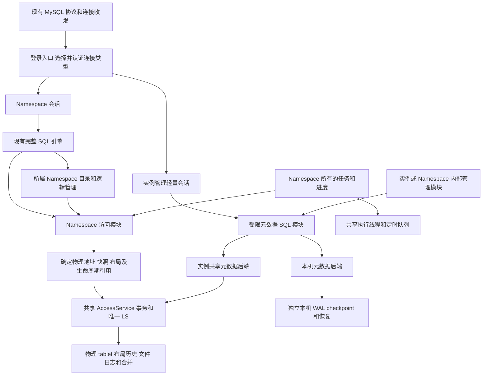

# Namespace 整体架构重构方案

日期：2026-09-30。代码核对基线：`f2b9c159a`。状态：架构建议，尚未作为实施计划确认。文档留在本地，不提交。本文回答：综合七类问题，如果重新组织 seekdb，哪些职责应该放在一起，哪些事实应该在一个地方决定。

建议保留独立 Namespace SQL 目录、唯一共享 LS 和 fork 写时复制。主要重构对象是数据目录、逻辑访问到物理访问的转换、持久事务边界及后台状态所有权。实例管理只增加通用元数据存取能力和轻量会话，不复制一套 NamespaceRuntime。

## 1 从当前问题归纳出的原因

过去没有 Namespace 时，一份 schema、一份 SQL proxy 和一套后台对象同时承担用户目录与实例控制职责。Namespace 拆分后，调用点换成 owner 并不能自动确定每张内表、每个后台任务和每个存储请求的归属。当前全局入口清理已经解决一批串用，但三个假设仍需整体退出：所有内表都随 Namespace 继承；共享存储能够借根 schema 补全逻辑信息；后台线程共享意味着其逻辑状态也应共享。

另外，schema 版本标识逻辑定义，提交 SCN 标识事务可见性，物理地址标识实际存储对象。它们有不同的用途。把根版本当全局时间、把逻辑 tablet 当物理地址，或者把编码结果写回 table_id，都使原本局部的问题扩散到其他模块。

## 2 三个持久数据域

| 数据域 | 内容 | fork | 主备复制 | 所有者 |
| --- | --- | --- | --- | --- |
| Namespace 目录及数据 | 用户表数据；表、列、索引、权限、schema 历史；Namespace 配置和可继承定义 | 在快照上继承 | 是 | 所属 Namespace |
| 实例共享目录 | Namespace 成员/血缘、pin、物理回收协调、冻结记录、实例共享配置和管理身份等控制状态 | 不继承 | 是 | 数据库的实例控制模块 |
| 本机目录 | 本机路径、端口、本机凭据及其他不应同步的数据；具体成员按模块语义确定 | 不继承 | 否 | 本机运行实例 |

这里的“实例共享”是主备拥有相同持久控制事实，并不意味着主备共享内存对象。本机凭据与主备共享的管理身份也要分开，具体认证部署政策仍须确定。

目录在创建时就绑定数据域。模块持有对应的目录 client，新增逻辑表属于该目录；执行请求不检查 table_name 或 ns_id 来决定归属。实例共享和本机表的定义都不注册到 Namespace SchemaService，Namespace 的 `__all_table` 与父链中没有这些对象。它们仍可由实例管理连接查询。

旧内表的搬迁需要审计所属模块和状态生命周期。通用存储解决新代码如何正确访问，不能凭名字自动推导旧表的业务归属。混合本机/共享状态或定义/执行状态的旧表，可能需要拆记录或拆表。

### Namespace 所有权和 fork 继承是两个维度

建议在 Namespace 内分别组织可继承定义/数据与运行记录。fork 引用可继承部分的快照，为运行记录创建新范围。执行占有、未完成调用和会话状态不直接从父空间复制；任务定义可以继承，子空间的执行占有和推进位置由自己的管理模块初始化。持久锁记录的处理还需要与事务锁语义一起核对。

运行记录仍归 Namespace，它们可以通过共享元数据后端中的显式 Namespace 范围保存。逻辑管理对象继续归 Namespace；物理存储共用不要求一个进程级调度器遍历所有空间。这个划分是新增建议，不能视为当前代码已具备的行为。

## 3 模块关系



三个值得集中实现的模块是：元数据 SQL、Namespace 访问、物理布局历史。调用者不需要分别掌握 KV 编码、父链/物化细节或历史布局保留规则。底层实现可复用当前代码，模块的接口负责把这些约束集中起来。

## 4 元数据 SQL 及两个后端

元数据 SQL 模块统一提供表声明、字段类型、编解码、受限 SQL、参数绑定、事务和结果输出。调用者持有固定目录 client，内部执行与人通过 MySQL 客户端查询使用相同目录和类型规则。无需为每张表写虚拟表或专用扫描器。

表声明包括 schema/name、字段名/类型、主键和存储映射。物理 KV 继续把 key/value 当字节；复合键和字段含义属于上层声明。当前 JSON/BYTES 标记和 key 描述可以作为实现基础。小表先做主键访问与扫描，不引入二级索引、生成列或触发器。只支持单表 DML、有限过滤/排序/limit 和事务；不支持的语法在这个模块的解析入口拒绝。

共享后端复用 InstanceMetaStore、AccessService、原生事务和 LS 日志。本机后端使用独立持久化；两个后端共享逻辑存取和 SQL 实现。后端由目录 handle 确定，不在每次行读写中检查是否复制。

本机后端仍然需要一个真实、可恢复的存储实现。WAL 本身不能代替读写、提交、checkpoint 和回收；共用接口也不会消除这部分工作。具体 Rust 库或已有本机持久化原语尚未选定，替换 SQLite 前必须验证事务失败与 crash 恢复。当前设计不承诺它已经足够轻量。

一个事务固定属于一个后端及其事务域。跨共享/本机后端的原子提交不提供；操作在写入前就检查事务归属。未来共享元数据与普通 SQL 表共同提交，应复用同一个 LS 原生事务 handle，不建立两次提交加补偿的隐式“联合事务”。用户已决定本期不做这项能力，本文不改变该范围。

## 5 登录 会话和管理权限

登录入口先确定连接种类，再创建对应会话。普通连接认证到一个 Namespace；管理连接认证到实例管理身份。用户名后缀或独立端口只是入口编码，不是权限。认证后的会话类型在连接生命周期内明确，切换身份必须重新认证。

Namespace 会话拥有 Namespace handle、SQL 会话状态及必要依赖。实例管理会话只拥有管理主体、权限、当前元数据目录和事务状态。它不创建 NamespaceRuntime、不借 Namespace 1 SchemaService 认证，也不装配计划缓存和全部 SQL 服务。

当前 Rust `sql-nio` 已提供握手、登录报文、TLS、命令解析和结果编码，可复用同一个 reactor。实例处理器需要自己的认证、轻量会话及结果包装，并覆盖 query/ping/quit/init_db/reset 和其他命令的明确拒绝。现有 `ObMPBase::get_session` 要求完整 NamespaceRuntime，不能直接拿来做管理会话的通用基类。

普通 Namespace parser/catalog 只能解析所属目录；实例元数据名称从未加入它。实例管理入口按固定目录能力访问 shared/local 数据，不用虚拟表的表名黑名单维持隔离。若要向普通用户公开某项实例状态，通过显式授权的只读投影暴露，不挂载整个实例目录。

## 6 Namespace 逻辑模块及共享物理模块

Namespace 拥有 SQL schema、计划/PS 缓存、逻辑统计、自增、DDL、向量/DBMS 任务管理和逻辑锁状态。当前已经拆分的对象继续沿这个方向。共享物理模块包括事务引擎、AccessService、LS、文件/块缓存、物理合并和执行线程。

建议用类型明确的 Namespace handle 和模块接口取代 `void*` 服务槽拼接。普通请求在登录时拿到 owner 的有效引用，后台任务在创建时拿到同样的引用；运行时不重新到 registry 猜 owner。模块的构造函数只接收实际依赖，共享物理依赖由启动组合处注入，不复制物理实例。

NamespaceRuntime 表示 Namespace 逻辑对象的生命周期容器；不会再把每个共享物理入口也登记成 Namespace 的必需服务。实例控制模块直接持有共享目录、冻结协调和物理能力，不新增一个完整或精简的 SQL Runtime。新增 Namespace 逻辑服务只接入 Namespace 的正常组合，不再需要判断一个特殊实例 Runtime 是否也应该装配它。

所有 Namespace 的物理 tablet 编码规则一致，包括 ID 1；只有 tablet 的上层物理地址转换使用 Namespace 编码。schema_id 不编码 Namespace。实例内部物理 tablet 使用明确的内部资源地址，存储把所有物理 ID 当不透明标识。不能把“未编码 ID”解释为 Namespace 1。

线程局部变量可辅助日志和分配器，owner 必须来自显式上下文。没有 owner 的调用按其接口报错或属于明确 bootstrap 操作，不增加默认根服务。

## 7 Namespace 访问与 fork 的具体接口

Namespace 访问模块集中解释逻辑对象、父链、fork cap、访问准入、物化和目录发布。其读接口返回一个有生命周期保护的物理读计划，写接口保证私有副本就绪后返回物理写计划：

```text
resolve_read(NamespaceHandle, LogicalTabletId, ReadSnapshot)
    -> PhysicalTabletId + effective_snapshot + access/source leases

prepare_write(NamespaceHandle, LogicalTableRef, LogicalTabletId, Transaction)
    -> PhysicalTabletId + ready layout + access lease
```

有效快照综合请求快照与父链的 cap。lease 覆盖整个扫描/写上下文，不能返回物理 ID 后立即解除保护。父链解析局限在该模块；共享物理存储接收完成解析的计划，不回调 NamespaceRegistry。

继承态 DDL 创建辅助 tablet 时，由同一模块准备所需原表/关联对象的物理前置条件，再提交物理操作。向量、LOB、全文和普通 DML 均经过这个接口，避免每类调用点另写补物化规则。

物化可与父物理 tablet 合并并发：源 snapshot pin 与文件引用必须仍有效，目标是新的物理对象。目录和物理创建若不能放在一个短事务中，应由可恢复的准备/发布协议管理，明确未就绪状态、幂等操作身份、目录版本校验和孤儿回收；不能把中间物理存在当成已发布写入口。

建议第一版保留现有父链模型并将其实现集中。若以后要改成直接持久物理映射，可在这个接口内替换；当前七类问题不要求同时重做目录树。

## 8 物理布局与 DDL 事务

完整 SQL schema 归 Namespace；物理布局和解码历史归物理对象。major 取得布局的输入应是 `PhysicalTabletId + freeze_scn`，不通过 Namespace 1，也不计算两个 Namespace schema 版本的 MIN。mini/minor 用自身输入范围和数据布局要求选择描述，不能机械套用 major 的 freeze 时刻。

DDL 使用一个持有完整最终对象定义的变更对象，公共目录写入口要求携带它。提交前由统一发布流程生成布局并登记到已拥有的物理 tablet，与该目录 DDL 事务共同提交；创建 tablet 自带完整初始布局。普通加列继续保留已有在线能力，重写型 DDL 继续使用原有构建/切换协议，不为布局登记全面停写。

以对象版本作为记录身份，以事务提交 SCN 决定可见性；不按内容/hash去重，不用语法类型白名单提醒各 DDL 手工发布。bootstrap、隐藏表、辅助索引和并行 DDL 也使用这些创建/变更原语。合并任务取得正确布局后固定在任务描述中，后续 DDL 不改变已生成任务。

### fork 子对象尚未物化时

子目录的新定义不能写到父物理 tablet，也不能为一次普通加列物化所有继承数据。建议采用以下衔接：继承数据仍用源物理布局和 fork cap 解码，SQL 用子目录定义做投影；真正物化时，目标初始记录同时明确源基线布局和子对象当前布局，初始化完成后才允许新的子空间写入。后续子 DDL 只更新已拥有的目标布局。

目标物理创建提交 SCN H 不伪造为 fork SCN F。早于 H 的 freeze 是否适用于该目标，要根据物理创建和基线覆盖范围判断；不适用时等待后续可用 freeze。目标创建与目录发布之间也需要就绪约束。

这是候选衔接协议，尚未验证：特别是源行上的版本、子布局的版本身份、基线 SSTable 与 mini/minor/major 的选择规则，必须逐项成立。现有 [物理 schema 历史方案](design-tablet-storage-schema-history.md) 仍将它列为开放问题，本文没有把建议当作已证明的实现。

物理布局不能代替表/索引关系等逻辑历史。逻辑 checksum 验证留在 Namespace 层，按一致的历史目录视图检查物理结果，存储层输出物理事实。长期目录读接口需要真正的提交 SCN 可见性；近期仍需正确的 per-Namespace freeze 版本边界。

## 9 快照与历史保留的一个权威协议

fork pin、活跃读事务、物化源引用以及合并输入共同约束物理回收。建议由一个物理历史保留模块管理登记/释放接口；持久 pin 与共享目录在同一个原生事务中提交，内存集合只是提交后发布与恢复得到的派生状态。

回收水位每个物理存储域只有一个持久权威。它必须与允许登记新 pin 的并发约束闭合；不能让 SQL 水位和 KV 水位各自独立决定是否接纳旧快照。达到数据水位之前的最后有效布局也要保留，文件/任务显式引用的更早布局不能直接删。

全局 freeze 保存共享物理 SCN 和推进状态，物理合并遍历唯一 LS 的实际 tablet。Namespace 进度检查需要逻辑目录时，由所属逻辑模块做；跨 Namespace 汇总是管理层明确的聚合操作。不能让每个物理合并任务为获得布局遍历 Namespace。

本机存储的回收与 checkpoint 使用自己的日志和保留条件，不受主备 fork pin 水位控制。

## 10 逻辑锁与物理锁

逻辑锁接口显式接收 Namespace、对象类型与逻辑 ID，内部产生不透明锁资源键；不改变 SQL 参数中的 table_id。TABLE、逻辑 TABLET 和 NAMED_LOCK 使用同一个所属 Namespace 规则。

显式整表锁必须与每次 DML 的表意向锁通过锁矩阵冲突。物化与后续新 tablet 同样经过该表的访问控制，整表锁的覆盖不依赖加锁时枚举了哪些 tablet。普通 DDL 的发布和重写切换按各自既有锁语义协调，不因此延长全部 DDL 的停写区间。

存储内部的物理 tablet/行锁继续只用确定物理 ID。它约束实际物理修改，不解释 Namespace 或逻辑表归属。逻辑 tablet 锁和物理 tablet 锁的对象不同，应由两种类型的接口表明，不让一处上层编码、另一处底层拼 table_id 来隐含区分。

这个设计需要原有锁矩阵、事务持有期限、fork 快照获取及物化路径的动态验证。当前整表锁跳过 tablet 的实现不能据此视为已修复。

## 11 后台任务 资源和删除

每个 Namespace 拥有索引发现、schema 变化判断、adapter、任务状态、消费位置和取消状态。任务创建时绑定 owner 和所需目录/物理能力。共享定时队列执行各 Namespace 注册的任务，共享 worker 执行已经绑定 owner 的工作；它们不负责遍历 Namespace 再寻找业务对象。

一个 LS 的物理日志 reader 可以共享；日志到 Namespace/索引工作的路由发生在上层，持久消费位点及任务属于其逻辑消费者。fork 异步索引需要明确快照基线和追赶点，父空间 fork 后的写入不能进入子消费。向量缓存默认按 owner 与版本隔离；共享物理块缓存可按实际文件对象共享。跨空间复用向量索引缓存必须另外证明来源、SCN 和参数一致。

fork 后 job 定义和执行占有的分离属于第 2 节的运行状态设计。真实任务执行/重启恢复需要补验证；不能用过期任务状态更新证明这项语义。

Namespace 删除采用停止准入、取消/停止派发、排空持有者、销毁 Runtime 的生命周期。会话和任务持有强引用，完成后释放；物理目录 tombstone、pin 和被子空间引用的数据可以继续保留，但不要求保留已删除 Namespace 的全部服务和缓存到进程退出。

逻辑对象拆分与线程拆分分别决定。共享线程池能避免线程数随 Namespace 数量线性增长；每 Namespace 的队列、公平调度和配额增加真实工作量，应在执行资源模块集中实现。对当前代码可先完成 owner 拆分，再改线程复用。

## 12 配置 bootstrap 和备库

配置注册声明作用域、持久目录、是否动态生效和校验规则。Namespace 配置归自身目录；主备共享的实例设置归共享目录；路径、端口等本机设置归本机目录。fork 继承的设置与本机资源额度分别定义，不能让子空间 fork 顺便取得修改全机资源的权限。

管理语法在认证后的明确目标上执行。Namespace 操作从所属会话取得目标；实例操作要求实例权限与实例 client。任何普通 Namespace 连接都不能因“本次没有 owner”自动转成管理连接。

bootstrap 先打开本机持久化及共享物理引擎，用内置固定格式恢复共享目录和 pin，再开放 Namespace 注册/登录。Namespace 初始对象通过统一的目录变更/物理创建原语生成；编号 1 与其他编号的初始化模型相同。少量引导定义解决自举，不用默认 root 的上下文补齐依赖。

备库先在一致回放位置装载共享目录、pin 和 Namespace 目录，然后开放只读访问。持续回放使受影响 Namespace 的目录和任务视图更新；缓存重建、pin 保留和角色任务停止/启动由相同生命周期模块完成。备库本机目录独立加载，切主不把主库端口/路径/本机凭据覆盖过来。

Namespace 成员变更需要逻辑层发现和处理，启动、成员管理、角色切换及汇总允许明确遍历注册表。普通请求和物理合并不因此引入跨 Namespace 枚举。

## 13 与现有代码的衔接及代价

可复用：唯一 LS、事务/MVCC、AccessService 的物理能力、MDS、MemTable/SSTable、当前 KV 与目录/血缘、已有 Namespace SchemaService、SQL 引擎和 Rust MySQL 协议。方案的主要代价是把旧内表调用改为所属目录 client，收拢 Namespace 存储 hooks，以及改造 DDL 发布/历史读取和后台生命周期。

无法用改几个指针完成的部分：实例账户和会话、旧内表中混合的状态、原生事务附着、完整布局历史及 fork 衔接、本机后端的可靠恢复、异步索引的基线/位点。它们应分项验收，不用“统一上下文”掩盖未实现的约束。

推荐实施顺序：

1. 先关闭当前 freeze 版本边界、继承 DDL 物理前置条件和整表锁覆盖的正确性缺口，保留历史失败用例在本地四件套。
2. 在现有实例 KV 上实现通用表声明和受限 SQL，并验证实例认证/轻量会话。按模块搬迁共享内表，删除相应 Namespace 定义与附带写入来源。
3. 收拢 Namespace 访问模块；向量后台状态和生命周期归 owner；共享线程作为独立执行资源改造。
4. 按完整变更对象接入 DDL 物理布局历史，验证 fork 初始布局和真实历史目录读取，再退出旧 freeze schema_version 的根假设。
5. 本机后端与备库按已记录的独立工作实施。二者分别验证 crash/checkpoint 和回放/切主，不依赖完整 NamespaceRuntime。

这些步骤是建议次序，本文没有授权或启动代码改造。全量 mysqltest/sysbench 仍按用户决定不运行，测试与文档不合入代码分支。

## 14 当前需要进一步确定的选择

- Namespace 运行记录中哪些可以作为 fork 的定义快照，哪些必须初始化新的执行身份。
- 实例共享的管理账户与本机认证材料的具体政策。
- 本机后端选型及可靠性/体积证据。
- fork 物化的布局版本、源数据版本和旧 freeze 适用规则。
- 整表锁与逻辑 tablet 锁的完整矩阵及现有 DML 的接入代价。

前三个数据域、Namespace 逻辑所有权、物理存储不解释 Namespace，以及不增加完整实例 Runtime，是本方案的基础。上面的选择应在这些约束下解决，而不是继续增加根服务回退。

## 代码依据和相关文档

- `src/namespace/namespace.h`：当前服务槽、物理编码的根回退和 Runtime 保留策略。
- `src/observer/namespace_worker_protocol_prototype.h`：当前线程路由和 storage scope。
- `src/storage/tx_storage/ob_access_service.cpp`：共享存储中的 Namespace hooks。
- `src/storage/instance_meta/instance_meta_store.{h,cpp}`：现有 KV、事务、快照和扫描。
- `src/rootserver/fork_table/instance_namespace_metadata.{h,cpp}`：目录、pin、父链、物化和 GC。
- `src/observer/mysql/obmp_connect.cpp`、`src/observer/ob_srv_xlator.cpp`、`rust/sql-nio/include/nio.h`：登录绑定、分派和协议能力。
- [当前主要问题](current-major-architecture-problems.md)、[领域词汇](CONTEXT.md)、[实例 SQL 通道](design-instance-metadata-sql-channel.md)、[物理 schema 历史](design-tablet-storage-schema-history.md)。
