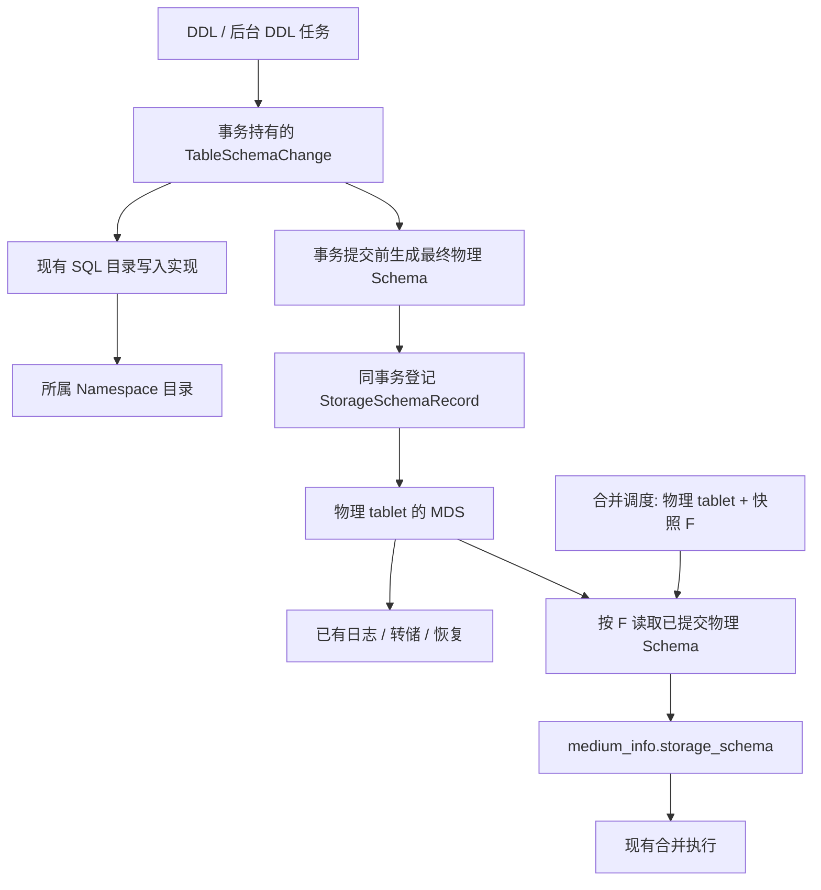

# Tablet 物理 Schema 的事务发布与历史管理

> **2026-10-10 更新：当前设计以 [晚物化与逻辑校验边界](design-storage-schema-boundaries.md) 为准。** 已选定专用元数据 tablet、表级共享 G 和原生 KV MVCC；晚物化按真实物理创建提交时间决定合并轮次；逻辑校验复用G@F携带的表级schema_version，按所属目录读取各表历史定义，不另加目录发布记录或扩大Namespace串行范围。主库freeze改为先等待继承对象完成物化和本机接管，再复用已有分配行锁与DDL协调完成最终复核、发布F；不以继承缺项跳过本轮，也不新增Namespace创建时间或每轮名单。下文是 2026-09-29 的历史方案，尤其“每 tablet 的 MDS 完整布局历史”、第12节对应开放问题及近期按Namespace采集freeze版本的建议不再作为当前实施决定。DDL入口收敛的原则和调用线索仍可参考。用户后来已允许代码、测试和文档共同提交备份，旧文中的不提交要求已被替代。

日期：2026-09-29  
代码核对基线：`f2b9c159a`，分支 `codex/namespace-worker-proxy-v20`  
状态：后续 TODO，暂不实施。本文记录长期方向与代码依据；开放问题列在第 12 节。近期先修复 freeze 的 Namespace 本地 schema 版本边界。  
文档与后续本地测试不提交到代码分支，不创建 PR。

## 1. 目标与设计决定

让 DDL 在修改表定义的同一事务中发布完整物理 schema，由 tablet 保存所需历史。普通数据大合并按快照 SCN 从存储侧取得布局，消除这条路径对 Namespace SQL 目录的反向查询。

已采用的设计约束：

1. Namespace 继续拥有自己的 SQL schema、SchemaService 和目录。表、列等 schema ID 不编码 Namespace。
2. 存储接口接收确定的物理 tablet、布局与事务，不解析 Namespace、父链或 `ns_id == 1`。
3. 保留普通加列的现有低成本能力；需要重写数据的 DDL 继续走已有重建流程。
4. 复用 `ObStorageSchema`、现有事务、唯一 LS、MDS、日志、恢复和合并执行模块。
5. 使用 schema 版本标识布局发布，使用事务提交 SCN 判断可见性；不比较布局内容或哈希来决定是否发布。
6. 不为合并新增实例级 schema 发号器、Namespace 版本缓存或独立历史 schema 服务。
7. 不将所有历史布局常驻内存。内存版本、落盘历史和永久回收分别管理。
8. 本版本不考虑旧格式升级兼容，不建设旧 SQL 查询路径与新路径长期双写、自动回退框架。

本方案不同时重做 `__all_freeze_info` 的实例存储归属、备库启动流程或所有逻辑 schema 校验。大合并的物理布局读取与索引/表逻辑关系检查分别收敛。

## 2. 当前实现及问题

### 2.1 物理 Schema 已经存在，但不是完整历史

`ObStorageSchema` 已包含存储列、行键、类型、原始默认值、存储格式和合并相关属性，并支持序列化。创建 tablet 时，`ObTablet::init()` 从 `ObCreateTabletSchema` 初始化完整描述。

当前 `storage_schema_addr_` 指向 tablet 保存的描述，`load_storage_schema()` 负责装载。它不是一个可按任意提交 SCN 查询的布局历史库。

| 更新路径 | 当前行为 |
| --- | --- |
| 创建 tablet | 从创建参数初始化完整 schema |
| mini | 根据 Memtable 提高列数及版本；缺少新增列信息时生成简化描述，并随 tablet 更新写回 |
| minor | 取得 tablet 描述，经过公共更新路径，通常没有新的完整列定义 |
| major | 使用任务携带的完整 schema，完成后与 tablet 已有描述合并更新 |
| fork 基线安装 | 综合目标 tablet 与传入的源 storage schema 更新 |
| 物理恢复 | 从恢复输入初始化 storage schema |

`ObStorageSchemaUtil::update_tablet_storage_schema()` 会综合列数、版本和存储属性。版本号提高不代表全部列定义已经补齐。

### 2.2 mini/minor 与 major 的需求不同

mini 先装载 tablet schema，再通过 `update_storage_schema_by_memtable()` 取得最大列数与数据 schema 版本。Memtable 只提供这些统计，不能补出新增列的完整类型、原始默认值等属性。

普通 mini/minor 在准备列描述时取得行键及多版本相关列，可以保留缺列表示。major 需要完整列描述，并在行融合时按原始默认值补缺列。因此不能把 major 的 schema 查询直接替换为当前的 `load_storage_schema()`。

### 2.3 当前大合并仍依赖 SQL 目录

`ObMediumCompactionScheduleFunc::get_table_schema_to_merge()` 先根据物理 tablet 找到所属 SchemaService，再使用 freeze schema 版本查询历史表定义。当前还使用 `MIN(freeze_version, local_refreshed_version)`。

各 Namespace 独立分配 schema 版本，Namespace 1 的版本不能作为其他 Namespace 的可靠边界；缓存落后也不能通过取较小值掩盖。

获得表定义之后，现有流程已经会生成 `medium_info.storage_schema_`，实际合并从任务中读取这份 schema。后半段可以复用。

### 2.4 两个不能直接复用的“近似入口”

- `ObDDLService::publish_schema()` 负责刷新 schema 缓存。普通 ALTER 在事务提交后调用它，不适合登记需要与 DDL 原子提交的物理 schema。
- `ObStorageSchemaRecorder` 当前入口没有完整更新提交流程，回放主要提取最大列数。不能因其名称而将其视作完整、可按 SCN 查询的布局历史。

### 2.5 原有 freeze 与 DDL 协调

现有 freeze 通过 `ObDDLSQLTransaction` 获取公共 DDL 排他锁；标准 DDL 元数据事务持有同一锁对象的共享或排他锁至事务结束。freeze 因而会等待已持锁的 DDL 元数据事务提交或回滚。

等待对象是元数据事务，不是整个后台建索引或重建表任务。该协调在 Namespace 改造前的 `e2dc7eecf` 中已经存在。本方案不因为物理 schema 历史而新增全实例 DML 停写机制。

## 3. 总体结构



`TableSchemaChange`、`StorageSchemaRecord` 及本文新增接口均为拟议名称，不表示现有代码已有实现。新 C++ 类型不加 `Ob` 前缀，不为命名统一重命名已有类型。

## 4. DDL 发布入口的具体改造

### 4.1 事务持有最终表定义

新增 `TableSchemaChange`，由一次 DDL 元数据事务持有，管理一个表或索引对象的修改：

| 内容 | 作用 |
| --- | --- |
| 对象身份及事务所属上下文 | 确定 SQL 目录中的修改对象，避免跨 Namespace 混用 |
| 原始定义（需要时）与可修改的完整最终 `ObTableSchema` | 复用现有 DDL 校验、生成目录增量和物理 schema |
| 最终 schema 版本 | 标识本次发布 |
| 物理对象变更 | 描述创建、更新、删除及相关 tablet 的变化 |

所有权必须覆盖事务结束，不能保存指向辅助函数栈变量的悬空指针。同一事务对同一对象多次修改，更新同一份最终定义；批量 DDL 和依赖对象各自持有对应变更。

这是事务内工作状态，事务结束后释放，不是跨请求 schema 缓存。

示意代码：

```cpp
// 拟议接口，展示职责，不是可直接编译的补丁。
auto &change = trans.edit_table(original_schema);
ddl_operator.add_column(change, column);
ddl_operator.modify_options(change, options);
trans.end(true); // 内部先完成物理 schema 登记，再提交。
```

### 4.2 保留增量目录写入的位置

不要求把全部目录 SQL 延迟到提交阶段。现有加列、属性修改等增量 SQL 可以保持原来的执行位置，尽量保留锁顺序、校验和失败处理。

但相关写接口必须取得变更对象或由它提供的写入上下文，同时维护完整最终定义。提交阶段直接使用这份定义，不从散落的 SQL 写入中收集表 ID 后重新查询、拼装 schema。

### 4.3 提交前统一登记

提交流程必须保证：

1. 本事务的表、索引及依赖对象修改已经结束，最终对象版本已确定。
2. 从最终定义生成完整 `ObStorageSchema`，解析受影响的确定物理 tablet。
3. 对新 tablet 通过创建流程初始化；对已有 tablet 在同一事务登记后续 schema 记录。
4. 任一步失败都回滚目录修改和 MDS 登记。
5. 最终提交之后再按现有机制刷新 SQL schema 缓存。

实际接入 `ObDDLSQLTransaction::end()` 时，要核对现有 DDL END_SIGN、并行 DDL 提交排序和目录水位更新的顺序。不能把“事务结束钩子”误当成无需调整内部顺序的现成能力。

同一事务修改多个物理 tablet 时，登记和加锁采用确定顺序，避免新增交叉锁序。隐藏表构建跨多个事务，每个元数据事务分别发布自己的最终状态，不能等整个后台任务结束才补登记。

### 4.4 通过接口限制防漏

仅让 DDL 调用者记得调用 `publish_storage_schema()` 不满足要求。

- 表定义相关的公共修改接口要求显式变更上下文。
- 将对应 `ObTableSqlService` 原始写接口限制为内部实现，禁止正常 DDL 直接绕过。
- 事务自动完成登记；不在 SQL 语法分支维护“需要更新 storage schema”的白名单。
- 利用接口签名变化和编译错误枚举旧调用，再检查局部变量调用及直接 SQL 写目录的路径。
- 创建、修改、后台切换、并行 DDL 和批量内表操作均要归入有明确语义的入口。

不能只封装 `ObDDLOperator::alter_table_options()`：其他接口可独立修改列、索引和表版本。也不能只更换 `publish_schema()`：它发生在事务提交之后。

### 4.5 版本规则

对于实际拥有物理存储的对象，发布新表定义版本时同步发布完整物理 schema。仅改名称、注释等操作也允许产生内容相同但版本不同的记录，不做内容或哈希去重。

- 同版本重试/回放按稳定记录身份和事务语义实现幂等。
- 一个已发布版本的定义不可再改变；不能覆盖同版本记录以修补错误。
- 同事务内部尚未发布的中间状态不必保留为独立历史记录。
- schema 版本只在明确对象身份内解释；不要求不同 Namespace 可比较。
- 提交 SCN 由事务系统提供，调用者不能伪造为 freeze 或 fork SCN。

fork 初始布局与后续子空间版本的身份衔接仍需验证，见第 12 节；不得为解决该问题将 Namespace 编码进 table_id。

## 5. 各类路径的接入规则

| 路径 | 处理 |
| --- | --- |
| 普通加列、instant 加删列、列属性与表属性修改 | 在该元数据事务中发布最终版本；保留现有在线执行语义 |
| 修改主键、需重写类型、离线重建 | 隐藏表/新 tablet 初始化布局，各阶段元数据事务发布对应状态，继续沿用既有停写与切换协议 |
| 创建/重建索引 | 索引作为独立物理对象管理布局；关联主表有版本更新时通过其变更对象处理 |
| 索引状态、名称、注释等修改 | 按对象版本发布，不用字段白名单猜测物理影响 |
| LOB、全文、向量等辅助表 | 通过自身变更对象接入，不能仅处理主表 |
| truncate、物理 tablet 替换 | 新 tablet 初始化；旧 tablet 保留仍被引用的布局，不把旧 ID 的状态转嫁给新 ID |
| drop | 发布删除/生命周期变化，保留历史引用，不写“空 schema”覆盖旧布局 |
| 无物理存储的视图等对象 | 仅处理其目录语义，无目标 tablet 可登记 |
| bootstrap、原生建表 | 显式创建参数初始化完整布局，目录初始化与物理初始化顺序必须闭合 |
| fork 懒物化 | 初始化目标 tablet 所需布局，不修改父 tablet；具体初始时间语义作为必需设计项 |

本表描述覆盖范围，不作为运行时按 DDL 类型分支登记的实现清单。seekdb 不支持的功能不因本方案重新启用；已有不可达或禁用路径须有明确证据，不能假定已经覆盖。

## 6. MDS 物理 Schema 记录

### 6.1 “新增记录类型”的含义

在现有 MDS 类型注册中增加保存完整物理 schema 的记录。复用已有描述、序列化、事务回调与多版本存储；不新增 SQL 表定义种类或 Namespace 服务。

概念结构：

```text
归属：物理 tablet
MDS unit：StorageSchemaRecord
Key：固定键（表示该 tablet 的物理 schema）
Value：schema 版本、完整 ObStorageSchema
MVCC：事务标识、状态、提交 SCN 等由 MDS 节点管理
```

新增记录启用多版本保留。需要核对变长列数组、默认值的深拷贝、序列化与内存计量，不能因 `ObStorageSchema` 已支持序列化就跳过接入工作。

### 6.2 内存与磁盘

MDS 的 `MdsRow` 已使用有序链表持有版本节点。新发布及尚未转储的记录进入现有版本链；转储后通过 MDS SSTable 保存历史。

不另建每 Namespace 或每 tablet 的无限历史 map。已落盘记录可按已有机制回收内存节点；永久删除磁盘历史必须服从引用与保留规则。

默认通用 MDS 数据读取不存在一个可直接替新 schema 类型兜底的专属 tablet 缓存，不为本方案额外增加这种缓存。

### 6.3 按 SCN 读取

拟议接口职责：

```cpp
// 示意：返回该物理 tablet 在 snapshot 可见的完整布局。
int read_storage_schema_at(
    SCN snapshot,
    Allocator &allocator,
    ObStorageSchema &result);
```

实现封装现有 `get_snapshot<Key, Value>()`：

1. 检查 tablet 元数据和回放状态是否允许读取。
2. 查询内存 MDS 的快照可见版本，服从未决事务的等待/重试语义。
3. 所需版本不在内存时，从 MDS SSTable 读取。
4. 将结果复制到调用方管理的生命周期，合并任务不保存无保护的 MDS 节点指针。

不能将“内存未命中”直接视为布局不存在；也不能在历史读取失败时退回最新 schema 或 SQL Namespace 1。

例：S1 在 SCN 100 提交，S2 在 150 提交，S3 尚未提交。对快照 180 读取应得到 S2。判定由 MDS 事务可见性完成，不自行扫描一个列表挑版本号最大的节点。

## 7. 合并接入与原字段处理

### 7.1 普通数据 major

```text
输入：物理 tablet、merge/freeze SCN F
    ↓
按 F 读取完整已提交 storage schema
    ↓
固定到 medium_info.storage_schema_
    ↓
复用现有任务日志与合并执行
```

实际执行仍通过 `prepare_from_medium_compaction_info()` 使用任务携带的布局。调度后发生的 DDL 不修改该任务的描述。

freeze 后提交的布局不进入旧 freeze 的 schema 选择。具体数据/布局兼容规则、tablet 在 F 时是否已存在、基线是否覆盖该合并版本，仍由明确的适用条件约束。

### 7.2 mini/minor

保留 Memtable 最大列数、数据版本等统计及现有行融合能力；完整布局的权威来源改为已发布的存储元数据，不能继续依靠列数增长构造一个“看起来版本更新”的权威布局。

mini/minor 处理的输入范围可能包含 F 之后的数据，不能照搬 major 的 freeze SCN 来取布局。接入前必须确定其输入数据版本、目标存储格式和完整布局之间的选择规则，验证现有兼容约束。此处属于实施前开放问题，不能宣称只替换一次装载调用即可完成。

### 7.3 `storage_schema_addr_` 与历史记录的关系

目标是单一权威来源：后续已提交布局以事务发布记录为准。旧字段若因现有读取/持久化格式继续保留，应成为明确定义的当前/基线派生描述，由同一布局管理流程维护。

不能保留“DDL 更新 MDS、mini 自行提高旧字段版本、major 又独立覆盖完整定义”的三个权威更新者。W2/W3 必须选定该字段最终角色并统一其更新入口。

### 7.4 freeze 与 checksum 的剩余依赖

普通合并取布局不再要求全局 schema 版本，但不意味着可以直接删除 freeze 记录中的 schema_version。

`ObTableCkmItems::check_schema_change_after_major_freeze()` 等逻辑校验仍涉及表/索引关系和历史 SQL schema。要单独确定其所需语义和正确取得方式，不能继续把 Namespace 1 版本作为所有空间的边界，也不能假称物理布局已包含全部逻辑信息。

仅物理布局路径改造完成，不足以宣称所有 Namespace 大合并正确性问题均已解决。

## 8. bootstrap、恢复与 fork

### 8.1 初始版本

创建 tablet 本来就要求显式 `ObCreateTabletSchema`。将初始布局纳入创建的持久化与提交协议，不要求先从尚未建立的 SQL 目录查询。

普通创建、bootstrap 和隐藏表创建复用底层初始化语义。bootstrap 已有启动阶段，不能添加一个普遍适用的“跳过 schema 发布”开关。

MDS 自身的物理读写格式目前由 `ObMdsSchemaHelper` 从代码定义初始化。需要保持这一自举关系，不能让读取 MDS 格式先依赖读取它内部保存的 schema。

### 8.2 事务、回放与恢复

- SQL 目录与布局记录使用同一 DDL 事务提交或回滚。
- 新布局支持的写入不能在布局无法持久恢复的状态下落地。
- 回放必须恢复记录及事务可见性，不能只恢复最大列数。
- 需要覆盖 MDS 转储前后、日志回放后、checkpoint 后的历史读取。
- 使用现有 LS 复制路径，不把物理布局历史放进实例私有的非复制存储。
- 本项只保证布局元数据具备复制/恢复设计，完整备库 Namespace 启动与切主仍是已有独立 TODO。

### 8.3 fork 并发与懒物化

物化创建子物理 tablet，不将父 tablet 原地改为子 tablet。父合并与子基线构建可以并发，但依赖快照 pin、源文件引用和明确的发布顺序。

当前物化先提交物理事务，再提交 KV owned 记录。合并调度可能遇到中间状态，需要将其解释为未就绪；不能将映射暂时缺失当作表已删除。

本方案必须满足：

1. 未物化的子 tablet 不因一次 DDL 发布而被全部创建。
2. 子 Namespace 的变更不发布到父物理 tablet。
3. 物化初始布局覆盖继承数据的解码需求；后续布局按子对象发布。
4. 区分 fork 快照、物理创建提交 SCN、基线数据边界和后续布局提交 SCN。
5. 不伪造 MDS 提交时间为 fork 时间。对于早于物理创建的候选 freeze，制定可验证的适用/不适用规则。
6. drop、物化、合并和历史回收之间的引用生命周期闭合。

这一协议尚未完成具体设计，必须在切换 fork tablet 合并路径之前解决。

## 9. 历史保留与资源成本

历史保留要同时覆盖：尚未完成的合并任务、仍需解码的文件、历史访问，以及 fork/pin 的需求。

对于一个最早需要的时间边界，至少保留它之前最后一个有效布局及之后仍需使用的版本；不能直接删除所有小于水位的记录。实际还要核对文件/任务是否按版本引用更早布局。

多版本注册仅提供保留能力，不自动证明 GC 规则正确。需接入 MDS 转储、落盘历史回收及 tablet 删除处理，并验证释放 pin 后确实能够回收。

必须纳入方案取舍与验收的成本，不能视为已经获得接受：

- 每次对象版本更新可能产生完整布局副本，即使物理内容相同。
- 大量列和高频 DDL 会增加内存、日志及磁盘用量，不能宣称成本为常数。
- 同事务只保留最终工作定义，尽量复用已有对象所有权；不增加内容去重机制。
- 历史读取可能产生 IO，但不走 SQL 解析、目录 schema 装载或 Namespace 服务选择。
- 多 tablet 表的发布开销与受影响物理 tablet 数量相关，单 LS 不等于单 tablet。

### 9.1 高分区表的放大与内存约束（2026-10-01 补充）

用户提出 8000 分区表的资源问题。当前候选实现向每个受影响物理 tablet 的 MDS 写完整布局，确有线性放大；不能以“历史可以落盘”代替峰值分析。

对照当前普通加列流程，不能说现有 DDL 完全与 tablet 数无关：`alter_table_in_trans()` 复制完整 `ObTableSchema`，其基类复制分区数组；列修改收尾调用 `ObDDLLock::lock_for_common_ddl_in_trans()`，收集 tablet IDs 后提交 tablet 锁请求。子 Namespace 的 schema 发布还会枚举本次变更表的新旧 tablet 集合并计算差异，单纯加列通常没有 tablet 映射增删。这些流程已经有按分区/tablet 数增长的遍历、分配和锁管理开销，但没有在普通非 LOB 加列事务中为每个 tablet 写完整 `ObStorageSchema`；新增方案会额外增加这项正文复制和发布开销。

当前 storage schema 的完整正文具备按需装载路径：持久化将正文写入元数据块，并把 `storage_schema_addr_` 保存为磁盘地址；`ObTablet::load_storage_schema()` 通过地址读取并反序列化到调用者的 allocator。创建或重建过程也存在正文暂驻内存、加载时复制的分支；tablet 的行键读取信息等必要元数据仍可能常驻。不能将“完整 storage schema 按需装载”等同于“tablet 没有常驻列相关元数据”。已有每 tablet 当前/基线描述的开销应作为基线；新增成本是额外历史、发布峰值及版本节点，不能把所有 8000 份当前描述都计为增量。

以 8000 个受影响物理 tablet、每份完整布局假设为 16 KiB 或 64 KiB 计算，一个发布版本的布局正文合计为 125 MiB 或 500 MiB。这是条件示例，不是实测大小；不含节点、分配器、额外复制、索引及辅助 tablet，也未计压缩影响。需分别测量反序列化内存大小与持久编码大小，不能直接将二者等同。未结束 DDL 的节点和安全释放条件尚未满足的节点不能任意驱逐；同事务写完 8000 份副本可能形成显著内存峰值。

现有 `MdsTableImpl::try_recycle()` 仅在节点已转储、结束 SCN 达到安全回收条件等约束下释放节点。`ObMdsTableHandler::try_gc_mds_table()` 可在无节点、无转储任务及引用条件满足时销毁内存 MDS 表。快照读取可在内存未命中时转向持久 MDS 数据。因此框架具有释放内存和读盘能力，但新增物理布局类型的多版本持久读取、保留和回收仍需验证；没有现成保证说明本方案拥有固定内存上限。

必须分开两件事：磁盘布局仍被 fork/pin/任务引用时不能永久删除；安全落盘且仍可从磁盘读取的布局，不应仅因这些引用就被要求终身常驻内存。旧 `storage_schema_addr_` 与新历史不能长期独立持有重复完整正文。还需定义 DDL 发布、转储积压及合并读取的内存预算和超限行为，不能用拆成多个独立提交破坏 DDL 原子性。

候选优化是按一次对象版本发布保存一份公共布局，各 tablet 保存自己的版本可见性及对公共布局的引用；tablet 特有状态另行保留。它按发布身份共享，不按内容或 hash 去重。这会改变第 6 节每 tablet 保存完整正文的方案，需要补充持久化位置、唯一引用身份、同事务发布、恢复及引用回收；目前未作最终选择，不能作为已实现能力或在没有验证前承诺精确的节省比例。

## 10. 已核实调用范围与实施分解

### 10.1 初步静态清单

基线下按表达式 `get_table_sql_service().method(...)`（允许空白及换行）统计，直接调用 105 处、10 个实现文件、42 个方法。

| 文件（相对 `src/rootserver/`） | 调用数 |
| --- | ---: |
| `ob_ddl_operator.cpp` | 74 |
| `parallel_ddl/ob_table_helper.cpp` | 7 |
| `parallel_ddl/ob_drop_table_helper.cpp` | 7 |
| `pl_ddl/ob_pl_ddl_operator.cpp` | 4 |
| `ob_ddl_service.cpp` | 3 |
| `parallel_ddl/ob_create_index_helper.cpp` | 3 |
| `ob_partition_exchange.cpp` | 2 |
| `parallel_ddl/ob_create_view_helper.cpp` | 2 |
| `parallel_ddl/ob_set_comment_helper.cpp` | 2 |
| `parallel_ddl/ob_update_index_status_helper.cpp` | 1 |

此清单用于估算入口收敛范围，不是最终修改清单。其中包含视图、外键辅助对象等；不包含通过局部变量调用、直接目录 SQL，以及物理 tablet/MDS 实现。不能将“改 105 处”当作完整工作量，也不能声称只有两个提交函数需要修改。

### 10.2 工作包及完成条件

| 工作包 | 主要修改 | 完成条件 |
| --- | --- | --- |
| W1：发布接口与路径收敛 | 事务变更对象、DDL operator、并行 DDL、后台切换、目录写接口约束 | 所有可达表定义写入有明确归属；最终定义生命周期闭合；没有正常 DDL 可绕过的原始写入口 |
| W2：布局 MDS 记录 | 类型注册、深拷贝/序列化、事务登记、回放、初始布局、落盘读取 | 提交/回滚/重启/转储前后可按 SCN 取得正确完整布局；明确旧字段角色 |
| W3：DDL 与物理发布闭合 | W1 的提交收尾接入 W2，创建/隐藏表/辅助表覆盖 | 目录与布局原子生效；失败路径无半发布；mini 不再独立制造权威版本 |
| W4：major 与 mini/minor 接入 | 调度读取、任务固定、输入数据与布局选择 | 普通 major 不反查 SQL schema；mini/minor 加列及多版本数据正确 |
| W5：fork 与 GC | 物化初始语义、pin、旧文件/任务引用、删除和回收 | 父子并发、重启、父删除及释放 pin 后回收正确；不破坏懒物化 |
| W6：逻辑校验依赖收敛 | checksum 等仍使用 freeze.schema_version 的路径 | 没有跨 Namespace 误用版本，或明确保留未完成项；不以 W4 代替整体验收 |
| W7：回归与清理 | 本地四件套、失败复现、过渡代码清理 | 相关用例进入四件套并通过；无旧路径静默回退、无多重权威更新者 |

依赖：W1、W2 可以分别准备；W3 依赖两者；W4/W5 切换依赖 W3 及第 12 节相应问题解决；最终验收包括 W6/W7。

建议先使 W1 可评审、可编译并保持现有行为，再打通 W2/W3 的单表加列事务链路；不能在仅覆盖一个 ALTER 分支时切换所有合并。

工作量判断：入口收敛本身就是独立重构；整体跨 DDL、事务元数据、tablet、合并、fork 与 GC。本文不在调用清单尚未闭合时给出精确工期或代码行数承诺。

## 11. 验证计划与四件套接入

本次只编写方案，未修改实现、编译或运行以下测试。实施时所有实际跑过的针对性用例（包括曾失败的复现）加入本地四件套；不运行完整 mysqltest 或 sysbench，不提交文档与测试。

本地入口：[run_four_gates.py](run_four_gates.py)。沿用 bootstrap、sql、direct、tls 四组以及现有 bootstrap-native-kv 子步骤，不另造正式验收体系。

| 用例组 | 必需检查 | 四件套归属 |
| --- | --- | --- |
| 自举与恢复 | 原生 bootstrap、普通建表、辅助 tablet、重启后初始布局 | bootstrap |
| 事务可见性 | 同事务目录+布局提交；提交前不可见；回滚后不存在；同版本重试幂等 | direct |
| MDS 存储 | 内存命中、转储后读盘、checkpoint/强制退出恢复后读取多个历史 SCN | direct |
| 在线加列 | 旧行、新行、未写入的新列、默认值、仅修改当前默认值、多列同事务 | sql + direct |
| 并行 DDL/freeze | freeze 前后提交、回滚、并行提交排序；任务固定后继续 DDL | direct |
| 物理重建 | 隐藏表、主键/类型重建、索引与 LOB 依赖、成功切换和失败清理 | sql + direct |
| mini/minor/major | 同 Memtable 混合 DDL 前后数据；转储/增量合并/大合并后的值与校验 | direct |
| fork | 父合并与子物化并发、多级继承、物化发布窗口、父删除、重启和历史读取 | direct |
| GC | 活跃任务/pin 期间保留，释放后回收，边界前最后版本仍可读 | direct |
| Namespace 隔离 | 相同本地表 ID 和版本，互不串用布局；不依赖 ns1 服务 | sql + direct + tls |

失败测试必须保留触发条件、返回码/日志、修复后结果及构建基线，不能仅记最终 PASS。既有独立缺陷如整表锁冲突覆盖不能因本方案的 schema 验证通过而被宣称解决。

## 12. 实施前必须闭合的问题

| 编号 | 问题 | 解决要求 |
| --- | --- | --- |
| Q1 | 完整目录写入入口清单 | 枚举直接 SQL、局部变量调用、并行 DDL、bootstrap 与后台任务；明确纳入或无需物理存储的理由 |
| Q2 | 初始 schema 与 fork 时间语义 | 给出创建提交、fork 快照、继承布局版本、基线安装、可调度 freeze 的精确关系；不得伪造提交 SCN |
| Q3 | mini/minor 的布局选择 | 以真实输入格式和版本规则证明选取完整布局后仍兼容，不能盲用最新或 major 的 F |
| Q4 | MDS 持久化历史与 GC | 核实新增多版本类型在转储、压缩、节点回收、备份恢复中的保留行为，以及 pin/任务/file 引用的约束 |
| Q5 | 原 tablet schema 字段 | 确定派生描述或替换方案，收敛全部写入者，避免两份权威 |
| Q6 | 发布与事务锁序 | 明确最终版本、END_SIGN、并行提交排序、MDS 登记、辅助对象和多 tablet 锁序 |
| Q7 | 逻辑校验 | checksum 等如何取得所属对象的正确历史关系；何时才能退出全局 freeze schema_version 的旧假设 |
| Q8 | 高分区表资源放大 | 评估每 tablet 完整布局副本与按发布身份共享布局；闭合常驻、DDL 峰值、转储积压预算及历史读盘，不以破坏原子提交降低峰值 |

这些是方案的明确剩余工作，不是已经实现或仅需打开开关的能力。Q2/Q3/Q4 未证明前，不切换所有数据合并路径。

## 13. 未采用的方案

- 每个 tablet 布局终身固定、所有加列都重建：会牺牲现有普通加列能力，不采用。
- 合并时统一全局 schema 发号，再将边界转成本地版本：作为此前修补旧路径的候选保留背景，不作为本方案实施方向。
- 在 `ObTableSqlService` 观察增量写入后重新拼最终表定义：会增加查询与隐含依赖，改为事务显式持有最终定义。
- 按内容或哈希去重布局：增加字段遗漏与判断规则，改为按版本发布。
- 新增 `(Namespace, freeze_version)` 缓存：本方案不依赖这一步，不新增该缓存。
- 合并读取失败后使用最新 schema、父空间 schema 或 Namespace 1：不提供此类回退。

## 14. 代码依据与外部参考

### 14.1 本地代码（路径相对仓库）

| 文件 | 核对内容 |
| --- | --- |
| [ob_storage_schema.h](../../src/storage/ob_storage_schema.h) | 完整物理描述、默认值、序列化接口 |
| [ob_storage_schema_util.cpp](../../src/storage/ob_storage_schema_util.cpp) | 现有 tablet schema 综合更新，完整与简化列信息 |
| [ob_tablet.cpp](../../src/storage/tablet/ob_tablet.cpp) | 创建、装载、merge/fork 更新及 medium 信息提交 |
| [ob_tablet_merge_ctx.cpp](../../src/storage/compaction/ob_tablet_merge_ctx.cpp) | mini 准备 schema、major 读取任务布局 |
| [ob_basic_tablet_merge_ctx.cpp](../../src/storage/compaction/ob_basic_tablet_merge_ctx.cpp) | mini 列数/版本补充、公共 tablet 更新、任务布局读取 |
| [ob_medium_compaction_func.cpp](../../src/storage/compaction/ob_medium_compaction_func.cpp) | 当前跨 Namespace freeze 版本使用及历史 SQL schema 查询 |
| [ob_table_ckm_items.cpp](../../src/storage/compaction/ob_table_ckm_items.cpp) | 尚需独立处理的逻辑 schema 校验 |
| [ob_ddl_service.cpp](../../src/rootserver/ob_ddl_service.cpp) | ALTER、离线重建、提交、register_tx_data、缓存刷新 |
| [ob_ddl_operator.cpp](../../src/rootserver/ob_ddl_operator.cpp) | 大部分表/列/索引目录修改入口 |
| [ob_table_sql_service.h](../../src/share/schema/ob_table_sql_service.h) | 待收敛的目录写入接口范围 |
| [ob_bootstrap.cpp](../../src/rootserver/ob_bootstrap.cpp) | 显式 schema 创建内表 tablet |
| [ob_tablet_creator.cpp](../../src/rootserver/ob_tablet_creator.cpp) | 现有事务中注册 tablet 创建数据 |
| [mds_register.h](../../src/storage/multi_data_source/compile_utility/mds_register.h) | 多版本记录注册与事务回调 |
| [mds_row.h](../../src/storage/multi_data_source/mds_row.h) | 内存有序版本链 |
| [ob_i_tablet_mds_interface.ipp](../../src/storage/tablet/ob_i_tablet_mds_interface.ipp) | 快照读：内存、落盘查询与错误语义 |
| [ob_mds_schema_helper.cpp](../../src/storage/tablet/ob_mds_schema_helper.cpp) | MDS 固定物理格式的初始化 |
| [ob_storage_schema_recorder.cpp](../../src/storage/ob_storage_schema_recorder.cpp) | 当前不具备完整布局历史能力的 recorder |
| [namespace_fork_kernel_prototype.cpp](../../src/rootserver/fork_table/namespace_fork_kernel_prototype.cpp) | 懒物化、pin、物理提交与 owned 发布窗口 |

### 14.2 设计参考

YugabyteDB 的 packed-row 合并通过存储侧布局元数据解码和重新打包，说明存储不反查 SQL 目录与 tablet 支持多代布局可以同时成立。本方案借鉴职责划分，不照搬其编码或全部版本协议。

- [Packed rows 设计](https://docs.yugabyte.com/stable/architecture/docdb/packed-rows/)
- [SchemaPackingStorage 接口](https://github.com/yugabyte/yugabyte-db/blob/master/src/yb/dockv/schema_packing.h)
- [tablet 元数据及布局提供实现](https://github.com/yugabyte/yugabyte-db/blob/master/src/yb/tablet/tablet_metadata.cc)
- [合并与缺列处理实现](https://github.com/yugabyte/yugabyte-db/blob/master/src/yb/docdb/docdb_compaction_context.cc)
- [旧布局被过早回收的官方缺陷说明](https://docs.yugabyte.com/stable/releases/techadvisories/ta-25106/)

外部源码链接指向上游分支，可能继续变化；本文对 seekdb 可行性的判断依据本地核对与尚待验证的协议，不把上游实现直接视为本地已具备的能力。
