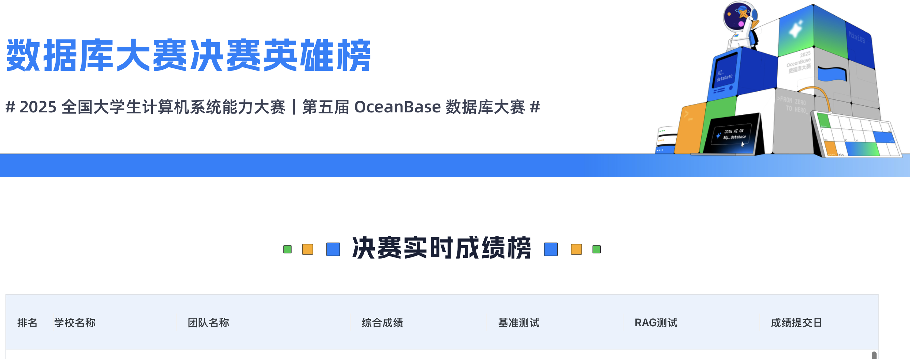
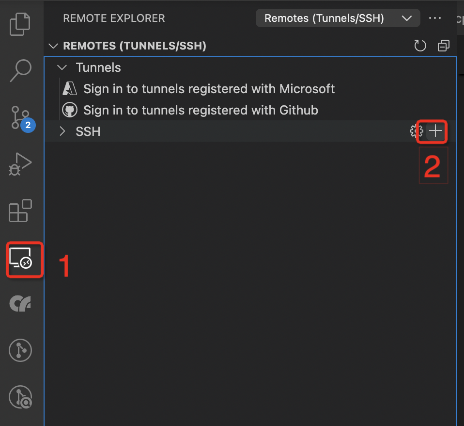
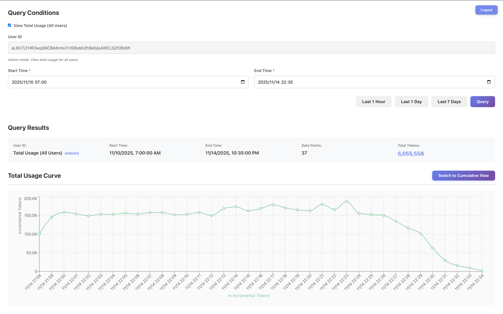

# 2025 数据库大赛决赛

本文档包含 2025 数据库大赛决赛的两个赛题：内核赛题和 AI 应用赛题。

---

## 第一部分：内核赛题

### 背景

随着大语言模型（LLM）与检索增强生成（RAG）技术的广泛应用，企业对智能数据系统的性能要求日益严苛。在典型 RAG 场景中，用户查询往往融合语义向量、关键词文本与结构化条件（如时间范围、用户等级、状态码等），例如：
“查找过去 7 天内，来自 VIP 用户、内容包含‘支付失败’的工单”
此类 **带标量过滤的全文查询**（Scalar-Filtered Full-Text Search）已成为 AI 应用的高频需求。传统方案依赖外部搜索引擎（如 Elasticsearch）处理全文检索，再与数据库结果在应用层融合，导致架构复杂、数据一致性风险高、端到端延迟大。
为简化并提升效率，**原生支持多模态检索的数据库**正成为新趋势。OceanBase 推出的 **seekdb**（[https://github.com/oceanbase/seekdb](https://github.com/oceanbase/seekdb)）是一款轻量级、嵌入式、面向 AI 应用的原生搜索数据库，已在单一引擎中统一支持向量、全文、JSON、关系型及 GIS 数据，并初步具备全文索引能力。
目前，seekdb 的全文索引功能虽已可用，但在 **混合标量-全文查询场景下的执行效率、资源消耗与扩展性方面仍有显著优化空间**。尤其在高并发、大数据量、多条件组合的生产环境中，查询延迟与吞吐量尚未达到理想水平。

### 赛题描述

本次赛题是在 OceanBase-seekdb 社区版（基于 2025-final-competition 分支，以下简称 seekdb）的基础上，在 MLDR 英文数据集（[mldr-v1.0-en](https://hf-mirror.com/datasets/Shitao/MLDR/tree/main/mldr-v1.0-en)）上，优化带标量的全文索引检索的性能。

```plsql
SELECT docid_col, MATCH(fulltext_col) AGAINST(XXX) as _score
FROM items1
WHERE MATCH(fulltext_col) AGAINST(XXX)
  and base_id in XXX
  and id < XXX
ORDER BY _score DESC
LIMIT XXX
```

### 赛题详情

为了让选手们专注在全文检索场景优化, 赛题场景简化如下：

1. 不考虑分布式场景，当前限定单机模式；
2. 后建索引，即先插入数据，再创建索引。

测试使用的 MLDR 测试脚本请参考（[https://github.com/oceanbase/ob-mldr-test](https://github.com/oceanbase/ob-mldr-test)），测试使用的表结构如下：

```sql
CREATE TABLE `items1` (
  `id` BIGINT AUTO_INCREMENT,
  `base_id` VARCHAR(255) NOT NULL,
  `docid_col` VARCHAR(255) NOT NULL,
  `fulltext_col` LONGTEXT
) ENGINE=InnoDB DEFAULT CHARSET=utf8mb4 COLLATE=utf8mb4_unicode_ci
```

索引如下：

```sql
# 普通索引
CREATE INDEX idx_base_id ON `items1`(`base_id`);
CREATE INDEX idx_docid ON `items1`(`docid_col`);

# 全文索引
CREATE /*+ parallel(90) */ FULLTEXT INDEX ft_fulltext ON `items1`(`fulltext_col`);
```

测试使用的数据集为 `mldr-v1.0-en/corpus.jsonl`，在此数据集基础上增加额外的标量列。

不限制选手对全文索引参数进行硬编码来进行修改，选手可通过修改代码中的硬编码值来实现参数替换。

### 查询测试

```sql
SELECT `docid_col`, MATCH(`fulltext_col`) AGAINST(`text`) as _score
FROM `items1`
WHERE MATCH(fulltext_col) AGAINST(`text`)
  and base_id in ('base_id_1', 'base_id_2', 'base_id_3')
  and id < 1000
ORDER BY _score DESC
LIMIT 10
```

测试步骤如下：

1. 导入表数据，构建标量、全文索引，并进行一轮查询用于预热。（注意：此轮测试不记录成绩）

```bash
python3 test_insert_fast.py --lang en
```

2. 运行三轮查询测试（查询集为 `mldr-v1.0-en/test.jsonl`）

```bash
# 查询
python3 get_search_rrf_oceanbase.py \
  --languages en \
  --query_types bm25 \
  --query_result_dave_dir query-results

# 计算召回率
python3 evaluate_results_oceanbase.py \
  --languages en \
  --metrics recall@10 \
  --query_result_dave_dir query-results
```

测试对应训练营中的 basic 题目，训练营中的真实得分为三轮查询测试的平均 QPS。

注意：

- 三次查询测试的召回率需都超过 0.95，才会得分。
- 因额外增加标量列，导致部分 query 在 qrels 中没有相关文档，计算召回率时会跳过这些没有相关文档的 query。

### 测试逻辑

#### 测试环境

单机环境部署单节点 seekdb 集群，机器规格 8C 16G。

测试脚本与 seekdb 集群在同一台机器上。

#### 测试流程

这里描述后台测试程序的测试流程，选手可以参考此流程用于本地测试。注意：以下以操作系统 Anolis OS 8.8 ANCK 64 位 为例，其他操作系统可能略有区别。

选手使用的基础环境中提供了用于编译部署 seekdb 运行测试所需的必要依赖。基础环境中提供了`/root/source/seekdb`做为基础代码，可免于大家 clone 代码，下载依赖。也提供了 mldr_benchmark 脚本，位于`/root/source/mldr_benchmark`

```bash
# 编译部署 seekdb 相关的环境依赖请参考初赛文档：https://open.oceanbase.com/train/TopicDetails?questionId=600034&subQesitonId=800284&subQuestionName=basic
# 运行 mldr_benchmark 需要先安装 python3.11 相关依赖，如果遇到依赖版本不兼容等问题，可以使用 conda 安装 python 3.11 环境。
# 推荐 python3.11 以上，python 版本不低于3.9
mkdir -p ~/miniconda3
wget https://repo.anaconda.com/miniconda/Miniconda3-latest-Linux-x86_64.sh -O ~/miniconda3/miniconda.sh
bash ~/miniconda3/miniconda.sh -b -u -p ~/miniconda3
~/miniconda3/bin/conda init bash
conda create -n fulltext python=3.11 jupyterlab -y
conda activate fulltext
```

1. 部署 seekdb 单节点集群。

```bash
# 编译/部署集群

## 编译
bash build.sh release -DOB_USE_CCACHE=ON --init --make -j3
## 部署
### 在 seekdb 目录下运行
./tools/deploy/obd.sh prepare -p /tmp/obtest

### 配置文件请参考下面 obcluster.yaml 示例
./tools/deploy/obd.sh deploy -c /data/obcluster.yaml

## 连接 seekdb
./deps/3rd/u01/obclient/bin/obclient -h127.0.0.1 -P2881 -uroot -Dtest -A

# 如有需要重启集群，可执行下面命令
./tools/deploy/obd.sh restart obcluster
# 停止集群
./tools/deploy/obd.sh stop obcluster
# 销毁集群
./tools/deploy/obd.sh destroy obcluster
```

注意：部署时出现如下失败可以忽略

> Installing /root/source/seekdb/build_release/syspack_release/\* FAIL

```yaml
seekdb:
  servers:
    - name: server1
      ip: 127.0.0.1
  server1:
    mysql_port: 2881
    home_path: /data/obcluster
    zone: zone1
    # The directory for data storage. The default value is home_path/store.
    # data_dir: /data
    # The directory for clog, ilog, and slog. The default value is the same as the data_dir value.
    # redo_dir: /redo
  tag: latest
  global:
    # for default system config used by farm, please see tools/deploy/obd/observer.include.yaml
    # You can also specify the configuration directly below (stored locally, switching the working directory and redeploying will still take effect)
    production_mode: false
    devname: lo
    root_password: ""
    memory_limit: "10G"
    system_memory: "1G"
    datafile_size: "20G"
    cpu_count: "8"
    __min_full_resource_pool_memory: "1073741824"
```

2. 全文检索测试
   1. 下载测试脚本。（如果本地没有下载测试脚本：[https://github.com/oceanbase/ob-mldr-test](https://github.com/oceanbase/ob-mldr-test)）
   2. 测试环境搭建（以 python3.9 为例）

```bash
# 下载测试脚本
# 安装 Python3.9 开发头文件和编译工具
sudo dnf module install -y python39
sudo dnf install -y python39-devel gcc gcc-c++ make cmake
# 为 Python3.9 安装依赖
## 更新 pip
python3.9 -m pip install --upgrade pip
python3.9 -m pip install -r requirements.txt
# 安装 java11
sudo dnf install -y java-11-openjdk-devel
export JAVA_HOME=/usr/lib/jvm/java-11-openjdk-11.0.22.0.7-0.al8.x86_64
export JVM_PATH=$JAVA_HOME/lib/server/libjvm.so
```

    3. 运行 mldr_benchmark 测试（一次预热 + 三次查询）

```bash
# 运行基础 mldr_benchmark 测试
## 测试时导入数据并构建索引
python3.9 test_insert_fast.py --lang en
## 进行一组测试，获得平均查询时间
python3.9 get_search_rrf_oceanbase.py --languages en
  --query_types bm25 --query_result_dave_dir ./query-results
## 计算召回率
python3.9 evaluate_results_oceanbase.py --languages en
  --metrics recall@10 --query_result_dave_dir ./query-results

## 一体化运行（一次预热 + 三次查询）
python3.9 mldr_data_test.py --lang en --query_types bm25
```

注意：

整个测试过程应该在 30min 内完成，超过这个时间会认为无效成绩。(不包含编译耗时，不包括下载数据集的时间)

#### 提交测试

与初赛相似，选手在训练营中填写 git 仓库地址、branch 和 commit id 信息。

注意：一次提测运行时间较长，请尽可能本地自测后提测，并耐心等待。

#### 约束条件

为了大家的精力更加集中在全文检索场景的代码优化中，同时为了提高测试效率，再次做一些约束与约定。

- 集中于内核源码逻辑功能修改：比如不允许修改影响程序运行效率的编译选项或指令集，不允许调整`build.sh`以及`deps`目录下所有内容等等
- 不允许改变 SQL 执行路径。比如不通过 SQL 执行引擎/存储引擎，直接返回数据。
- 不允许使用额外的缓存机制。只允许现在现有缓存机制，如 kv cache 等。

---

## 第二部分：AI 应用赛题

### 背景

OceanBase 数据库是一款完全自研的企业级原生分布式数据库，在普通硬件上实现金融级高可用，首创"三地五中心"城市级故障自动无损容灾新标准，刷新 TPC-C 标准测试，单集群规模超过 1500 节点，具有云原生、强一致性、高度兼容 Oracle/MySQL 等特性。自 2021 年 6 月 1 日正式开源以来，OceanBase 受到了金融机构、电信运营商、政府单位以及互联网企业的广泛关注和应用，并逐步介入更多应用场景。

随着大模型（LLM）技术的迅猛发展，检索增强生成（RAG）已成为构建企业级智能问答、知识库助手和语义搜索系统的核心架构。在 RAG 流程中，系统不仅需要将原始数据向量化以支持语义相似性检索，还需要处理大量结构化或半结构化文本（如用户评论、工单记录、产品描述、日志内容等）。传统方案通常将全文检索交由 Elasticsearch 等专用搜索引擎处理，再与向量检索结果进行后端融合，导致系统架构复杂、数据一致性难以保障、运维成本居高不下。

[PowerRAG](https://github.com/oceanbase/powerrag) 是一款基于 [RAGFlow](https://github.com/infiniflow/ragflow) 二次开发的 RAG 平台，充分利用 OceanBase/seekdb 原生的多模检索能力（向量检索、全文检索、结构化查询等），将向量检索与全文检索统一在单一数据库中，简化系统架构，提升数据一致性，降低运维复杂度，帮助开发者构建更易用、更准确、更可靠的 RAG 系统。

本赛题将带领大家从 0 到 1 打造属于你的 RAG 系统！

### 赛题任务

本次比赛将以你的 seekdb 数据库为基础，完成 RAG 应用的开发以及评测。具体如下:

提供一个由多个图文混排 PDF 文档组成的知识库，以及一系列包含文本与图像依赖关系的测试查询。评估将重点关注答案的准确性、完整性、信息关联性以及可解释性（即是否明确标注信息来源）。

参赛系统需完成以下四项核心任务:

#### 多模态信息理解

能够同时解析用户提出的自然语言问题，并准确理解知识库中图像与文本的语义内容，实现对多模态输入的统一表征。

#### 跨模态检索

面对多个 PDF 文档，系统需高效检索与用户查询相关的文本段落、图像、图表，或其任意组合，确保召回内容在语义和视觉层面均与问题高度相关。

#### 图文关联推理

对检索到的多模态信息进行深度融合与逻辑推理，建立图像与文本之间的语义关联，从而回答那些依赖图文协同理解的复杂问题。

#### 可溯源答案生成

基于检索结果与推理过程，生成准确、简洁且语境适配的答案，并明确标注信息来源（例如: 具体 PDF 文件、页码，甚至图表编号），以增强答案的可信度与可验证性。

### 评审规则

#### 数据说明

##### 数据集

本次大赛的数据集来自裁剪后的 [财报数据集](https://obcommunityprod.oss-cn-shanghai.aliyuncs.com/prod/training/2025-11/a9e250e3-24aa-416f-a849-ba681ce500c8.zip), 下载方式:

```bash
$ wget -O ./rag/data/dataset.zip https://obcommunityprod.oss-cn-shanghai.aliyuncs.com/prod/training/2025-11/a9e250e3-24aa-416f-a849-ba681ce500c8.zip
```

结构如下:

```bash
./
├── 千味央厨-公司深度报告打造央厨之道服务千万餐饮-22121364页.pdf
├── 千味央厨-公司深度报告深耕餐饮供应链厚积薄发大小B双轮驱动共筑高成长-23062827页.pdf
├── 千味央厨-公司深度报告深耕餐饮供应链借力上市迎风成长-21090634页.pdf
├── 千味央厨-公司深度报告深耕蓝海鹏程万里-22110953页.pdf
├── 千味央厨-公司深度报告新品与渠道双轮驱动打开成长空间-23072461页.pdf
├── 千味央厨-公司深度分析立足餐供市场拓展速冻米面新维度-22081221页.pdf
├── 千味央厨-公司深度分析千滋百味厨师之选-22041226页.pdf
├── 千味央厨-公司深度研究千家餐饮之选味触万户之心-22122234页.pdf
├── 千味央厨-公司研究报告-餐供米面龙头大小B梯次突破-24011120页.pdf
├── 千味央厨-公司研究报告-大小B双轮驱动餐饮市场大有可为-23061240页.pdf
├── 千味央厨-公司研究报告-深耕餐饮供应链为人间千味-23011258页.pdf
├── 千味央厨-兼具确定性与成长性的速冻面米制品B端龙头-22042629页.pdf
├── 千味央厨-深度报告深耕B端抢占蓝海-21090629页.pdf
├── 千味央厨-深度报告深耕餐饮渠道研发助力发展-22033022页.pdf
├── 千味央厨-深度报告速冻B端优势企业借餐饮长风乘势而起-21090728页.pdf
├── 千味央厨-深度研究报告聚焦B端蓝海扬帆-22051936页.pdf
├── 千味央厨-首次覆盖报告受益餐饮工业化趋势大B端壁垒赋能小B端降维打击-22052929页.pdf
├── 千味央厨-投资价值分析报告滴水穿石觅百厨千味-22021137页.pdf
├── 千味央厨-再论千味产业角色定位精准无惧竞争大有可为-22092632页.pdf
└── 千味央厨公司研究报告中国领先的餐饮渠道速冻面米制品供应商34页.pdf
```

##### 测试集

测评问题集合，[部分测试集](./rag/data/questions.json) 如下:

```json
[
  {
    "question": "千味央厨的成立时间是什么时候？"
  },
  {
    "question": "千味央厨的财务报表预测中，预计2024年的营业收入是多少？"
  },
  {
    "question": "千味央厨的主要产品有哪些类别？"
  }
]
```

#### 评审方式

##### 标准答案

[标准答案](./rag/data/answer.json) 格式如下 (仅展示部分):

```json
[
  {
    "question": "千味央厨的成立时间是什么时候？",
    "answer": "千味央厨成立于2012年。",
    "filename": "千味央厨-公司研究报告-深耕餐饮供应链为人间千味-23011258页.pdf",
    "page": 15
  },
  {
    "question": "千味央厨的财务报表预测中，预计2024年的营业收入是多少？",
    "answer": "千味央厨预计2024年的营业收入为2,459百万元。",
    "filename": "千味央厨-首次覆盖报告受益餐饮工业化趋势大B端壁垒赋能小B端降维打击-22052929页.pdf",
    "page": 27
  },
  {
    "question": "千味央厨的主要产品有哪些类别？",
    "answer": "千味央厨的主要产品包括油炸类、烘焙类、蒸煮类、菜肴类及其他四个大类。",
    "filename": "千味央厨-深度报告深耕餐饮渠道研发助力发展-22033022页.pdf",
    "page": 10
  }
]
```

##### 输出文件格式

输出文件格式应与标准答案相同，类似如下:

```json
[
  {
    "question": "千味央厨的成立时间是什么时候？",
    "answer": "xxx",
    "filename": "xxx.pdf",
    "page": 1
  },
  {
    "question": "千味央厨的财务报表预测中，预计2024年的营业收入是多少？",
    "answer": "xxx",
    "filename": "xxx.pdf",
    "page": 2
  },
  {
    "question": "千味央厨的主要产品有哪些类别？",
    "answer": "xxx",
    "filename": "xxx.pdf",
    "page": 3
  }
]
```

##### 分数计算方式

该评分函数主要从三个方面对每个问题的回答进行评估，每个提问并计算一个综合分数:

- 页面匹配度（满分 25 分）
- 文件名匹配度（满分 25 分）
- 答案内容相似度（满分 50 分）

具体的分数计算方式与 [eval.py](./rag/eval.py) 代码相同

#### 项目结构

##### 目录结构

本项目的初始代码是由 AI 生成的最简的 RAG 流程代码，有较大的优化空间。

```bash
rag/
├── data/              # 数据目录
│   ├── answer.json    # 标准答案 (部分)
│   ├── dataset/       # 数据集 (从 dataset.zip 解压缩得到)
│   ├── output.json    # 输出答案
│   └── questions.json # 测试集 (部分)
├── .env.example       # 环境变量示例
├── eval.py            # 评分脚本 (本地自测)
├── main.py            # 主程序入口
├── requirements.txt   # Python 依赖
└── src                # 代码目录
    ├── core/          # 核心算法 (Add, Search 等)
    ├── integrations/  # 模型集成目录
    │   ├── embedding/ # 嵌入模型
    │   ├── llm/       # 文本模型
    │   └── vlm/       # 视觉模型
    ├── parser/        # 文件解析 (Pdf 解析等)
    ├── prompt/        # 提示词目录
    ├── split/         # 文档划分
    ├── storage/       # 存储
    └── util/          # 工具函数
```

##### 核心文件

- [main.py](./rag/main.py) RAG 执行主函数，输入数据集，测试集以及输出文件地址:

```bash
$ cd rag && python3 main.py --help
usage: main.py [-h] [--dataset DATASET] [--questions QUESTIONS] [--output OUTPUT]

RAG system for question answering

options:
  -h, --help            show this help message and exit
  --dataset DATASET     Path to dataset directory (default: ./data/dataset/)
  --questions QUESTIONS
                        Path to questions/test JSON file (default: ./data/questions.json)
  --output OUTPUT       Path to output JSON file (default: ./data/output.json)

Examples:
    cd rag && python3.10 main.py --dataset="./data/dataset/" \
                       --questions="./data/questions.json" \
                       --output="./data/output.json"
```

- [eval.py](./rag/eval.py): 评分函数，通过输出答案和标准答案计算总分数

```bash
$ cd rag && python3 eval.py --help
usage: eval.py [-h] [--output OUTPUT] [--answer ANSWER]

Evaluate answers against ground truth

options:
  -h, --help       show this help message and exit
  --output OUTPUT  Path to the output JSON file (player answers)
  --answer ANSWER  Path to the answer JSON file (ground truth)

Examples:
  cd rag && python3 eval.py --output ./data/output.json --answer ./data/train.json
```

#### 评测逻辑

##### 编译 seekdb 数据库

```bash
$ bash build.sh --init release -DOB_USE_CCACHE=ON -DOB_BUILD_UNITTEST=OFF -DOB_INCLUDE_UNITTEST=OFF --make -j6
```

##### 启动 seekdb 数据库

```bash
$ ./build_release/src/observer/observer -P 2881 &
```

##### 删除 .env 文件

```bash
$ cd rag && rm -rf .env .env.example
```

##### 下载对应依赖 (限时 500 秒)

```bash
$ cd rag && timeout 500 python3.10 -m pip install -r requirements.txt
```

##### 执行 RAG (限时 40 分钟内完成)

```bash
$ cd rag && timeout 2400 python3.10 main.py --dataset="xxx" --questions="xxx" --output="xxx"
```

##### 执行评测

```bash
$ cd rag && python3.10 eval.py --output="xxx" --answer="xxx"
```

#### 评测环境

Python 版本

```bash
$ python3.10 --version
Python 3.10.12
```

#### 约束条件

##### 环境变量

测评环境会提供环境变量，环境变量的命名与 [.env.example](./rag/.env.example) 一致，请勿修改环境变量的命名

##### 时间限制

pip 包下载时间不超过 500 秒，以避免下载过重代码依赖

RAG 执行时间 (含文档导入，输出结果等) 不超过 40 分钟

#### 模型限制

比赛模型提供来自阿里云百炼平台，可选模型列表参考: https://modelstudio.console.aliyun.com/?tab=doc#/doc/?type=model&url=2840914

##### 模型限速

参考 [https://modelstudio.console.aliyun.com/?tab=doc#/doc/?type=model&url=2840182](https://modelstudio.console.aliyun.com/?tab=doc#/doc/?type=model&url=2840182)

---

## 评分与排名规则

### 决赛积分成绩

赛题成绩分为两大部分：内核赛题成绩和 AI 应用赛题成绩。

### 内核赛题成绩

真实成绩为：进行一次预热后，运行三次 MLDR 英文查询集得出的 QPS 平均值，排名时按照 QPS 数值排名，数值越大排名越高。

按照 QPS 排序，QPS 最高的换算为 100 分，其余分数折算规则为

本队 QPS ÷ 最高 QPS × 100

### AI 赛题成绩

真实成绩为：所有问题得分的平均值作为 RAG 的准确率。

按照准确率排序，准确率最高的换算为 100 分，其余分数折算规则为

本队准确率 ÷ 最高准确率 × 100

### 综合积分成绩

最终成绩将由内核赛题成绩（对应下图基准测试）和 AI 应用赛题成绩（对应下图 RAG 测试）两部分进行加权。

综合成绩得分 = (内核成绩积分 × 70%) + (AI 应用成绩积分 × 30%)

也就是内核成绩积分与 AI 应用成绩的占分比例是 7 ：3。

每个队伍都使用最新的有效成绩进行综合计算。

最终按照综合得分（对应下图综合成绩）排名。



### 答辩后总成绩

最终成绩采用决赛成绩 ✖️70% + 答辩成绩 ✖️ 30%，然后按照总成绩从高到低排名。

---

## 自测环境与资源

### ECS 自测环境

由于部分同学没有本地测试环境，决赛题目部署测试所需规格也比较高（8C 16G），为了便于大家开发调试，对于参与决赛的同学，大赛会为每队最多提供两台 ECS（8C 16G，与评测机规格/环境相同），用于自测调试，请按需申请。

注意：

1. 跳板机规格比较低，禁止使用跳板机编译测试，做额外用途。
2. 禁止使用 ECS 开发机做额外用途。
3. 在比赛结束后，ECS 环境会回收，注意及时保存自己的代码及其他需要保存的东西（平时也需要注意及时保存）。
4. 如果使用第三方软件，也需要使用没有严重高危漏洞版本。

**如何开发**：

可以使用 vscode 来开发调试代码。

vscode 在 ECS 上的配置方法如下：

1. 安装 `Remote Development`,点击下图中的按钮 1，再点击下图中的按钮 2。输入 ssh 连接字符串（例如：`ssh -J proxy@jumpserver user@ip`）即可使用 vscode 连接远程开发机。



seekdb (与 OceanBase 类似) 的编译部署可以参考初赛文档：[https://open.oceanbase.com/train/TopicDetails?questionId=600034&subQesitonId=800284&subQuestionName=basic](https://open.oceanbase.com/train/TopicDetails?questionId=600034&subQesitonId=800284&subQuestionName=basic)

注意：

- 编译过程中的并发数过大可能会导致 ECS 卡住，可以使用 -j3 作为编译参数。
- 测试过程中 seekdb 占用内存过大可能会导致 ECS 卡住，可以适当调小 `/data/obcluster.yaml` 中的 `memory_limit`

### 自测模型提供

为便于选手开发，我们自部署了一个大模型代理平台，提供了上述模型列表中的模型供选手使用。代理平台仅限开发机连接，具体的 BaseURL 和 ApiKey 将在决赛开始后私发到各队伍。

代理平台也加入了一些 feature，可以使用浏览器访问同端口，以提供的 ApiKey 登陆，查看自己的 token 用量：




---

## 公平竞赛规则

**（1） 抄袭行为: 凡未能保证原创性的竞赛行为均视为抄袭行为。** 例如：

- 直接引用他人代码；
- 私自与其他队伍或非本队伍成员进行互相抄袭的；

**（2） 不正当竞争行为: 凡未遵从竞赛宗旨，恶意获取高分的行为均被视为不正当竞争行为。** 例如：

- 可以通过除竞赛规定途径之外的其他途径接触到竞赛相关数据的人员参加竞赛的；
- 邀约参赛团队名单之外的人员参与解题与方案设计，或以外包、求助等形式在参赛团队之外完成赛题的；
- 参赛者以任何形式使用竞赛提供数据之外的任何数据参赛的（大赛主页明确规定可以使用的除外）；
- 人工标注部分或所有测试集、标注或刻意跳过测试用例、正确性测试与性能测试代码逻辑明显不同，并作为结果进行提交的；
- 使用竞赛规定外的计算资源的（大赛主页未做任何规定的除外）；
- 在同一个比赛中，使用多个账号参赛的；
- 利用平台或规则漏洞进行参赛的。
- 严禁使用违规优化方法，包括但不仅限于:
  - 硬编码数据: 将预处理的知识库数据编码到代码
  - 答案标注: 使用测试集数据参与文档导入，知识库构建等过程
  - 提示词注入: 在输出集中参杂提示词误导评分模型评测
  - pip 包注入: 将带有违规优化方法的 pip 包下载并注入代码

> 对于有疑问的优化行为保持沟通

**（3）蓄意破坏行为：凡通过恶意手段对比赛平台、评估系统和环境进行破坏的均视为蓄意破坏行为。** 例如：

- 蓄意上传携带病毒文件的；
- 通过扫盘等行为获取测试数据/评测代码的；
- 蓄意发起对比赛平台、评估系统的攻击，扰乱比赛秩序的。

## 赛后查重

决赛结束后，我们将对最终成绩对应的代码进行查重以及人工代码审查，请在决赛结束后保留最终成绩对应的代码提交信息，若仓库或对应提交信息不存在，我们将取消该队的决赛成绩。

## 决赛 FAQ

见 [FAQ.md](./FAQ.md), 我们将整理问题并实时更新。

## 参考资料

OceanBase 全文索引文档（seekdb 类似）：[https://www.oceanbase.com/docs/common-oceanbase-database-cn-1000000003980331](https://www.oceanbase.com/docs/common-oceanbase-database-cn-1000000003980331)

seekdb 基准代码：[https://github.com/oceanbase/seekdb/tree/2025-final-competition](https://github.com/oceanbase/seekdb/tree/2025-final-competition)

用于本次大赛测试的 mldr_benchmark 仓库：[https://github.com/oceanbase/ob-mldr-test](https://github.com/oceanbase/ob-mldr-test)

PowerRAG 社区版源码: [https://github.com/oceanbase/powerrag](https://github.com/oceanbase/powerrag)

---

<div align="center">

# 

### **🔷 AI 原生混合搜索数据库**

**在一个数据库中融合向量、文本、结构化与半结构化数据能力，并通过内置 AI Functions 支持多模混合搜索与智能推理。**

</div>

---

<div align="center">
<p>
    <a href="https://oceanbase.ai">
        
    </a>
    <a href="https://space.bilibili.com/3546900567427713">
        
    </a>
    <a href="https://ask.oceanbase.com/"  >
        
    </a>
    <a href="https://h5.dingtalk.com/circle/joinCircle.html?corpId=ding320493024256007024f2f5cc6abecb85&token=be84625101d2c2b2b675e1835e5b7988&groupCode=v1,k1,EoWBexMbnAnivFZPFszVivlsxkpAYNcvXRdF071nRRY=&from=group&ext=%7B%22channel%22%3A%22QR_GROUP_NORMAL%22%2C%22extension%22%3A%7B%22groupCode%22%3A%22v1%2Ck1%2CEoWBexMbnAnivFZPFszVivlsxkpAYNcvXRdF071nRRY%3D%22%2C%22groupFrom%22%3A%22group%22%7D%2C%22inviteId%22%3A1057855%2C%22orgId%22%3A313467091%2C%22shareType%22%3A%22GROUP%22%7D&origin=11?#/">
        
    </a>
    <a href="https://pepy.tech/projects/pylibseekdb">
        
    </a>
    <a href="https://github.com/oceanbase/seekdb/blob/master/LICENSE">
        
    </a>
</p>
</div>

## 🚀 什么是 OceanBase seekdb？

**OceanBase seekdb** 是 OceanBase 打造的一款开发者友好的 AI 原生数据库产品，专注于为 AI 应用提供高效的混合搜索能力。它支持向量、文本、结构化与半结构化数据的统一存储与检索，并通过内置 AI Functions 支持数据嵌入、重排与库内实时推理。seekdb 在继承 OceanBase 核心引擎高性能优势与 MySQL 全面兼容特性的基础上，通过深度优化数据搜索架构，为开发者提供更符合 AI 应用数据处理需求的解决方案。

---

## 🔥 为什么选择 OceanBase seekdb？

---

| **Feature**              | **OceanBase seekdb** | **OceanBase** | **Chroma** | **Milvus** |      **MySQL 9.0**       | PostgreSQL<br/>**+pgvector** | **DuckDB** |          **Elasticsearch**          |
| ------------------------ | :------------------: | :-----------: | :--------: | :--------: | :----------------------: | :--------------------------: | :--------: | :---------------------------------: |
| **Embedded Database**    |          ✅          |      ❌       |     ✅     |     ✅     | ❌<br/> (removed in 8.0) |              ❌              |     ✅     |                 ❌                  |
| **Single-Node Database** |          ✅          |      ✅       |     ✅     |     ✅     |            ✅            |              ✅              |     ✅     |                 ✅                  |
| **Distributed Database** |          ❌          |      ✅       |     ❌     |     ✅     |            ❌            |              ❌              |     ❌     |                 ✅                  |
| **MySQL Compatible**     |          ✅          |      ✅       |     ❌     |     ❌     |            ✅            |              ❌              |     ✅     |                 ❌                  |
| **Vector Search**        |          ✅          |      ✅       |     ✅     |     ✅     |            ❌            |              ✅              |     ✅     |                 ✅                  |
| **Full-Text Search**     |          ✅          |      ✅       |     ✅     |     ⚠️     |            ✅            |              ✅              |     ✅     |                 ✅                  |
| **Hybrid Search**        |          ✅          |      ✅       |     ✅     |     ✅     |            ❌            |              ⚠️              |     ❌     |                 ✅                  |
| **OLTP**                 |          ✅          |      ✅       |     ❌     |     ❌     |            ✅            |              ✅              |     ❌     |                 ❌                  |
| **OLAP**                 |          ✅          |      ✅       |     ❌     |     ❌     |            ❌            |              ✅              |     ✅     |                 ⚠️                  |
| **Open Source License**  |      Apache 2.0      | MulanPubL 2.0 | Apache 2.0 | Apache 2.0 |         GPL 2.0          |      PostgreSQL License      |    MIT     | AGPLv3<br/>+SSPLv1<br/>+Elastic 2.0 |

- ✅ 支持
- ❌ 不支持
- ⚠️ 有限支持

---

## ✨ 核心特性

### 开箱即用，极速开发，易学易用

采用单点架构设计，可快速完成安装配置；无其他组件依赖，单点启动即可运行，适用于 AI 业务敏捷开发场景。提供灵活多样的部署方式，支持服务器和嵌入式两种部署模式：服务器部署模式下，支持 yum install、docker 或 Windows/macOS 桌面版部署方式；嵌入式部署模式下，支持原生 Python 集成，可作为 AI 应用内嵌数据库。已集成各类 AI 应用开发框架，几分钟即可快速构建 AI 应用。

### 支持 1C2G 小规格，垂直弹性扩缩容

1 核 CPU + 2GB 内存即可运行 VectorDBBench Performance1536D50K 基准测试。当系统对并发量、数据量、查询复杂度有较高要求时，可灵活垂直扩展资源规格。

### 高性能向量索引、全文索引，支持向量、全文、标量混合搜索

- <b>向量搜索：</b>支持高达 16,000 维向量存储与高性能检索，兼容 L2、内积、余弦相似度等多种距离计算方式。提供 HNSW/IVF 索引及相关量化算法，支持精确最近邻及近似最近邻搜索，满足 AI 场景多样化的向量检索需求。
- <b>全文搜索：</b>支持基于 BM25 相关性排序算法的高性能全文索引，实现面向关键词的精准搜索。提供 Space、Beng、Ngram、IK、Jieba 等多种分词器，支持 Natural Language Mode、Boolean Mode、Phrase Query、Multi Match 等多种查询模式，可在海量数据中高效检索符合过滤规则的相关文本。
- <b>混合搜索：</b>支持向量、全文、标量、空间等多类数据的混合搜索，一条 SQL 即可完成多路查询与重排序，大幅提升 RAG 应用查询结果的准确性。

### 向量搜索升级，基于 Semantic Index 指定文本也可进行语义搜索

seekdb 提供了 Semantic Index 功能，只需写入文本数据，系统即可自动进行 Embedding 并生成向量索引，查询时仅需指定文本搜索条件即可进行语义搜索。该功能对用户屏蔽了向量嵌入和查询结果 Rerank 的复杂流程，显著简化 AI 应用开发对数据库的使用方式。

### 无缝对接各类模型，内置 AI Function 实现库内实时推理

seekdb 支持大语言模型和向量嵌入模型接入，通过 DBMS_AI_SERVICE 系统包实现模型注册和管理。内置 AI_COMPLETE、AI_PROMPT、AI_EMBED、AI_RERANK 等 AI Function，支持在标准 SQL 语法下进行数据嵌入和库内实时推理。

### 基于 JSON 的动态 Schema，支持文档元数据动态存储和高效访问

seekdb 支持 JSON 数据类型，具备动态 Schema 能力。支持 JSON 的部分更新以降低数据更新成本，提供 JSON 函数索引、多值索引来优化查询性能。实现半结构化编码降低存储成本。在 AI 应用中，JSON 可作为文档元信息的存储类型，并支持与全文、向量的混合搜索。

### 数据实时写入，实时可查

基于 LSM-Tree 存储架构，seekdb 支持数据的高频实时写入。在执行数据 DML 操作时同步构建全文、向量、标量等各类索引，数据入库成功后立即可查。

### 兼容 MySQL 不止于 MySQL，支撑 HTAP 混合负载

深度兼容 MySQL 的语法、协议、数据字典等，确保 MySQL 应用无缝迁移。同时通过创新架构突破 MySQL 支持的场景边界，基于行列混存技术和向量化执行能力，一个实例可同时支持联机交易和实时分析等多种负载，省去数据同步的时间延迟和同步链路的维护成本。

---

## 🎬 快速开始

### 安装

选择您的平台：

<details>
<summary><b>🐍 Python（推荐用于 AI/ML）</b></summary>

```bash
pip install -U pyseekdb

```

</details>

<details>
<summary><b>🐳 Docker（快速测试）</b></summary>

```bash
docker run -d \
  --name seekdb \
  -p 2881:2881 \
  -v ./data:/var/lib/oceanbase/store \
  oceanbase/seekdb:latest
```

</details>

<details>
<summary><b>📦 二进制文件（独立安装）</b></summary>

```bash
# Linux
rpm -ivh seekdb-1.x.x.x-xxxxxxx.el8.x86_64.rpm
```

请将版本号替换为实际的 RPM 包版本。

</details>

### 🎯 AI 搜索示例

在 5 分钟内构建语义搜索系统：

<details>
<summary><b>🗄️ 🐍 Python SDK</b></summary>

```bash
# install sdk first
pip install -U pyseekdb
```

```python
"""
this example demonstrates the most common operations with embedding functions:
1. Create a client connection
2. Create a collection with embedding function
3. Add data using documents (embeddings auto-generated)
4. Query using query texts (embeddings auto-generated)
5. Print query results

This is a minimal example to get you started quickly with embedding functions.
"""

import pyseekdb
from pyseekdb import DefaultEmbeddingFunction

# ==================== Step 1: Create Client Connection ====================
# You can use embedded mode, server mode, or OceanBase mode
# For this example, we'll use server mode (you can change to embedded or OceanBase)

# Embedded mode (local SeekDB)
client = pyseekdb.Client(
    path="./seekdb.db",
    database="test"
)
# Alternative: Server mode (connecting to remote SeekDB server)
# client = pyseekdb.Client(
#     host="127.0.0.1",
#     port=2881,
#     database="test",
#     user="root",
#     password=""
# )

# Alternative: Remote server mode (OceanBase Server)
# client = pyseekdb.Client(
#     host="127.0.0.1",
#     port=2881,
#     tenant="test",  # OceanBase default tenant
#     database="test",
#     user="root",
#     password=""
# )

# ==================== Step 2: Create a Collection with Embedding Function ====================
# A collection is like a table that stores documents with vector embeddings
collection_name = "my_simple_collection"

# Create collection with default embedding function
# The embedding function will automatically convert documents to embeddings
collection = client.create_collection(
    name=collection_name,
    #embedding_function=DefaultEmbeddingFunction()  # Uses default model (384 dimensions)
)

print(f"Created collection '{collection_name}' with dimension: {collection.dimension}")
print(f"Embedding function: {collection.embedding_function}")

# ==================== Step 3: Add Data to Collection ====================
# With embedding function, you can add documents directly without providing embeddings
# The embedding function will automatically generate embeddings from documents

documents = [
    "Machine learning is a subset of artificial intelligence",
    "Python is a popular programming language",
    "Vector databases enable semantic search",
    "Neural networks are inspired by the human brain",
    "Natural language processing helps computers understand text"
]

ids = ["id1", "id2", "id3", "id4", "id5"]

# Add data with documents only - embeddings will be auto-generated by embedding function
collection.add(
    ids=ids,
    documents=documents,  # embeddings will be automatically generated
    metadatas=[
        {"category": "AI", "index": 0},
        {"category": "Programming", "index": 1},
        {"category": "Database", "index": 2},
        {"category": "AI", "index": 3},
        {"category": "NLP", "index": 4}
    ]
)

print(f"\nAdded {len(documents)} documents to collection")
print("Note: Embeddings were automatically generated from documents using the embedding function")

# ==================== Step 4: Query the Collection ====================
# With embedding function, you can query using text directly
# The embedding function will automatically convert query text to query vector

# Query using text - query vector will be auto-generated by embedding function
query_text = "artificial intelligence and machine learning"

results = collection.query(
    query_texts=query_text,  # Query text - will be embedded automatically
    n_results=3  # Return top 3 most similar documents
)

print(f"\nQuery: '{query_text}'")
print(f"Query results: {len(results['ids'][0])} items found")

# ==================== Step 5: Print Query Results ====================
for i in range(len(results['ids'][0])):
    print(f"\nResult {i+1}:")
    print(f"  ID: {results['ids'][0][i]}")
    print(f"  Distance: {results['distances'][0][i]:.4f}")
    if results.get('documents'):
        print(f"  Document: {results['documents'][0][i]}")
    if results.get('metadatas'):
        print(f"  Metadata: {results['metadatas'][0][i]}")

# ==================== Step 6: Cleanup ====================
# Delete the collection
client.delete_collection(collection_name)
print(f"\nDeleted collection '{collection_name}'")
```

更多详情请参考[用户指南](https://github.com/oceanbase/pyseekdb)。

</details>

<details>
<summary><b>🗄️ SQL</b></summary>

```sql
-- Create table with vector column
CREATE TABLE articles (
    id INT PRIMARY KEY,
    title TEXT,
    content TEXT,
    embedding VECTOR(384)
);

-- Create vector index for fast similarity search
CREATE INDEX idx_vector ON articles USING VECTOR (embedding);

-- Insert documents with embeddings
-- Note: Embeddings should be pre-computed using your embedding model
INSERT INTO articles (id, title, content, embedding)
VALUES
    (1, 'AI and Machine Learning', 'Artificial intelligence is transforming...', '[0.1, 0.2, ...]'),
    (2, 'Database Systems', 'Modern databases provide high performance...', '[0.3, 0.4, ...]'),
    (3, 'Vector Search', 'Vector databases enable semantic search...', '[0.5, 0.6, ...]');

-- Example: Hybrid search combining vector and full-text
-- Replace '[query_embedding]' with your actual query embedding vector
SELECT
    title,
    content,
    embedding <-> '[query_embedding]' AS vector_distance,
    MATCH(content) AGAINST('your keywords' IN NATURAL LANGUAGE MODE) AS text_score
FROM articles
WHERE MATCH(content) AGAINST('your keywords' IN NATURAL LANGUAGE MODE)
ORDER BY vector_distance ASC, text_score DESC
LIMIT 10;
```

对于 python 开发者, 推荐使用 sqlalchemy 来操作数据

</details>

## 📚 使用场景

### 📖 RAG 应用

针对智能聊天机器人、知识库及领域专家系统等 RAG（检索增强生成）场景，seekdb 提供了一套完整的 RAG Pipeline 解决方案。该方案整合了文档解析处理、向量嵌入（Embedding）、结果重排序（Rerank）及大语言模型（LLM）交互能力，支持向量、全文与标量的混合搜索，可在单一数据库实例内完成从文档输入到数据输出的端到端处理（Doc In Data Out）。以知识库场景为例，seekdb 能够从知识库中高效检索事实信息，为 LLM 提供精准、实时的数据支撑，既提升了生成内容的准确性，又增强了生成过程的可解释性。

### 💻 AI 辅助编程

面向 AI 辅助编程场景，seekdb 支持对代码仓库构建向量和全文索引，基于代码关键词或代码语义进行高效的代码搜索和生成补全。同时，seekdb 提供了高效的数据组织能力，支持代码片段的结构化存储（如语法树、依赖关系图谱）与非结构化存储（如原始代码文本），并通过动态元数据管理实现对代码属性（如语言类型、函数名、参数列表）的灵活扩展与高效查询。

### 🎯 AI Agent 平台类应用

seekdb 为 AI Agent 开发提供了一站式的数据解决方案，支持快速启动和嵌入式部署，可及时拉起服务以满足敏捷开发需求。其高性能引擎保障高频增删改操作和实时查询能力，有效消除数据库性能瓶颈对 AI 开发效率的影响。内置向量搜索、全文搜索及混合搜索功能，配合灵活的元数据管理和会话管理能力，同时集成记忆存储模块，无需引入其他库即可快速构建完备的 AI Agent，显著降低系统复杂度和开发门槛。

### 🔍 语义搜索引擎

针对电商商品搜索与推荐、多媒体内容检索、图片搜索、人脸识别等语义搜索场景，seekdb 提供了完整的向量搜索解决方案。支持对接主流向量嵌入模型，将文本或图像特征以向量形式存储在 seekdb 中，并通过高性能索引实现高效的相似度计算，快速返回与查询内容最匹配的结果。同时，seekdb 的 Semantic Index 功能进一步简化了开发流程，用户只需提交文本查询即可自动完成向量嵌入和结果重排序（Rerank），无需关注底层复杂实现，显著降低 AI 应用与数据库的集成门槛，使语义搜索更加易用且高效。

### ⬆️ MySQL 应用现代化和 AI 化升级

seekdb 继承了 OceanBase 单机存储引擎、执行引擎、事务引擎、高级查询优化器的完整能力，高度兼容 MySQL，并在此基础上扩展了 AI 能力。小规格适用于物联网边缘设备、小型应用开发和实验教学等场景，中大规格适用于各行业 OLTP、HTAP 或 AI 业务场景。

## 🌟 生态系统与集成

<div align="center">

<p>
    <a href="https://huggingface.co">
        
    </a>
    <a href="https://github.com/langchain-ai/langchain/pulls?q=is%3Apr+is%3Aclosed+oceanbase">
        
    </a>
    <a href="https://github.com/langchain-ai/langchain/pulls?q=is%3Apr+is%3Aclosed+oceanbase">
        
    </a>
    <a href="https://github.com/langgenius/dify/pulls?q=is%3Apr+is%3Aclosed+oceanbase">
        
    </a>
    <a href="https://github.com/coze-dev/coze-studio/pulls?q=is%3Apr+oceanbase+is%3Aclosed">
        
    </a>
    <a href="https://github.com/run-llama/llama_index/pulls?q=is%3Apr+is%3Aclosed+oceanbase">
        
    </a>
    <a href="https://firecrawl.dev">
        
    </a>
    <a href="https://github.com/labring/FastGPT/pulls?q=is%3Apr+oceanbase+is%3Aclosed">
        
    </a>
    <a href="https://db-gpt.io">
        
    </a>
    <a href="https://github.com/camel-ai/camel/pulls?q=is%3Apr+oceanbase+is%3Aclosed">
        
    </a>
    <a href="https://github.com/alibaba/spring-ai-alibaba">
        
    </a>
    <a href="https://developers.cloudflare.com/workers-ai">
        
    </a>
    <a href="https://jina.ai">
        
    </a>
    <a href="https://ragas.io">
        
    </a>
    <a href="https://jxnl.github.io/instructor">
        
    </a>
    <a href="https://baseten.co">
        
    </a>
</p>

<p>
更多详情请参考[用户指南](docs/user-guide/README.md)。
</p>

</div>

---

## 🤝 社区与支持

<div align="center">

<p>
    <a href="https://h5.dingtalk.com/circle/joinCircle.html?corpId=ding320493024256007024f2f5cc6abecb85&token=be84625101d2c2b2b675e1835e5b7988&groupCode=v1,k1,EoWBexMbnAnivFZPFszVivlsxkpAYNcvXRdF071nRRY=&from=group&ext=%7B%22channel%22%3A%22QR_GROUP_NORMAL%22%2C%22extension%22%3A%7B%22groupCode%22%3A%22v1%2Ck1%2CEoWBexMbnAnivFZPFszVivlsxkpAYNcvXRdF071nRRY%3D%22%2C%22groupFrom%22%3A%22group%22%7D%2C%22inviteId%22%3A1057855%2C%22orgId%22%3A313467091%2C%22shareType%22%3A%22GROUP%22%7D&origin=11?#/">
        
    </a>
    <a href="https://ask.oceanbase.com/">
        
    </a>
</p>

</div>

---

## 🛠️ 开发

### 从源码构建

```bash
# Clone the repository
git clone https://github.com/oceanbase/seekdb.git
cd seekdb
bash build.sh debug --init --make
mkdir ~/seekdb
mkdir ~/seekdb/bin
cp build_debug/src/observer/observer ~/seekdb/bin
cd ~/seekdb
./bin/observer
```

本例中, 使用 $HOME/seekdb 作为测试目录, 开发者可以酌情使用一个空目录作为测试工作目录, 更多详细说明请参见[开发者指南](docs/developer-guide/zh/README.md)。

### 贡献

我们欢迎贡献！请查看我们的[贡献指南](CONTRIBUTING.md)开始。

---

## 📄 许可证

OceanBase seekdb 采用 [Apache License, Version 2.0](LICENSE) 许可证。
