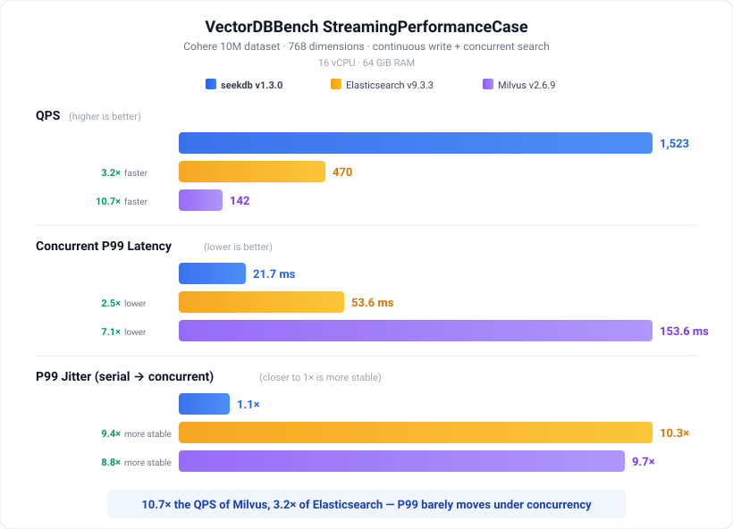
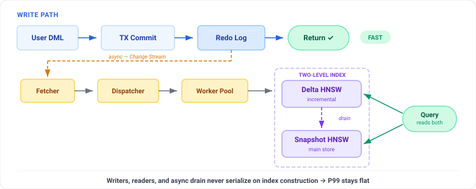

<div align="center">

<picture>
  <source media="(prefers-color-scheme: dark)" srcset="https://mdn.alipayobjects.com/huamei_ytl0i7/afts/img/A*pKqtRILxGioAAAAAQLAAAAgAejCYAQ/original" width="420">
  <source media="(prefers-color-scheme: light)" srcset="https://mdn.alipayobjects.com/huamei_ytl0i7/afts/img/A*6BO4Q6D78GQAAAAAQFAAAAgAejCYAQ/original" width="420">
  
</picture>

# **写入 · 搜索 · Fork · AI Agent 的状态存储**

<p>
    <a href="https://github.com/oceanbase/seekdb/stargazers">
        
    </a>
    <a href="https://github.com/oceanbase/seekdb/releases">
        
    </a>
    <a href="https://github.com/oceanbase/seekdb/commits">
        
    </a>
    <a href="https://github.com/oceanbase/seekdb/graphs/contributors">
        
    </a>
    <a href="https://github.com/oceanbase/seekdb/issues">
        
    </a>
    <a href="https://github.com/oceanbase/seekdb/blob/HEAD/LICENSE">
        
    </a>
    <a href="https://pepy.tech/projects/pyseekdb">
        
    </a>
    <a href="https://discord.gg/74cF8vbNEs">
        
    </a>
    <a href="https://docs.seekdb.ai/">
        
    </a>
    <a href="https://deepwiki.com/oceanbase/seekdb">
        
    </a>
    <a href="https://www.linkedin.com/company/oceanbase" target="_blank" rel="noopener noreferrer">
        
    </a>
    <a href="https://www.youtube.com/@OceanBaseDB">
        
    </a>
</p>

MySQL 兼容 · 嵌入式 / 服务器双模式 · 向量 + 全文混合搜索 · COW 沙箱

⚡ 流式写入 + 搜索达 1,523 QPS（10× Milvus，3× Elasticsearch）<br>
🌿 FORK/MERGE 沙箱，Agent 安全探索、自由回滚<br>
🔍 向量 + 全文 + 标量，一条 SQL 搞定<br>
🐬 完整 ACID，MySQL 协议，原生对接 LangChain / LlamaIndex / Dify

[English](README.md) | **中文版** | [日本語](README_JP.md)

[30 秒体验](#30-秒体验) · [快速开始](#快速开始) · [为什么选择 seekdb](#为什么-ai-agent-要选择-seekdb) · [生态系统](#生态系统与集成) · [开发](#开发)

<sub>如果你觉得 seekdb 有用，请给一个 <a href="https://github.com/oceanbase/seekdb/stargazers">star</a> — 让更多人发现这个项目。</sub>

---

</div>

## ⚡ 性能一览

<div align="center">
  
</div>

> 📖 [阅读发布博客 →](docs/blog/launch_blog_zh.md) · 🔁 [复现基准测试 →](https://github.com/oceanbase/vdb-streambench)

---

<a id="30-秒体验"></a>

## ⏱️ 30 秒体验

<div align="center">
  
</div>

```bash
pip install -U pyseekdb   # pyseekdb 是 seekdb 的 Python SDK
```

> 📋 [查看 demo.py 源码 →](images/demo.py)

无需服务器、无需定义 Schema、无需配置 Embedding。嵌入式模式直接在进程内运行；一行代码切换到服务器模式或 OceanBase 分布式模式。[更多示例 →](#更多示例)

---

<a id="为什么-ai-agent-要选择-seekdb"></a>

## ✨ 为什么 AI Agent 要选择 seekdb？

### 🔥 流式写入 + 并发搜索，P99 零毛刺

Agent 工作负载的核心特征是持续写入 + 毫秒级读取。seekdb 的**异步索引流水线（Change Stream）**将 DML 与索引构建解耦，**两级 HNSW**（增量 + 快照）让新写入的向量立即可搜索。

<div align="center">
  
</div>

写入路径提交即返回，*无需等待*索引构建。Change Stream 流水线异步消费 redo 日志并更新增量 HNSW。查询同时命中增量索引和快照索引，通过细粒度读锁保证隔离 — **这就是高并发下 P99 依然平稳的关键。**

> **实测结果：1,523 QPS，并发 P99 仅 21.7 ms — QPS 达 Milvus 的 10.7 倍；并发提升时 P99 波动仅 1.1 倍（同等负载下 ES / Milvus 约为 10 倍）。**

<sub>源码: [`src/observer/change_stream/`](src/observer/change_stream/) · [`src/observer/vector_index/`](src/observer/vector_index/)</sub>

### 🌿 写时复制沙箱，Agent 自由探索

`FORK DATABASE` 秒级完成整库快照 — 零数据拷贝。Agent 在沙箱中自由实验（写入、查询、甚至破坏表结构均可）；随后 `MERGE TABLE` 将成果合并回主线，或 `DROP DATABASE` 一键丢弃。内核级 COW 实现，而非应用层的保存/恢复。

```sql
-- 秒级快照，无数据拷贝
FORK DATABASE agent_state TO agent_sandbox_42;

-- Agent 在沙箱中自由读写...
USE agent_sandbox_42;
INSERT INTO memory (session_id, embedding, content) VALUES (...);

-- 将成果合并回主线（策略：FAIL / THEIRS / OURS）
MERGE TABLE agent_sandbox_42.memory INTO agent_state.memory STRATEGY THEIRS;
-- ...或直接丢弃：
DROP DATABASE agent_sandbox_42;
```

<sub>源码: [`tools/deploy/mysql_test/test_suite/fork_table/`](tools/deploy/mysql_test/test_suite/fork_table/)</sub>

### 🔍 一条 SQL 完成混合搜索

向量 + 全文 + 标量过滤统一下推至同一执行计划。告别客户端 N+1 合并，告别胶水代码拼接结果。

```sql
SELECT id, title, l2_distance(emb, '[0.12,0.34,...]') AS dist
FROM docs
WHERE MATCH(content) AGAINST('quarterly report')
  AND author_id = 42
  AND created_at > '2026-01-01'
ORDER BY dist APPROXIMATE LIMIT 10;
```

### 🐬 MySQL 兼容、ACID、可嵌入

基于成熟的 OceanBase SQL 引擎构建。可作为嵌入式库、单节点服务器或 OceanBase 分布式集群运行。完整 ACID，实时写入，开箱即用的 MySQL 生态。

---

<a id="快速开始"></a>

## 🎬 快速开始

### 安装

选择你的平台：

<details open>
<summary><b>☁️ 云服务（零安装）</b></summary>

一条 curl 命令，即刻获得运行中的数据库 — 无需注册，无需信用卡。

```bash
curl -X POST https://d0.seekdb.ai/api/v1/instances
```

免费使用 7 天。[了解更多 →](https://d0.seekdb.ai)

</details>

<details open>
<summary><b>🐍 Python（推荐用于 AI/ML）</b></summary>

```bash
pip install -U pyseekdb
```

</details>

<details>
<summary><b>🐳 Docker（快速测试）</b></summary>

```bash
docker run -d \
  --name seekdb \
  -p 2881:2881 \
  -p 2886:2886 \
  -v ./data:/var/lib/oceanbase \
  oceanbase/seekdb:latest
```
请参考此 Docker 镜像的[文档](https://github.com/oceanbase/docker-images/blob/main/seekdb/README.md)获取详细信息。

</details>

<details>
<summary><b>📦 二进制文件（独立安装）</b></summary>

```bash
# Linux（一键安装，可能需要 sudo）
curl -fsSL https://obportal.s3.ap-southeast-1.amazonaws.com/download-center/opensource/seekdb/seekdb_install.sh | bash

# macOS（Homebrew）
brew tap oceanbase/seekdb
brew install seekdb
```

DEB/RPM 离线安装和配置详情请参见[部署文档](https://docs.seekdb.ai/seekdb/deploy-by-systemd/)。

</details>

<a id="更多示例"></a>

### 📝 更多示例

完整的 Python SDK 指南 — 连接模式、嵌入函数、元数据过滤 — 请参见 [pyseekdb 用户指南](https://github.com/oceanbase/pyseekdb)。

<details open>
<summary><b>🤖 Agent 记忆模式（持续写入 + 即时检索）</b></summary>

Agent 的经典循环：写入一条观察，毫秒后检索相关上下文，周而复始。seekdb 的异步索引流水线确保在持续并发下读写两端均保持高吞吐。

```python
import pyseekdb

client = pyseekdb.Client(path="./agent_state.db")
memory = client.get_or_create_collection(name="episodic")

for step in agent.run():
    # 持久化观察结果
    memory.upsert(ids=[step.id], documents=[step.observation])

    # 检索相关上下文 — 写入后毫秒级返回，
    # 由增量 HNSW 提供服务（无需等待后台重建）
    relevant = memory.query(query_texts=step.next_query, n_results=5)

    agent.act(relevant)
```

</details>

<details>
<summary><b>🗄️ SQL — Schema + 混合搜索</b></summary>

```sql
-- 包含向量列、全文索引和 HNSW 向量索引的表
CREATE TABLE articles (
  id        INT PRIMARY KEY,
  title     TEXT,
  content   TEXT,
  embedding VECTOR(384),
  FULLTEXT INDEX idx_fts (content) WITH PARSER ik,
  VECTOR   INDEX idx_vec (embedding) WITH (DISTANCE=l2, TYPE=hnsw, LIB=vsag)
) ORGANIZATION = HEAP;

-- 混合搜索：向量相似度 + 全文匹配在一条查询中完成
SELECT id, title,
       l2_distance(embedding, '[0.12, 0.34, ...]') AS dist
FROM articles
WHERE MATCH(content) AGAINST('quarterly report')
ORDER BY dist APPROXIMATE
LIMIT 10;
```

Python 开发者可通过 SQLAlchemy 或任何 MySQL 驱动来访问。

</details>


## 📚 使用场景

<details open>
<summary><b>🎯 Agent AI — 记忆、沙箱与状态</b></summary>

Agent 需要一个能够支撑持续写入记忆、毫秒级检索、分支探索以及出错即回滚的状态存储。seekdb 正是为此而生：

- **流式友好** — 写入即可查，毫秒级可见
- **COW 沙箱** — `FORK DATABASE` 安全实验，`MERGE` 接受成果，`DROP` 一键回滚
- **混合检索** — 向量 + 全文 + 结构化，一条 SQL 搞定
- **MySQL 协议** — 原生兼容 LangChain、LlamaIndex、Dify

个人助手 · 企业自动化 · 垂直领域 Agent · Agent 平台

</details>

<details>
<summary><b>🧩 其他使用场景</b></summary>

seekdb 的混合检索 + 多模引擎同样适用于经典 AI 工作负载：

- **📖 RAG 与知识检索** — 向量 + 全文 + 标量过滤，支持多级访问控制。*企业问答、客服、行业洞察、个人知识库。*
- **🔍 语义搜索** — 基于嵌入向量的文本、图像及多模态搜索。*商品搜索、以文搜图、以图搜商品。*
- **💻 AI 辅助编程** — 语义代码搜索、多项目隔离、时间旅行查询，适用于 IDE 插件和代码 Agent。*本地 IDE、Web IDE、设计转代码。*
- **⬆️ 企业应用智能化** — MySQL 兼容的 AI 层，适用于遗留系统，支持行列混合存储。*文档智能、业务洞察、金融系统。*
- **📱 端侧与边缘 AI** — 嵌入式/微服务器模式，适用于资源受限设备。*车载系统、AI 教育、伴侣机器人、医疗设备。*

</details>

---

<a id="生态系统与集成"></a>

## 🌟 生态系统与集成

<div align="center">

<p>
    <a href="https://github.com/langchain-ai/langchain/pulls?q=is%3Apr+is%3Aclosed+oceanbase">
        
    </a>
    <a href="https://github.com/run-llama/llama_index/pulls?q=is%3Apr+is%3Aclosed+oceanbase">
        
    </a>
    <a href="https://github.com/langgenius/dify/pulls?q=is%3Apr+is%3Aclosed+oceanbase">
        
    </a>
    <a href="https://github.com/langchain-ai/langchain/pulls?q=is%3Apr+is%3Aclosed+oceanbase">
        
    </a>
    <a href="https://github.com/coze-dev/coze-studio/pulls?q=is%3Apr+oceanbase+is%3Aclosed">
        
    </a>
    <a href="https://huggingface.co">
        
    </a>
</p>

<sub>+ Camel-AI · DB-GPT · FastGPT · Firecrawl · Spring-AI-Alibaba · Cloudflare Workers AI · Jina AI · Ragas · Instructor · Baseten — 完整列表请参见[用户指南](https://docs.seekdb.ai/seekdb/seekdb-overview)。</sub>

</div>

---

## 🌐 下一步与社区

- 📖 **[阅读文档 →](https://docs.seekdb.ai/)** — 快速开始、API 参考、集成指南
- 📝 **[发布博客 →](docs/blog/launch_blog_zh.md)** — Milvus 10.7 倍 QPS 背后的架构
- 🐛 **[提交 Issue →](https://github.com/oceanbase/seekdb/issues)** — 报告 Bug、请求功能
- 🤝 **[参与贡献 →](CONTRIBUTING.md)** — 共建 Agent 时代的状态存储

<div align="center">

<p>
    <a href="https://discord.gg/74cF8vbNEs">
        
    </a>
    <a href="https://github.com/oceanbase/seekdb/discussions">
        
    </a>
    <a href="https://ask.oceanbase.com/">
        
    </a>
</p>

</div>

---

<a id="开发"></a>

## 🛠️ 开发

### 从源码构建

构建之前，请先根据操作系统安装所需的工具链和依赖。详见[安装工具链](docs/developer-guide/zh/toolchain.md)。

```bash
# 克隆仓库
git clone https://github.com/oceanbase/seekdb.git
cd seekdb
source ~/.bashrc
./build.sh release --init --make
mkdir -p ~/seekdb/bin
cp build_release/src/observer/seekdb ~/seekdb/bin
cd ~/seekdb
./bin/seekdb
```

本例中工作目录为 $HOME/seekdb，请使用一个全新的空目录进行测试。详细说明请参见[开发者指南](docs/developer-guide/zh/README.md)。

### 贡献

我们欢迎贡献！请查看[贡献指南](CONTRIBUTING.md)开始。

<a href="https://github.com/oceanbase/seekdb/graphs/contributors">
  
</a>

---

## 📈 Star 历史

<a href="https://star-history.com/#oceanbase/seekdb&Date">
  
</a>

如果 seekdb 对你有帮助，**点个 star 帮助更多人发现它。** ⭐

---

## 📄 许可证

seekdb 由 [OceanBase](https://en.oceanbase.com/) 团队打造 — 与支付宝、淘宝、滴滴、小米等生产环境中运行的数据库同源同核。完全开源，采用 [Apache License, Version 2.0](LICENSE) 许可证。
