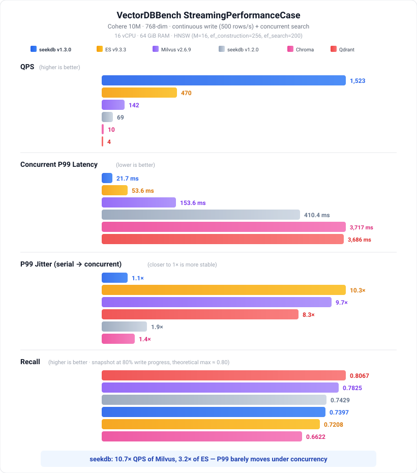

# 你在用错误的 Benchmark 选 Agent 的向量数据库

**Agent 的真实负载是 streaming workload——大多数向量数据库不是为它设计的。**

如果你正在为 Agent 选向量数据库，大概率参考的是 ann-benchmarks 或者各家官方发的性能对比。那些测试跑的是这样的负载：先批量导入全部数据，建好索引，再做只读查询。

**这不是 Agent 的负载。**

Agent 的真实负载是这样的：

```python
for step in agent.run():
    memory.write(step.observation)        # 持续写入
    relevant = memory.search(step.query)  # 毫秒后检索
```

写入和检索同时发生，间隔是毫秒级，而且是并发的。这套负载有个名字——streaming workload。[VectorDBBench](https://github.com/zilliztech/VectorDBBench) 专门为此设计了 StreamingPerformanceCase：固定速率持续写入 + 并发查询，跟生产环境的 Agent 一模一样。

VectorDBBench 由 Zilliz（Milvus 背后的公司）维护，是一个第三方开源 benchmark 框架。我们用它测了 6 款主流向量数据库。

---

## 一个被忽略的指标：并发下你的 P99 会涨多少？

测试条件：Cohere 10M 数据集（768 维），16 vCPU / 64 GiB，统一 HNSW 索引参数（M=16 / ef_construction=256 / ef_search=200），持续写入 500 行/秒。



大多数人看 benchmark 只看 QPS 和串行延迟。但 Agent 在生产环境里不是单线程运行的。**真正决定你 SLA 的是并发 P99——以及它在并发加大后涨了多少倍。**

看图里"P99 Jitter"那组：

- **ES：10.3 倍**——串行 P99 只有 5.2ms（比 seekdb 快），但并发一开就涨到 53.6ms
- **Milvus：9.7 倍**——串行 15.9ms，并发直接飙到 153.6ms
- **seekdb：1.1 倍**——从 19.7ms 到 21.7ms，几乎不动

这不是参数调优的问题——是架构问题。下一节详细解释。

> 完整测试脚本和配置：[github.com/oceanbase/vdb-streambench](https://github.com/oceanbase/vdb-streambench)，欢迎提 PR 补充更多产品。

---

## 为什么 streaming 负载下 P99 会炸

Milvus、ES、Qdrant 在它们擅长的场景（批量导入 + 只读查询）下表现优秀——它们本来就是为那个场景设计的。但 streaming 写入会暴露一个结构性的问题：不断产生新的 segment。查询时需要 fanout 到 N 个 segment 分别做 knn 再合并结果。单线程下勉强可控，**并发一上来，N 个 segment × M 个查询线程在 CPU 上互相争抢，P99 就会飙升。**

**大多数向量数据库的索引段数量会随 streaming 写入膨胀，并发查询的争抢越来越严重。seekdb 的索引数量是固定的（永远只有两个），所以不会。**

具体来说，seekdb v1.3.0 为 streaming 负载设计了两个机制：

**第一，写入路径不碰索引。** 事务提交后只写 redo log 就返回。一条独立的 Change Stream 管道在后台异步消费 redo log，把向量写入内存中的 delta HNSW 索引。写入和索引构建物理上完全解耦——写入不会被索引构建阻塞。

**第二，查询路径固定只走两个索引。** seekdb 维护一个 delta HNSW（增量层，接收新写入）和一个 snapshot HNSW（主存量层），类似 LSM-Tree 的分层思路。查询时对两个索引各做一次 knn search 再合并结果——不管写入了多少数据，索引数量不膨胀，并发查询不争抢。

我们自己踩过这个坑。图里 seekdb v1.2.0 那组——69 QPS、并发 P99 410ms——就是我们在做架构重写之前的成绩。旧版本的写入路径会同步构建索引，跟上面说的传统架构是同一个问题。重写后，同一个产品，QPS 提升 22 倍、P99 延迟降低至原来的 1/19，全部来自这两个机制。

---

## Agent 需要的不只是快——还需要后悔药

性能讲完了。但做过 Agent 的人都知道，还有一个痛点：Agent 需要试探性地修改数据（改 memory、跑实验、可能写坏表），**你需要一个安全的沙箱和回滚机制。**

大多数向量数据库没有这个概念。seekdb 直接在内核实现了 Copy-on-Write：

```sql
-- 亚秒级快照，不复制数据
FORK DATABASE agent_state TO sandbox_42;

-- Agent 在沙箱里随便折腾
USE sandbox_42;
INSERT INTO memory (embedding, content) VALUES ('[0.1,...]', 'new observation');

-- 试探成功 → merge 回主线
MERGE TABLE sandbox_42.memory INTO agent_state.memory STRATEGY THEIRS;

-- 试探失败 → 扔掉，主线不受影响
DROP DATABASE sandbox_42;
```

这是内核级 COW，不是应用层的 snapshot/restore。fork 秒级完成，不复制数据，每个沙箱是完整可写的数据库（表结构、向量索引、自增列全部正常）。三种冲突策略（`FAIL` / `THEIRS` / `OURS`）让你精确控制 Agent 的修改有多少可以被信任。同时支持 `FORK DATABASE` 和 `FORK TABLE` 两种粒度。

---

## 一条 SQL 完成混合检索

Agent 的检索通常不是纯向量相似度。你可能需要同时过滤作者、时间范围，再加上全文匹配。在 seekdb 里，这是一条 SQL 的事：

```sql
SELECT id, title, l2_distance(emb, '[0.12,0.34,...]') AS dist
FROM docs
WHERE MATCH(content) AGAINST ('quarterly report')
  AND author_id = 42
  AND created_at > '2026-01-01'
ORDER BY dist APPROXIMATE LIMIT 10;
```

向量 + 全文 + 标量过滤在同一个执行计划里下推，不需要客户端拼装多次查询结果。完整 MySQL 协议兼容，LangChain / LlamaIndex / Dify / 任何 MySQL 客户端直接对接。

---

## 30 秒试一下

```bash
pip install -U pyseekdb
```

```python
import pyseekdb

client = pyseekdb.Client(path="./agent_state.db")
memory = client.get_or_create_collection(name="episodic")

# 第一轮：写入 Agent 观察
memory.upsert(
    ids=["1", "2", "3"],
    documents=[
        "user prefers dark mode",
        "user speaks English and Chinese",
        "user timezone is UTC+8",
    ],
)
memory.refresh_index()

results = memory.query(query_texts="ui preferences?", n_results=1)
print(results["documents"])
# -> [['user prefers dark mode']]

# 第二轮：写入新观察，刷新索引后立即可查
memory.upsert(ids=["4"], documents=["user saw pricing page 3 times today"])
memory.refresh_index()

results = memory.query(query_texts="purchase intent signals", n_results=1)
print(results["documents"])
# -> [['user saw pricing page 3 times today']]
```

无需 server，无需 schema，嵌入式模式在进程内运行。写入走异步索引管道（和 server 模式相同的架构），需要立即查询时调一次 `refresh_index()` 确保索引就绪。切换到 server 或分布式模式只需改一行连接参数。也可以用 [Cloud 免安装试用](https://d0.seekdb.ai)（免注册，免费 7 天，一个 curl）。

---

## 关于 seekdb

seekdb 完全开源（Apache 2.0），由 [OceanBase](https://www.oceanbase.com/) 团队开发。你可能已经在用 OceanBase 了——它跑在支付宝、淘宝、滴滴、小米等公司的生产环境里。seekdb 继承了同一套存储引擎和 SQL 执行器，专注于 Agent 场景的向量 + 关系型混合负载——开源以来已获 2,500+ GitHub star，LangChain / LlamaIndex / Dify / Coze 等主流框架均已集成。

---

如果你正在为 Agent 选数据库——花 30 秒跑一下上面的 demo。

**⭐ [github.com/oceanbase/seekdb](https://github.com/oceanbase/seekdb)** — 一个 star 让更多人发现这个项目，也让我们有动力继续投入。

遇到问题或想讨论你的 Agent 场景：[GitHub Issues](https://github.com/oceanbase/seekdb/issues) · [GitHub Discussions](https://github.com/oceanbase/seekdb/discussions)
