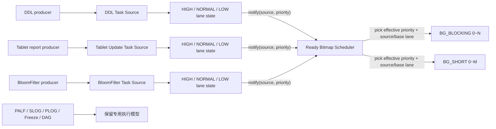

# seekdb 后台任务共享线程池设计

> 状态：设计草案
>
> 适用范围：seekdb 小规格模式优先
>
> 相关分析：[seekdb 小规格空载线程分析](idle-thread-analysis.md)

## 摘要

seekdb 当前不少后台功能采用“一条业务队列 + 一组固定消费线程”的实现。该方式简单、隔离性好，但在小规格、长期空载场景中会保留较多几乎不工作的线程。

本文建议增加一个租户级 `ObTenantBackgroundExecutor`，用统一接口管理少量可伸缩 worker，并以“任务源（Task Source）”作为调度单位：

- 业务模块继续拥有task key、payload及去重、合并、批处理、重试、屏障等业务语义；
- 符合条件的任务源统一使用 `ObKeyedTaskQueue` 管理task key和生命周期，不再各自预分配不同的固定HashMap、HashSet或指针队列；
- 原来固定在线的消费线程改为向共享执行器注册任务源；
- 任务携带基础优先级，任务源在内部维护 `HIGH/NORMAL/LOW` 可运行 lane；
- 业务入队后只需通知执行器“该任务源的某个 priority lane 可运行”；
- 共享 worker 每次只为一个 `(Task Source, Priority Lane)` 执行一个有限批次，完成后再参与调度；
- worker 数量按需从 0 创建并有明确上限；理想模型在真正无周期 Source 时可回收到 0，当前 mini 实验为避免 pthread churn 保留已经达到的 6 条高水位；
- 短任务和可能阻塞的任务使用不同的物理 worker 组，不能把所有后台任务无差别地塞进一个 FIFO。

首期目标原本只是以较小改动收敛 DDL、BloomFilter、Tablet 元数据更新等低频后台队列。当前实验分支已经进一步接入 DAG scheduler、SLOG、Timer callback、同步 IO 和多类 IO callback；PALF redo `IOWorker`、异步 IO completion、PLOG、TimerSvr、ClockGenerator、DAG worker、SQL 请求执行和 SQL NIO 仍保持原执行模型。

## 背景与问题

空载线程分析中，seekdb 小规格实例启动约 3 分钟后通常有 `64~68` 个线程。除 SQL 网络、日志持久化和系统基础线程外，以下队列 worker 在没有任务时仍然常驻：

| 任务源 | 小规格线程数 | 当前队列特性 | 空载行为 |
|---|---:|---|---|
| `ObDDLScheduler` 的 `DDLTaskExecutor` | 2 | DDL 状态机、重试、允许并发 | 线程等待但不退出 |
| `ObDDLReplicaBuilder` 的 `DdlBuild` | 1 | 深拷贝任务、失败重试 | 线程等待但不退出 |
| `ObTabletTableUpdater` 的 `TbltTblUp` | 1 | 去重、按 group 批处理、屏障、处理中诊断 | 线程等待但不退出 |
| BloomFilter build 的 `BFBuildTask` | 1 | 去重、过期和 GC | 线程等待但不退出 |
| BloomFilter load 的 `MaBlkBFLoad` | 1 | 按 SSTable key 合并多个请求 | 线程等待但不退出 |

这些队列在小规格空载时合计保留 6 个 worker。它们的共同特征是：

1. 任务不是持续到达，很多实例大部分时间队列为空；
2. 任务允许等待少量时间，不要求微秒级唤醒；
3. 各模块分别创建线程，峰值并发上限简单相加；
4. 每种队列重复实现等待、唤醒、停止和线程命名；
5. 部分队列还会预分配较大的数组、hash map 或优先级队列。

需要注意，线程“空载时不消耗 CPU”不等于没有成本。常驻线程仍会带来线程栈虚拟地址、glibc/pthread 元数据、TLS、调度和诊断复杂度，也会使小规格实例的线程基线偏高。

## 目标

本设计的目标是：

- 符合条件的后台队列在持续空载后不保留 worker；
- 多个低频业务队列共享少量物理线程；
- 保留现有任务的去重、顺序、批处理、屏障、重试和生命周期语义；
- 迁移队列使用同一种基础存储、lazy create、二倍扩容和空载释放策略；
- 业务容量上限不再直接决定初始化bucket数量，真正无任务时不保留大bucket数组；
- 一个任务源可以包含多种业务任务和多个 priority lane；
- 优先级作用于任务和本次可运行 lane，而不是永久绑定整个任务源；
- 每个任务源可以单独设置总并发和各 priority lane 的并发预算；
- 高优先级任务不会被持续的低优先级任务饿死；
- 阻塞任务不会占满短任务的执行资源；
- 队列和线程数都有明确上限，过载时有可观察的背压；
- 能够逐个模块迁移和回滚，不要求一次性重写所有后台队列；
- 为后续分析提供按池、按任务源的排队时间、执行时间和扩缩容数据。

## 非目标

以下内容仍不在当前实验范围内：

- 不替换 `TimerSvr` 的 deadline 管理；仅把到期 callback 的消费迁入共享池；
- 不替换 SQL 请求 worker、SQL NIO 网络线程或 OMT 调度；
- 不合并 PALF redo `IOWorker`、异步 IO completion 和 PLOG；
- 不替换 DAG worker；DAG scheduler 的协调循环已迁入共享池；
- 不引入协程运行时；
- 不自动识别任务是否阻塞，任务类型必须在注册时明确声明；
- 不提供通用 `future.get()` 式同步等待接口，避免 worker 相互等待造成线程池死锁；
- 首期不保证普通模式的全部固定线程池都迁移，优先验证小规格模式。

## 现有基础设施评估

### `ObSimpleThreadPool` / `ObLinkQueueThreadPool`

`deps/oblib/src/lib/thread/ob_simple_thread_pool.h` 已经提供了可复用的动态 worker 骨架：

- worker 数量可以设置为 `min~max`；
- 入队时没有空闲 worker 会尝试增加一个线程；
- worker 空闲后可以收缩；
- 停止的 worker 由全局 `qth_mgr` 定期回收；
- 支持 `MTL_CTX()` run wrapper。

它适合作为物理 worker 的基础，但不能直接作为完整方案，原因是：

- 只有一个 FIFO，不能表达业务优先级和任务源公平；
- 每次入队的是单个任务，无法保留 `ObDedupQueue`、`ObUniqTaskQueue` 的复合语义；
- 当前收缩依据是“某一个 worker 连续 pop 超时”，高频低负载任务可能让多个 worker 轮流被唤醒，长期无法回收；
- 扩容失败路径会持续重试创建 worker，需要改为失败后回滚计数并返回错误；
- 当前 `push()` 即使入队失败也可能尝试扩容，应只在成功产生 runnable work 后扩容。

因此，本设计复用它的 worker 创建、线程上下文和统一回收能力，在上层增加任务源调度，并调整扩缩容策略。

### `ObDedupQueue`

`ObDedupQueue`把多项职责放在一个类中：

- 固定消费线程；
- 固定容量指针队列；
- 对waiting、running以及完成后未过期任务进行查重的task map；
- deep copy allocator；
- 完成后的保留和过期GC。

以BloomFilter为例，task map和指针队列都按10000初始化。即使没有任务，bucket数组和队列指针数组也已经分配。它的核心业务语义应保留，但不能只替换固定线程而原样保留预分配容器。

### `ObUniqTaskQueue`

`ObUniqTaskQueue`支持：

- 等待队列去重；
- 按 group 轮转和批处理；
- `need_process_alone()`；
- barrier；
- waiting/processing task 诊断。

它当前使用 `task_set_`保存和去重waiting task，任务被claim时从 `task_set_`删除，再插入 `processing_task_set_`防止同key并发执行。因此，它允许一个key处于“一个running task加一个pending task”的状态。`group_map_`则负责group id到group队列的索引。

初始化时 `task_set_`的bucket数直接使用业务 `queue_size`，`group_map_`固定128，`processing_task_set_`按batch size乘线程数创建。Tablet updater在小规格下的 `queue_size`为50000，因此即使没有waiting task，也会保留较大的bucket数组。

这些语义不能被一个普通共享FIFO替代，但也不需要三套彼此独立的索引。`task_set_`、`processing_task_set_`和 `group_map_`暴露了实现手段，职责和去重范围不够直观。迁移时应把它们表达为统一task registry中的pending/running状态和可选group索引。

### `ObOccamThreadPool`

`ObOccamThreadPool` 已经支持五级优先级和 future，但不适合作为本方案的直接基础：

- 初始化时创建全部固定线程；
- 五个优先级分别预分配完整队列；
- worker 始终从最高优先级向下扫描，持续高优任务可能使低优任务饥饿；
- 没有任务源并发限制、Sequence、aging 和动态回收。

它的“提交函数任务”接口适合短小异步调用，不适合直接承载当前这些带有复杂队列语义的后台模块。

### 结论

采用以下组合：

```text
ObSimpleThreadPool / ObAdaptiveWorkerPool
  提供物理 worker 的创建、上下文、等待和回收

ObTenantBackgroundExecutor
  提供任务源注册、优先级、公平调度、并发限制和观测

ObKeyedTaskQueue
  提供统一task registry、priority lane、group、retention和自适应存储

业务 Task Source
  定义task key、重复策略、批处理、屏障、重试和业务处理逻辑
```

## 核心概念

### 物理线程池

物理线程池是实际 OS worker 的集合。一个统一的后台执行器内部可以有多个物理线程池，避免不同资源特征互相干扰：

| Pool | 接受的任务 | 小规格建议范围 | 说明 |
|---|---|---:|---|
| `BG_SHORT` | 明确不会长时间阻塞的短控制任务 | `0~2` | 单次执行建议不超过 10ms |
| `BG_BLOCKING` | 可能访问存储、SQL、RPC、锁等待或执行较长计算的任务 | `0~3` | 首批迁移对象主要进入该池 |

“统一线程池”在本设计中指统一注册、调度和观测接口，不表示所有任务必须共用同一组 OS 线程。短任务与阻塞任务分池是必要的故障隔离。

首期可以只创建 `BG_BLOCKING` 的对象；其最小线程数为 0，因此仅初始化执行器不会新增常驻线程。`BG_SHORT` 等出现明确迁移对象时再启用。

### 任务源

任务源表示一个业务队列及其语义所有者，而不是单个任务，也不等价于某一种 Task Type。它负责：

- 接收和保存业务任务；
- 判断重复、过期和是否可执行；
- 选择一个任务或一个批次；
- 处理完成、失败重试和资源释放；
- 提供各 priority lane 的 pending 数和最老任务时间等诊断数据。

一个任务源可以包含多种 Task Type。例如 DDL 任务源内部可以同时存在不同的 DDL 状态机任务；它们共享任务内存、停止、去重或顺序语义，但调度优先级不一定相同。

例如，整个 `BFBuildTask` 去重队列可以是一个任务源，Tablet 元数据更新队列也可以是一个任务源。共享执行器只保存任务源和 priority lane 的可运行状态，不保存其全部业务任务。

这样做有两个直接收益：

1. 不需要把现有复杂队列展开成一个全局任务队列；
2. 调度状态与任务源数量和priority数量相关，而不是与所有业务任务总数相关。

### Source Slot

每个已注册任务源占用一个 `SourceSlot`。接口支持动态注册和注销，以适配租户、可选模块和初始化失败回滚；实际运行时任务源数量很少，通常在模块初始化后长期存在，频繁变化的是Source内部的业务任务。

首期可以使用固定小数组，例如16或32个slot：

```cpp
struct ObBgSourceSlot
{
  ObIBackgroundTaskSource *source_;
  ObBgTaskSourceConfig config_;
  ObBgPriorityLaneState lanes_[3];
  int64_t running_count_;
  int64_t running_count_by_priority_[3];
  uint64_t generation_;
};
```

`SourceHandle`包含slot编号和generation，避免slot注销、复用后旧handle误通知新Source。

一个Source存在三级优先级时仍然只占一个Source Slot、一个Source对象和一套业务队列资源。增加的只是三份轻量lane状态，不应预分配三套完整task map、allocator或队列容量。

### Priority Lane

任务携带基础优先级；任务源根据自己的顺序和业务规则，将ready task暴露到 `HIGH/NORMAL/LOW` lane：

```cpp
struct ObBgPriorityLaneState
{
  int64_t ready_count_;
  int64_t oldest_enqueue_ts_;
  int64_t running_count_;
  uint64_t state_generation_;
};
```

priority lane是调度视图，不要求业务队列一定复制成三个完整容器：

- 可重排的独立任务可以共享一个allocator，并使用三个链表头；
- 严格FIFO/Sequence任务只能暴露当前队头所在的lane，高优任务不能越过其依赖；
- task registry、group、barrier和总容量仍由Source统一维护；
- `HIGH + NORMAL + LOW`的任务总数受同一个Source容量约束。

Task Type回答“任务是什么、如何处理”；Priority Lane回答“Source下一次以什么优先级获得执行机会”。二者不能混为一谈。

lane的 `base_priority` 在任务进入业务队列时确定。aging只生成本次调度使用的 `effective_priority`，不能改变任务归属的lane；worker最终仍把原始lane传给Source，避免提升后的LOW任务被误当成HIGH业务任务处理。

### Keyed Task Queue与Task Registry

`ObKeyedTaskQueue`是任务源内部统一的任务存储和生命周期管理核心，不创建worker，也不参与不同Source之间的全局调度。所有迁移队列使用同一实现，不允许 `ObDedupQueue`、`ObUniqTaskQueue`等adapter各自选择不同的HashMap、初始bucket或扩容算法。

每个Source只有一个 `task_registry_`，key至少包含Source内部Task Type和业务key。registry跨越三级priority lane，不能HIGH、NORMAL、LOW各建一张去重表：

```cpp
struct ObTaskRecord
{
  ObTaskKey key_;
  ObITask *pending_task_;
  ObITask *running_task_;
  ObBgTaskPriority pending_priority_;
  int64_t retain_until_ts_;
  ObDLink lane_link_;
  ObDLink group_link_;
  ObDLink retain_link_;
};
```

一个key的生命周期可以表示为：

```text
EMPTY -> PENDING -> RUNNING -> RETAINED -> ERASED
                    +
                  PENDING
```

其中 `RUNNING + PENDING`表示一个任务执行期间，同key允许保留一个下一轮任务。Task Record中的状态代替独立的waiting set和processing set；priority lane、group队列和retention队列只保存record的侵入式链接，不拥有另一份task key。

Task Source通过policy定义语义差异：

```cpp
enum class ObDuplicateAction
{
  REJECT,
  MERGE,
  REPLACE,
  MARK_RERUN
};

struct ObTaskDuplicatePolicy
{
  bool allow_pending_while_running_;
  ObDuplicateAction pending_duplicate_action_;
  bool retain_key_after_completion_;
};
```

现有 `ObDedupQueue`对应“running期间不允许pending、完成后按任务过期时间保留key”；现有 `ObUniqTaskQueue`对应“每个key最多一个pending和一个running、running期间允许再次pending、完成后不保留key”。策略只改变状态迁移，不改变基础容器和扩容方式。

### Ready Bitmap与Dispatch Token

Executor真正选择的是 `(SourceSlot, PriorityLane)`，而不是整个Source。这个二元组可以视为逻辑上的dispatch token，不要求每次调度都申请一个对象。

当Source数量不超过64时，建议每个物理pool维护三级ready bitmap：

```cpp
uint64_t ready_sources_[3];  // 按 base priority lane 索引
int64_t rr_cursor_[3];       // 按 effective priority 索引
```

第N位表示slot N的对应base priority lane存在ready task，并且仍有可用并发额度。同一个Source的不同lane可以同时在不同bitmap中置位，但它们仍共享一个Source Slot、总并发和业务队列容量。

worker根据base bitmap和lane最老等待时间得到少量effective-priority候选，再按加权策略选择effective priority。调度器先把该等级的候选lane合并成Source bitmap，在同级Source之间round-robin；选中Source后，才从它符合条件的lane中确定一个base lane，最终得到明确的 `(SourceSlot, BasePriorityLane)`。同一Source有多个lane进入同一effective priority时仍只占一个同级轮转位置，不会因此获得多倍Source份额。该过程最多检查 `Source数 × 3` 份轻量元数据，不遍历各Source中的业务任务。

如果实现选择intrusive ready node，也只需要每个Source lane一个轻量静态节点，或者按 `max_concurrency` 预留少量执行许可；不能为每个业务任务创建dispatch对象。ready bitmap是首期更简单的建议实现。

### Sequence

Sequence 是逻辑串行关系，不绑定某个固定线程。属于同一 Sequence 的任务满足：

- 按该任务源定义的顺序取出；
- 任意时刻最多一个任务在执行；
- 前一个任务结束后，下一个任务可以由另一条物理线程执行。

首期使用“任务源级 `max_concurrency=1`”表达Sequence。对于严格Sequence，只有队头任务的priority lane可以置为ready；priority不能破坏依赖顺序。后续如果一个任务源内部需要“不同key并行、同一key串行”，再增加 `sequence_key`，不作为首期前置条件。

## 总体架构



关键点是scheduler调度 `(SourceSlot, PriorityLane)`，而不是把所有业务任务复制到三条公共队列，也不是把一个业务Source复制成三个完整Source。

## 接口设计

以下接口是建议形态，名称可以在实现时按现有代码规范调整。

```cpp
enum class ObBgTaskPriority
{
  HIGH,
  NORMAL,
  LOW
};

enum class ObBgExecutionClass
{
  SHORT,
  MAY_BLOCK
};

enum class ObBgShutdownPolicy
{
  DRAIN,
  CANCEL_PENDING,
  DROP_BEST_EFFORT
};

struct ObBgTaskSourceConfig
{
  const char *name_;
  ObBgTaskPriority default_priority_;
  ObBgExecutionClass execution_class_;
  ObBgShutdownPolicy shutdown_policy_;
  int64_t max_concurrency_;
  int64_t max_concurrency_by_priority_[3];
  int64_t batch_limit_;
  int64_t time_slice_us_;
};

struct ObBgRunResult
{
  int64_t processed_count_;
  bool has_more_ready_in_lane_;
  int64_t next_ready_ts_;
};

class ObIBackgroundTaskSource
{
public:
  virtual int process_one_quantum(
      ObBgTaskPriority base_priority,
      ObBgRunResult &result) = 0;
  virtual bool has_ready_task(ObBgTaskPriority base_priority) const = 0;
  virtual int64_t pending_count(ObBgTaskPriority base_priority) const = 0;
  virtual int64_t oldest_enqueue_ts(ObBgTaskPriority base_priority) const = 0;
  virtual void cancel_pending() = 0;
};

class ObTenantBackgroundExecutor
{
public:
  int register_source(
      ObIBackgroundTaskSource &source,
      const ObBgTaskSourceConfig &config,
      ObBgTaskSourceHandle &handle);
  int notify(
      const ObBgTaskSourceHandle &handle,
      ObBgTaskPriority base_priority);
  int unregister_source(
      ObBgTaskSourceHandle &handle,
      ObBgShutdownPolicy policy);
};
```

`default_priority_`只用于没有显式调度等级的任务，不表示整个Source固定使用该优先级。首期不提供任意 lambda、future 和同步wait。业务任务的所有权仍由任务源管理，避免额外堆分配，也避免worker在同一线程池内等待另一个任务完成。

## 入队与唤醒

业务入队流程如下：

```text
producer
  -> source.add_task()
       -> 在业务队列中完成深拷贝/去重/合并/顺序判断
       -> 确定本任务可进入的 priority lane
       -> lane 从不可运行变为可运行
       -> executor.notify(source_handle, priority)
            -> 设置 ready_sources_[base_priority] 中的 source bit
            -> 必要时启动一个 worker
```

`notify()`是提示而不是业务任务本身。重复通知必须是幂等的，只更新ready bit和lane元数据，不能重复计算pending，也不能让同一任务被执行多次。

任务源状态至少包含：

- `REGISTERED / STOPPING / UNREGISTERED`；
- slot generation；
- pending epoch；
- 三级priority lane的ready、oldest timestamp和running状态；
- Source总running数和各priority running数；
- delayed wakeup状态。

必须保持以下不变量：

> 只要某个Source lane存在ready task，并且Source总并发和该lane并发都未达到上限，对应Source bit就必须在有效调度视图中，或者某个正在运行的worker会在退出前再次检查并恢复该bit。

worker 完成最后一次检查和 producer 新增任务之间需要通过同一把锁或 epoch/CAS 协议衔接，以避免 lost wakeup。

## 调度策略

### 优先级

首期只保留三级调度优先级：

| 优先级 | 含义 |
|---|---|
| `HIGH` | 影响前台可用性、控制路径或有明确短等待SLA的任务 |
| `NORMAL` | 普通后台状态推进和元数据更新 |
| `LOW` | BloomFilter等可延迟优化或维护任务 |

Task Source不再配置唯一固定priority。具体Task携带 `base_priority`，Source把ready task组织到相应lane；Executor调度的是 `(SourceSlot, PriorityLane)`。

优先级只决定下一个执行机会，不中断已经开始执行的任务，也不是OS线程的nice值。一个LOW任务已经占用worker后，后来到达的HIGH任务只能使用空闲worker、触发允许范围内的扩容，或者等待当前任务返回。

### Source与Priority的配合

worker获取工作时不遍历所有Source的业务任务，而只查看ready bitmap和少量lane元数据：

```text
1. 根据base bitmap和oldest timestamp计算各lane的effective priority
2. 按权重、aging和并发预算选择effective priority
3. 合并候选lane，在该effective priority的Source之间round-robin
4. 在选中Source内确定一个符合该effective priority的base lane
5. Source.try_acquire(base_priority)检查总并发和lane并发
6. Source.process_one_quantum(base_priority)取并执行一个有限batch
7. 根据该lane是否仍ready，保留或清除bitmap中的bit
```

因此，它不是“遍历完所有Source的HIGH业务队列，找不到任务再遍历NORMAL业务队列”。调度器只检查最多 `Source数 × 3` 个lane状态；选中一个候选后，才调用对应Source一次。若Source数为16，调度视图最多48个候选，与业务任务积压总量无关。

同effective priority下使用 `rr_cursor_[priority]` 轮转Source，不能每次都从slot 0开始，否则编号较小且持续积压的Source会压住同级其他Source。同一Source有多个base lane进入相同effective priority时，优先选择最老ready task；时间相同再选择较高base priority。

当Source已经达到总并发上限，或该base priority达到lane并发上限时，暂时清除对应ready bit；任务完成释放额度后，如果lane仍有ready task，再恢复bit。

Source内部必须保证同一任务只属于一个调度lane。若任务优先级改变，应原子更新lane状态和generation，避免旧调度状态导致重复执行。

### 公平性与 aging

不能采用“只要 HIGH 不空就永远不看 LOW”的严格优先级扫描。建议使用加权轮转：

```text
HIGH : NORMAL : LOW = 8 : 4 : 1
```

某个priority为空时直接跳过，不让worker空等；同一个Source无论积压1个还是1万个任务，都只按其可用并发额度参与调度，不能用业务任务数量淹没全局调度结构。

aging作用于等待过久的Task或lane，不提升整个Source。建议初始值：

- `NORMAL` lane最老ready task等待超过1秒，临时以 `HIGH` effective priority参与调度；
- `LOW` lane最老ready task等待超过5秒，临时以 `NORMAL` effective priority参与调度；
- 继续等待时可以再提升一级；
- Source可以按业务SLA覆盖阈值。

任务执行完成后，Source根据该lane剩余任务的最老时间重新计算effective priority。新进入的LOW任务不能因为同Source中曾有一个老任务而永久获得NORMAL或HIGH待遇。

首期可以在选择候选时检查ready bitmap对应的少量lane元数据并计算effective priority；如果要求严格在阈值时刻提升，可以复用delayed wakeup触发调度。base bitmap不随aging迁移，claim时记录本次effective priority和原始base lane，确保同一个lane不能被重复获取。

### 同一Source中的多优先级任务

Source如何选择lane必须服从业务顺序：

| 任务关系 | 处理方式 |
|---|---|
| 任务彼此独立、允许重排 | Source可以维护三级ready list，优先执行HIGH |
| 严格FIFO或Sequence | 只暴露队头任务所在lane，HIGH不能越过其依赖 |
| 共享task registry、allocator、barrier | 保留一个Source Slot，在内部维护多个lane |
| 生命周期、Execution Class、队列和停止语义不同 | 拆成不同Source Slot |

一次选中base HIGH lane的quantum只能处理HIGH lane中的任务，不能执行一个HIGH任务后继续drain NORMAL或LOW任务。LOW lane即使因aging以effective HIGH参与调度，worker也仍然只处理LOW lane。两种情况下都不能在一个quantum内切换lane，否则会发生“优先级洗白”。

对于barrier任务，是否继承被阻塞任务的最高优先级属于Source业务策略。首期不在线程池层实现通用priority inheritance；迁移时必须先确认barrier和前后任务的依赖关系。

### 阻塞池并发预算

阻塞任务无法被抢占。如果所有 worker 都在执行低优阻塞任务，后来的 DDL 即使是高优先级也只能等待。因此，小规格 `BG_BLOCKING` 建议设置分层并发预算：

```text
总 worker 上限                         3
LOW 同时运行上限                      1
NORMAL + LOW 同时运行上限             2
HIGH 可使用全部                       3
```

这不是预先创建保留线程。线程仍然按需创建，只是在选择下一个 `(SourceSlot, PriorityLane)` 时为更高优先级保留执行槽位。

除pool级预算外，每个Source还可以设置：

```text
Source总并发上限
Source HIGH/NORMAL/LOW各自的并发上限
```

例如DDL总并发为2时，可以限制LOW最多使用1个额度，避免后台build占满DDL自己的全部并发。

### 执行 quantum

worker选中 `(Source, PriorityLane)` 后不能无限drain某一个业务队列，否则共享池会退化成“先抢到的任务源独占线程”。

建议：

- `SHORT`：最多执行 64 个任务或 10ms，以先到者为准；
- `MAY_BLOCK`：默认执行一个业务批次；
- Tablet updater 可以继续使用现有 batch；
- BloomFilter load 每次处理一个合并后的 key/array；
- DDL 每次推进一个任务的一轮状态机；
- 一个quantum只能处理选中lane中的任务，不能顺带执行更低优先级lane；
- quantum结束后该lane仍有积压则继续保留ready bit，接受下一次公平调度。

time slice 只能限制一批中任务的数量，不能抢占单个已经阻塞的 C++ 函数。因此，特别长或不可控的操作仍不应进入共享池。

## 动态扩缩容

### 扩容

初始worker数为0。某个 `(Source, PriorityLane)` 首次变为ready后，如果满足以下条件，则一次只扩一个worker：

```text
没有空闲 worker
且 runnable/running 数超过当前执行能力
且没有超过物理池上限和优先级并发预算
```

为了避免一个突发批次瞬间创建很多线程：

- 普通扩容增加 10ms 冷却窗口；
- 冷却期内继续积压只记录 pressure，不重复创建；
- 高优任务超过排队阈值时可以绕过冷却；
- 线程创建失败必须回滚 worker 计数并返回，不能无限重试；
- 只有base lane ready状态成功发布后才能触发扩容，重复notify不能重复扩容。

### 收缩

不沿用“每个 worker 是否连续两次 pop 超时”作为唯一条件。建议记录池级 `last_pressure_ts`：

- 只有“无空闲 worker”或存在持续 runnable backlog 时才更新 pressure；
- 周期性到达一个轻任务、且一直有空闲 worker，不应刷新整个池的 pressure；
- runnable 队列为空、当前 worker 数高于最小值，并且距离最近 pressure 超过 30 秒时，允许回收一个 worker；
- 每次只回收一个，避免负载刚降低时全部退出；
- 最小 worker 数为 0；
- 停止 worker 继续由现有 `qth_mgr` 回收，不增加新的管理线程。

这一策略解决的核心问题是：少量高频任务可以保留一个实际需要的 worker，但不应因为任务在多个 worker 之间轮流执行而永久保留全部扩出来的线程。

## 队列、去重与背压

### 统一职责与命名

`Dedup`和 `Uniq`都只描述“有重复任务时怎么办”的一部分，不能准确表示队列的生命周期和并发语义。目标结构统一使用以下名称：

| 名称 | 职责 |
|---|---|
| `ObKeyedTaskQueue` | Source内部按key管理任务生命周期、lane和选批 |
| `task_registry_` | `TaskKey -> TaskRecord`的唯一身份索引 |
| `pending_task_` | 该key等待执行的任务，最多一个 |
| `running_task_` | 该key当前正在执行的任务，最多一个 |
| `group_index_` | 可选的group id到group调度状态索引 |
| `retained_list_` | 可选的完成后去重保留链表 |
| `ObTaskDuplicatePolicy` | 定义重复任务是拒绝、合并、覆盖还是标记重跑 |

迁移期间可以保留 `ObDedupQueue`和 `ObUniqTaskQueue`作为兼容Facade，但它们不能继续拥有独立的 `task_map_`、`task_set_`和 `processing_task_set_`。旧接口最终都委托给同一个 `ObKeyedTaskQueue`核心。

### 统一自适应存储

`task_registry_`和可选的 `group_index_`统一使用同一种lazy、可增长HashMap。首期所有Source采用相同规则：

```text
Source初始化                     不创建bucket
第一次插入                      创建16个bucket
entry数达到扩容阈值             bucket数量扩大2倍
pending总数达到Source hard limit 拒绝或按业务策略合并
registry完全为空                记录idle起点
持续空载60秒                    destroy bucket，回到未创建状态
```

首期不做非空状态下的部分缩容，避免后台任务低频波动造成反复rehash。不同Source可以有不同的pending hard limit和内存上限，但不能配置不同的初始bucket数、扩容倍率或空载释放算法。

所有registry操作由Source状态锁保护，底层HashMap使用无内部bucket锁的模式。现有HashMap只允许无内部锁模式启用自动扩容，因此需要先把并发边界统一收敛到Source状态锁，不能只给当前 `ObDedupQueue`的per-bucket latch map修改扩容倍率。deep copy等可能分配内存的准备工作可以在锁外完成，入锁后必须重新查重；实际业务 `process()`也在锁外执行。若后续观测到入队锁竞争，只能在公共容器内部统一增加分片，不能让各业务Source分别实现不同Hash表。

priority lane统一使用Task Record上的侵入式链接，不为三级priority分配三套HashMap或固定数组队列。`ObDedupQueue`当前的固定指针队列也需要由该结构替换，否则只优化HashMap仍会保留与业务hard limit等大的空队列数组。

bucket和task payload allocator不能挂在一个永不reset的长生命周期arena上。registry完全为空并达到idle阈值后，需要同时destroy bucket并回收没有业务对象引用的allocator page，否则HashMap虽然destroy，tenant hold仍可能不下降。

空载释放不增加专用管理线程。registry从非空变为空时记录idle epoch，并通过已有TimerService合并注册一个Source级延迟检查；新任务到来使旧epoch失效。回调只在Source锁内复查pending、running、retained和generation，满足条件时释放容器，不执行任何业务任务。每个Source同时最多存在一个cleanup wakeup。

### 去重范围与priority

Dedup Key不包含调度priority。同一个业务key即使分别以LOW和HIGH提交，也只能命中一个Task Record：

- 已有pending任务时，根据policy执行 `REJECT/MERGE/REPLACE`；
- MERGE或REPLACE后如果priority提高，在Source锁内把record从旧lane移动到新lane；
- 已有running任务时，policy决定拒绝、设置 `MARK_RERUN`，或者创建一个pending successor；
- pending lane、ready bitmap和oldest timestamp必须在同一个状态转换中更新。

Task Type默认应是key的一部分，避免一个宽Source中的不同任务类型被错误去重。只有业务明确认为不同Task Type可以互相覆盖或合并时，才允许它们共享key空间。

### 两级容量

共享执行器只有少量Source Slot和lane状态，业务任务容量仍由每个任务源控制：

```text
业务队列容量
  限制某种任务可以占用的内存和积压数量

Source/lane调度容量
  限制可注册Source和可运行lane数量，通常很小
```

不为每个优先级预分配1024个通用task slot。一个Source Slot只包含三份轻量lane状态；当前最大Source数为32，最多只有96个lane候选。业务任务总容量不因三级优先级扩大三倍。

共享worker和 `ObKeyedTaskQueue`分别解决线程常驻及空载容器预分配问题。业务hard limit仍需按实际峰值设置，但不会在Source初始化时立即转换成等量bucket、指针数组或task node。

### 过载策略

任务源需要明确自己的入队策略：

| 类型 | 队列满时行为 |
|---|---|
| 必须执行 | 返回 `OB_EAGAIN`，由调用方重试或走已有同步/持久化保障 |
| 可去重 | 相同 key 已存在时合并或返回已存在 |
| 可覆盖 | 只保留同一 key 的最新状态 |
| Best effort | 允许丢弃并累计 drop 指标 |

执行器不能擅自丢弃业务任务。是否可合并、覆盖或丢弃必须由任务源定义。

### 延迟和重试

`process_one_quantum(priority)`可以通过 `next_ready_ts_` 表示“该lane仍有任务，但在某个时间点以后才可运行”。执行器不应让worker sleep到该时间：

- 使用现有 TimerService 注册一次轻量唤醒；
- timer回调只执行 `notify(source, priority)`，不处理业务；
- 同一任务源的每个lane最多保留一个delayed wakeup，也可以合并为该Source最早的统一wakeup；
- 新任务提前可运行时可以立即 notify；
- unregister 时取消 delayed wakeup。

这样既保留 DDL 等任务的退避重试，也不会因为一个未来任务常驻一条 worker。

## 阻塞、锁和线程池死锁

任务注册时必须显式声明 `SHORT` 或 `MAY_BLOCK`，执行器不自动猜测。

以下操作通常应归为 `MAY_BLOCK`：

- 同步文件或对象存储 IO；
- RPC/SQL 请求等待；
- 无确定上限的 condition wait；
- 可能长时间竞争的 mutex；
- 等待其他后台任务完成。

共享池内禁止以下依赖：

```text
任务 A 占用 BG_BLOCKING worker
  -> 提交任务 B 到同一个 BG_BLOCKING
  -> 同步等待任务 B 完成
```

当全部 worker 都执行任务 A 时，任务 B 永远没有线程可运行。应改成回调、状态机、DAG，或者把 B 放到独立执行资源。

首期不实现类似 `ScopedBlockingCall` 的“任务执行中报告开始阻塞并临时补线程”机制。该机制需要可靠的嵌套计数、硬上限和异常退出恢复，复杂度较高。先通过显式执行类型和物理池隔离解决。

## 生命周期与停止

租户销毁顺序建议为：

```text
1. executor 进入 STOPPING，拒绝新 source 注册
2. 各 producer 停止产生新任务
3. 按 source 的 shutdown policy 执行 drain/cancel/drop
4. unregister_source 清除该 source 的三级ready bit，并等待running归零
5. 停止物理 worker，wake_all
6. wait 并销毁 worker
7. 销毁 source 自己的ObKeyedTaskQueue、task registry和allocator
```

`ObTenantBackgroundExecutor`的生命周期必须长于所有已注册任务源。任务源对象在 `unregister_source()`完成前不能析构，否则Source Slot会持有悬空指针。注销完成后递增slot generation，再允许slot复用。

三种停止策略的建议使用方式：

| 策略 | 含义 | 典型来源 |
|---|---|---|
| `DRAIN` | 拒绝新任务，执行完已接收任务 | 当前生命周期明确要求 drain 的队列 |
| `CANCEL_PENDING` | 取消未执行任务，等待正在执行任务结束 | 可由持久化状态或下次启动重建的更新任务 |
| `DROP_BEST_EFFORT` | 丢弃未执行任务并记录数量 | BloomFilter 等纯优化任务 |

具体模块必须沿用迁移前的 stop 语义，不能因为接入共享执行器而擅自从 cancel 改为 drain，或从 drain 改为 drop。

## 租户上下文与线程诊断

物理 worker 在创建时使用 `MTL_CTX()` run wrapper，确保任务运行在正确租户上下文中。首期执行器按租户创建，不允许一个物理池跨租户执行，以避免内存归属、配置、诊断和销毁顺序复杂化。

线程名建议保持物理池身份：

```text
T1_BG_BLOCKING0
T1_BG_SHORT0
```

不要把线程永久改名为最后执行过的业务任务。当前 TimerWK 的线程名残留已经说明，这会使 `/proc/*/comm` 采样产生误解。

当前任务源名称、task key、trace id 应记录在诊断上下文和虚拟表/日志中，而不是只依赖线程名。

## 可观测性

### Pool 级指标

- 当前、空闲和峰值 worker 数；
- 扩容、收缩、线程创建失败次数；
- 已注册Source Slot数、各priority ready bitmap和ready lane峰值；
- 最近一次 pressure 时间；
- 各优先级当前 running 数；
- worker busy ratio；
- stop/drain 耗时。

### Source 级指标

- Source总pending/running，以及各priority lane的pending/running/peak；
- enqueue、completed、failed、retried；
- deduplicated、merged、expired、dropped、rejected；
- 各lane oldest task age；
- queue wait 平均值、P95、P99、最大值；
- execute 平均值、P95、P99、最大值；
- quantum 执行次数和平均 batch size；
- task/lane priority promotion次数；
- 当前 delayed wakeup 时间；
- task registry当前entry数、bucket数、扩容次数和峰值bucket数；
- task registry lazy create、空载destroy及rehash失败次数；
- pending/running/retained key数；
- task registry、Task Record和业务payload各自的allocator hold。

建议提供限频日志：

- 队列满；
- 最老任务超过 SLA；
- 单次执行明显超过 time slice；
- worker 已达上限且高优任务持续积压；
- unregister 等待超时。

## 首批迁移建议

迁移前必须先盘点Source内部Task Type、依赖和SLA。任务性质高度一致的Source可以让任务统一使用 `default_priority_`；DDL等宽Source必须为具体Task Type显式设置priority，不能直接整体标为HIGH。

| 顺序 | 任务源 | 初始调度建议 | 必须保留的语义 | 说明 |
|---:|---|---|---|---|
| 1 | `BFBuildTask` | 默认 `LOW/MAY_BLOCK/max=1` | deep copy、active key去重、expire | 使用统一KeyedTaskQueue验证lazy registry和retention；该任务过期时间为0 |
| 2 | `MaBlkBFLoad` | 默认 `LOW/MAY_BLOCK/max=1` | 按key合并、array回收 | 当前会一直drain到空，迁移后每次只处理一个LOW key batch |
| 3 | `TbltTblUp` | 默认 `NORMAL/MAY_BLOCK/max=1` | group、batch、同key不并发、running期间允许一个pending、barrier | 使用Task Record的running/pending状态代替processing set；严格顺序不能被priority破坏 |
| 4 | `DDLTaskExecutor` | `MAY_BLOCK/max=2`，priority按Task Type和SLA分类 | `need_schedule`、重试、leader/stop状态 | 不把整个DDL Source固定为HIGH；保留小规格原有总并发2 |
| 5 | `DdlBuild` | `MAY_BLOCK/max=1`，由提交关系显式传入priority | 深拷贝、retry interval/times | 与DDL主任务一起验证priority传播、停止和依赖关系 |

以下是设计初稿中的首批排除项；当前 demo 的实际处理结果见下一节：

| 模块 | 原因 |
|---|---|
| PALF `IOWorker` | redo 顺序、持久化和故障隔离要求高 |
| `OB_PLOG` / `OB_SLOG` | 初稿按日志和元数据持久化关键路径排除；当前 demo 仍保留 `OB_PLOG`，但已把两条 SLOG 队列作为两个独立 Source 迁入共享池 |
| `FrzAsync` | 初稿按潜在阻塞任务处理；后续源码检查确认当前没有任务提交方 |
| DAG scheduler/worker | worker 已有自适应回收模型；调度协调线程仍可单独优化 |
| `LogIOCB` / `IO_SYNC_CH` | 初稿认为原动态池已经可回收到 0、稳态收益有限；当前实验仍将二者以 external-driver 方式接入共享池，以减少启动和短突发期间的临时 pthread |
| `DDLTransCtr` | 串行 schema version 发布语义敏感，只有一个低 CPU 等待线程 |

`DDLQueueTh` 和 `DDLPQueueTh` 在当前 lite 分支没有任务来源，应单独删除，而不是迁移到共享池。

### 当前 demo 实现状态（2026-07-29）

当前分支 `codex/background-thread-pool-demo` 在 mini mode 下已经接入以下 Source：

| Source | 替代的原线程 | 当前并发和调度语义 |
|---|---|---|
| `BFBuildTask` | 1 个 build worker | `max=1`，保留去重、过期和 GC |
| `TbltMetaUp` | 1 个 Tablet 元数据 worker | `max=1`，保留 group、batch、barrier 和处理中去重 |
| `DDLTaskExecutor` | 2 个 DDL executor worker | 总并发上限 2，保留状态机、重试和优先级 |
| `DdlBuild` | 1 个 DDL build worker | `max=1`，保留 deep copy 和延迟重试 |
| `DDLTransCtr` | 1 个 schema version 发布线程 | `max=1`，保持串行发布 |
| `MaintainDepI` | 1 个依赖维护 worker | `max=1` |
| `SerScheQueue` | 1 个 server schema updater worker | `max=1` |
| `DBMSSched` | 1 个 DBMS scheduler 线程 | 以延迟通知保持原周期检查 |
| `DBMS_JOB_MASTER` | 1 个 DBMS job master 线程 | 以延迟通知保持原状态推进 |
| `DeadLockLocal` | 1 个本地死锁队列 worker | `max=1`，事件到达时唤醒 |
| `LockWaitMgr` | 1 个锁等待管理线程 | 有 waiter 时每 100ms 检查；无 waiter 时每 5s 维护 holder mapper |
| `DagScheduler` | 1 个 DAG 调度协调线程 | 只迁移 DAG/DAG net 扫描、派发和 worker 回收；实际 DAG 仍由原动态 worker 执行 |
| `CSIdleMaint` | 空载时替代 `CSFetcher`、`CSDispatcher` 2 个固定线程 | `max=1`；无异步向量索引时在共享池推进 refresh SCN 和 CLOG 回收边界，有异步索引时启动原专用线程 |
| `MergeScheduler` | 1 个 major merge 调度线程 | `NORMAL/max=1`；每个 quantum 只推进一次 merge progress，空载 10s、合并中 1s 后再次调度 |
| `TFSwap` | 1 个临时文件 swap/flush 控制线程 | 总并发 `max=1`；同步换页走 `HIGH`，普通写入后的 flush 走 `LOW`；无活跃工作时 60s 维护检查 |
| `IO_HEALTH` | 1 个磁盘故障探测线程 | `HIGH/max=1`；每个 quantum 完整执行一个原有同步探测/重试任务 |
| `TxTsWaiter` | 1 个事务提交 GTS 等待协调线程 | `HIGH/max=1`；每次最多移交 64 个已满足条件的事务，GTS 未推进时 500us 后重试 |
| `MemoryDump` | 1 个信号触发的内存转储线程 | `HIGH/max=1`；合并 pending dump/stat 请求，每个 quantum 处理一批 |
| `SLOGLocal` | 1 个租户存储元数据日志线程 | `HIGH/max=1`；每个 quantum 最多刷 16 批，保留本日志流内顺序和同步落盘等待 |
| `SLOGServer` | 1 个服务级存储元数据日志线程 | `HIGH/max=1`；启动早于共享池时先用 bootstrap thread，运行时初始化后原子切换为 Source |
| `DetectorTimer` | 1 个 10ms 精度死锁检测 TimeWheel 扫描线程 | `HIGH/max=1`；复用原 bucket、task 引用和取消协议，每个 quantum 总计最多扫描 64 步 |
| `TransTimeWheel` | 1 个 100ms 精度事务 TimeWheel 扫描线程 | `HIGH/max=1`；复用原 bucket、task 引用和取消协议，每个 quantum 总计最多扫描 64 步 |
| `ApplyService` | 1 个 PALF append callback worker | `HIGH/max=1`；沿用原有 bounded link queue、task lease、流内队列和 100ms callback time slice，每个 quantum 处理一个 queue token |
| `PALFLogLoop` | 1 个 PALF 周期控制线程 | `HIGH/max=1`；保留 10ms state gate、1s freeze-mode gate 和 100ms/1ms 自适应周期，每个 quantum 执行一轮 |
| `TimerService` | mini mode 下全部 `TimerWK` callback worker | `HIGH/max=2`；`TimerSvr` 继续维护 deadline 和同一 Timer 串行语义，到期 token 由共享 worker 消费 |
| `DiskCallback`（global） | 全局 `ObIOManager` 的磁盘 IO callback worker | `HIGH/max=8`；复用原 callback 队列，只有共享池满载且无 idle worker 时才临时启动 1 个 rescue worker |
| `SyncIO` | 通用同步 `pread/pwrite` worker | `HIGH/max=1`；复用原同步 IO 队列，池满载时可临时启动 1 个 rescue worker避免完成依赖饿死 |
| `LogIOCallback` | PALF `LogIOCB` worker | `HIGH/max=1`；复用原 PALF callback 队列，池满载时可临时启动 1 个 rescue worker |
| `DiskCallback`（runtime） | runtime `ObIOService` 的磁盘 IO callback worker | `HIGH/max=8`；与 global callback 保持独立 Source、队列和配置，物理 worker 共用 |

当前共有 29 个已注册 Source。实现把 `MAX_SOURCE_COUNT` 从 16 提高到 32，并用静态断言保证不超过 64 位 ready bitmap 的表达范围。当前 release 编译配置下，`sizeof(ObBackgroundTaskExecutor)` 从 6144 字节增加到 11136 字节，每进程增加 4992 字节；容量单测同时覆盖注册满 32 个 Source、拒绝第 33 个 Source和完整注销。继续迁移前只剩 3 个 Slot，若接近 32 个 Source，应改为动态 Slot 存储或分段 bitmap，不能再次只提高静态上限。

此外，`ObMemstoreFreezer` 中的 `FrzAsync` 线程池只有初始化、启动和销毁，没有任何任务提交方，因此本次直接删除该空线程，而不是迁入共享池。

`DagScheduler` 在 DAG、DAG net 和待回收 worker 全部为空时不再发布 1 秒延迟通知；新 DAG/DAG net、worker 完成和配置变更会显式唤醒 Source。DAG worker 的上限、优先级、执行模型和约 60 秒一轮的回收算法均未改变。

Change Stream 没有直接把日志消费任务迁入共享池。mini mode 启动时先注册 `CSIdleMaint`，每 200ms 复用原 `ObCSFetcher` 的 IDLE 维护逻辑推进 refresh SCN，每 5 秒推进 `change_stream_min_dep_lsn`，避免停掉 Fetcher 后卡住 `wait_refresh_scn()` 或 CLOG 回收。schema publish 会立即唤醒该 Source；发现任一 `sync_mode=async` 的向量索引后，由共享 worker 一次性启动原 `CSWorker -> CSDispatcher -> CSFetcher` 组件，后续日志消费、事务保序和索引写入仍在原隔离执行模型中完成。

当前实现只做一次性 lazy activation：专用组件一旦启动，即使最后一个异步索引被删除，也保留到进程退出，不在第一阶段引入 active/idle 反复停启状态机。这使普通无异步索引实例稳定减少 2 个线程，同时避免在日志消费中途停止、重新定位 LSN 和处理 in-flight transaction 的额外风险。非 mini mode 仍在启动阶段直接创建原组件。

`MergeScheduler` 只迁移 major merge 的控制循环，不迁移具体 Compaction DAG。mini mode 不再创建 `T1_MergeSchedul`，而是把原循环拆成单步 quantum：无合并时每 10 秒检查一次，有合并时每 1 秒执行一次 `check_progress/update_merge_status`；freeze info detector、pause 和 resume 可立即唤醒 Source。Source 总并发固定为 1，避免同一轮 merge 状态被并发推进。非 mini mode 继续使用原专用线程，控制本阶段的影响范围。

`TFSwap` 在 mini mode 下不再创建专用线程。临时文件普通写入完成后发布可合并的 `LOW` readiness；WBP 分配失败、前台线程同步等待换页时，在接收 SwapJob 的同一个生命周期门闩内发布 `HIGH` readiness，避免 enqueue、notify 和 stop 之间丢唤醒。Source 总并发固定为 1，继续串行推进 shrink、swap 和 flush 状态机；dirty/write-back、待淘汰 clean page、shrink context 或 flush 内部队列仍活跃时保持原 5ms/1s 节奏，完全空闲后只做 60s 一次的配置和 shrink 维护检查。非 mini mode 保留原 `TFSwap` 专用线程。

同步 SwapJob 当前仍沿用原有超时模型：`timeout_ms` 由 TFSwap 执行 quantum 时检查，前台条件变量本身不是可取消的 timed wait。因此该迁移依赖所有共享 Source 遵守“单次 quantum 有界”的接口契约；生产化前若要提供无关任务阻塞下的硬时限，需要为 `HIGH` 预留执行能力，或补齐带所有权/取消协议的 timed wait，不能只让前台超时后直接释放仍可能在队列中的 Job。

`IO_HEALTH` 在 mini mode 下也不再创建专用线程。`ObIOManager` 的初始化和启动早于 server runtime，因此 detector 先把故障探测任务放入自身的有界队列，待共享 executor 初始化后再注册 `IO_HEALTH` Source；队列保存任务对象及所有权，共享 executor 只保存 readiness。三类原有 producer——慢 IO timing task、IO timeout 和 read failure——统一发布 `HIGH` readiness，Source 总并发固定为 1，每次只取一个任务并复用原 `handle()` 完整执行探测、指数退避重试和 device warning 判定。stop/destroy 会先停止接收和注销 Source，等待正在执行的 quantum 退出，再释放队列中残留的 `RetryTask`。非 mini mode 保留原专用线程。

这是一次直接迁移，刻意没有把原同步重试状态机拆成 5 秒定时器或多阶段 continuation。正常磁盘下任务很快完成；磁盘异常时，一个探测任务可能在 `data_storage_warning_tolerance_time` 窗口内同步重试，默认配置下会占用一条共享 worker 约 5 秒。`max=1` 能避免多个故障探测同时占满共享池，但不能消除这一条 worker 被占用的延迟；若后续要加强故障隔离，应把重试循环拆成“一次探测 + `next_ready_ts`”的分段状态机，或为阻塞类任务设置独立 lane/执行配额。

`TxTsWaiter` 只迁移事务提交等待 GTS 推进的协调循环，不迁移事务完成回调。原专用线程在等待队列非空时每 500us 获取一次 GTS，并把 `commit_version <= GTS` 的 `ObTxCtx` 移交给 `TxTsCb` 回调池；队列为空时则无限等待。mini mode 现在注册 `HIGH/max=1` Source，每个 quantum 获取一次 GTS并最多移交 64 个 ready context，队头尚未满足条件、GTS 暂不可用或回调队列背压时，通过 `next_ready_ts` 在 500us 后继续。等待队列仍保持原 FIFO/队头阻塞语义。

`TxTsCb` 没有合入通用池：`gts_elapse_callback()` 会进入事务上下文、完成提交或发送响应，执行时间和锁行为比单纯协调轮询更难界定；原 callback pool 已支持按需创建和空闲回收，空载时不保留 worker。stop 时先停止接收并注销 `TxTsWaiter` Source、等待正在执行的 quantum 退出，再停止 callback pool并中断剩余等待项，避免 Source 或 callback 持有已销毁的事务对象。非 mini mode 保留原 `T1_TxTsWaiter` 专用线程。

`MemoryDump` 在 mini mode 下不再启动 `T1_MemoryDump`。信号处理和虚拟表等 producer 仍只设置原来的 pending bit；新 notifier 在锁外向共享池发布 readiness，避免在 `ObMemoryDump` 条件变量锁内进入 executor。一个 quantum 原子取走当前 pending bitmap，分别执行一次 dump 和 label stat，执行期间到达的新请求留给下一轮。普通模式保留原专用线程。运行验证使用 `kill -62` 触发真实转储，`T1_BGTask0` 成功生成 `log/memory_meta`，没有创建 `T1_MemoryDump`。

两条 SLOG 没有合并为同一业务队列，而是分别注册 `SLOGLocal` 和 `SLOGServer` Source，共享物理 worker但继续保留各自的目录、队列、文件游标、流内顺序和落盘完成通知。`ObBaseLogWriter` 新增“外部驱动 + 有界 flush quantum”能力；每次 append 在队列由空变为可刷时通知 Source，每个 quantum 最多处理 16 批，仍由原 `process_log_items()` 完成聚合、写盘和 waiter 唤醒。

server SLOG 的生命周期比共享 executor 更早：首次 bootstrap/replay 时先启动原 base flush thread；runtime 初始化共享 executor 后，在 `build_log_mutex_` 保护下停止并 join bootstrap consumer，再注册 `SLOGServer`，保证任一时刻同一队列只有一个消费者。注册失败会尝试恢复 bootstrap thread。runtime 正常停止或初始化中途失败时，先 detach `SLOGServer` 并恢复 base flush thread，再销毁共享 executor；这样随后由 abort/cleanup 写入的 SLOG 仍有消费者，不会卡在同步落盘等待。local SLOG 创建时 executor 已存在，可直接注册。非 mini mode 仍使用原专用 SLOG runner。

`ApplyService` 不是日志扫描 timer，而是 PALF append 完成后的 callback 队列。producer 按 SCN hash 把 callback 放入原有 16 条内部顺序队列，再把对应 queue token 放入 bounded link queue；task lease 保证同一 token 不会重复并发入队。当前 demo 为 `ObSimpleThreadPoolBase` 增加 opt-in external-driver 模式：仍使用相同 queue、容量和 push 语义，但不创建自己的 worker，由 `ApplyService` Source 非阻塞 pop。一个 quantum 只处理一个 token；原 `try_handle_cb_queue()` 的 100ms time slice、失败/未完成重入队、引用计数和 stop 时 drop 语义均保留。普通模式继续使用 `T1_ApplySrv0`。

`PALFLogLoop` 只迁移 PALF 控制循环，不迁移 redo `IOWorker`。原循环中的 `check_and_switch_state()`、freeze mode 切换、`period_freeze_last_log()` 和磁盘用量统计被提取成单轮函数；默认在 100ms 后再次 ready，period-freeze mode 下保持原 1ms，执行超过周期时立即续跑。非 mini mode 保留原 `T1_LogLoop`。

PALF `IOWorker` 明确不直接迁入同一共享池。部分 DDL、元数据和后台 Source 会同步等待事务提交，而事务完成依赖 PALF IOWorker 持久化、LogIOCB 和 ApplyService。如果所有共享 worker 都被“等待提交”的任务占满，再把 IOWorker 放在同一池中会形成执行资源环路，队列优先级无法解开这种无空闲 worker 的死锁。除非先提供保留 worker/独立物理 lane 或把同步等待改成 continuation，否则 IOWorker 必须保留隔离。

`TimerWK` callback 已在 mini mode 下迁入后台共享池，但 `TimerSvr` 仍保持专用。`TimerSvr` 负责 deadline priority queue、repeat token 重调度、取消及同一 Timer 不并发；它只在任务到期时把 token 交给 `TimerService` Source，实际 callback 由共享 worker 执行。普通模式继续使用原 `TimerWK`。

`TimerService` 最初尝试 `HIGH/max=1`，空载也会在同周期 timer burst 下出现 1～2.5 秒 callback backlog，并触发 500ms thread-pool delay 和 1s same-timer delay 告警，因此串行方案被否决。当前折中配置为 `HIGH/max=2`：允许两个到期 callback 并行，又不让 timer burst 单独把共享池扩到原来的 4～10 条 worker。timer 注册、周期、取消及同一 Timer 串行语义都没有改变。

PALF `LogIOCallback`、通用 `SyncIO` 和 global/runtime 两套 `DiskCallback` 也采用 external-driver 方式接入：业务模块继续拥有原队列、容量、task 所有权、resize 和 stop 语义，共享执行器只负责非阻塞 pop 一个有界 quantum。`LogIOCallback` 和 `SyncIO` 各限制为 `max=1`，两个 `DiskCallback` Source 分别允许最多 8 个并发 callback。为了避免共享池完全饱和时形成“共享任务等待 IO，而 IO completion 又等共享 worker”的环路，每个底层队列在通知失败或共享池达到上限且无 idle worker 时，最多临时拉起 1 个原生 rescue worker；队列清空后该 worker 仍按原动态池规则退出。

`DetectorTime` 和 `TransTimeWheel` 已在 mini mode 下迁移，但没有重写成另一套 deadline queue。当前实现继续使用原来每个 `TimeWheelBase` 的 10000 个 bucket、task lock、对象引用、schedule/cancel 和 callback 协议，只把“哪个线程推进扫描”替换为两个 Source。`DetectorTimer` 保持 10ms 精度，`TransTimeWheel` 保持 100ms 精度；每个 quantum 在多个 base 间轮转、总计最多扫描 64 步，有已到期 backlog 时立即续跑，否则通过 `next_ready_ts` 在一个 precision 后继续。普通模式仍启动原专用扫描线程。

TimeWheel 迁移的实验风险比普通低频 Source 高：`DetectorTimer` 每 10ms 产生一次 delayed readiness，即使没有到期 task，也会持续占用共享调度路径并使用 TimerService 保存延迟通知。当前 1 秒粒度观测没有发现常驻 `TimerWK` 增加，且总线程净下降，但生产化前仍需补充共享 worker CPU、TimerService 分配次数、10ms callback 延迟分位和死锁检测压力测试。如果这条高频 tick 干扰其它 Source，下一步应在 TimeWheel 内维护最近 deadline，仅在最早 bucket 到期时唤醒，而不是固定 10ms 空扫。

共享池使用 30 秒 idle hysteresis，mini mode 的物理 worker 上限当前为 8。曾尝试让单个 dispatch token 每执行 8 个 Source quantum 就归还到底层队列，以便多余 worker 进入 idle shrink；但实测 45 秒内出现 8 个不同共享 worker TID、并发数在 3～5 间抖动，相当于每轮收缩后又被周期任务重新扩出，重新引入 pthread 和线程栈的申请释放，因此该策略已撤回。撤回后 3 分钟仍出现 `1～6` 条 worker、22 个不同 TID，说明根因是周期 Source 每逢 30 秒 shrink 又把高水位扩回来。当前 mini mode 改为 lazy 创建、保留实际观察到的 6 条高水位 worker，并保留最多 8 条的突发/救援余量；如果实例从未需要 6 条，不会仅因配置主动预创建。

接入 Change Stream 前，最终二进制复用数据目录重启后的 3 分钟空载样本：

- 总线程最小 `39`、最大 `49`、平均 `42.8`、终点 `40`；
- `T1_FrzAsync`、`T1_DagScheduler`、`T1_LockWaitMgr` 全程为 `0`；
- 启动遗留的 DAG worker 在约两分钟内按原算法从 `2 -> 1 -> 0`；
- `T1_BGTask` 全程只有 2 个不同 TID，终点为 2 个 worker；
- 对照短回收阈值版本，3 分钟内出现过 38 个不同 `T1_BGTask` TID；30 秒 hysteresis 消除了周期性 pthread 抖动。

接入 `CSIdleMaint` 后，同一数据目录再次重启并空载采样 181 次、持续 3 分钟：

- 总线程最小 `37`、最大 `47`、平均 `40.67`、终点 `41`；
- `T1_CSFetcher`、`T1_CSDispatcher` 全程为 `0`，确定性减少 2 个空载线程；
- `T1_BGTask` 最大为 2；启动期 `T1_TimerWK` 最大为 4，随后回收到 0；`T1_TxLoopWorker` 最大为 6；
- 相比接入前样本，最小值和最大值各下降 2，平均值下降约 `2.13`；终点受其他短生命周期线程影响，不适合单独作为 A/B 结论。

功能验证除原有建表、建索引、`ALTER TABLE`、DDL DAG 和行锁等待外，还覆盖：

- 无异步索引且两个专用线程不存在时，`REFRESH_SCN` 和 `MIN_DEP_LSN` 持续前进；
- 普通建表、写入、删除数据库不会错误启动 Change Stream 专用线程；
- 创建 `sync_mode=async` 的 HNSW 索引后，在 250ms 采样粒度内观察到 `CSFetcher`、`CSDispatcher` 启动；
- 异步索引写入、`dbms_index_manager.refresh()` 和 approximate nearest-neighbor 查询结果正确；
- 专用组件已经激活时，进程仍能正常 stop/wait/destroy。

接入 `MergeScheduler` 后又执行了一次 2G 小规格实测：

- 启动后及 major freeze 完成后的线程快照都没有 `T1_MergeSchedul`；
- 写入 1024 行后执行 `ALTER SYSTEM MAJOR FREEZE`，`frozen_scn`、`global_broadcast_scn` 和 `last_merged_scn` 最终相等，`merge_status=0`、`is_merge_error=0`；
- 调度状态机在 `T1_BGTask0` 上按约 1 秒一个 quantum 推进，实际 Compaction DAG 仍在 `T1_MAJOR_MERGE/*` 上执行；
- 完成后的单点快照为 51 个线程、3 个 `T1_BGTask0`。共享池本来就服务多个 Source，因此这个瞬时总数不等价于 MergeScheduler 独自扩出 3 个线程；确定性收益是少掉 1 个专用线程。

接入 `TFSwap` 后执行了 2G 小规格启动和临时文件外排压力验证：

- 启动 23 秒时共有 49 个线程、2 个 `T1_BGTask0`，没有 `T1_TFSwap`；
- 将 `ob_sql_work_area_percentage` 设为 1，构造 524288 行、约 256MiB 字符串数据，预期触发外排的排序约 18 秒完成，结果为 524288 行、268435456 字节；
- 压力期间共享池扩到 3 个 worker，始终没有创建 `T1_TFSwap`，日志中没有 TFSwap readiness、swap wait 或 source quantum 错误；
- 压力结束约 1 分钟后总线程降到 41，但 3 个共享 worker 仍保留。第 3 个 worker 的存活时间早于本次排序，说明当前剩余问题是多个周期 Source 共同作用下的共享池回收策略，而不是 TFSwap 重新创建了专用线程；
- `test_parallel_external_sort.test_writer` 和 `test_background_task_executor` 12 个用例全部通过。

接入 `IO_HEALTH` 后又用全新数据目录执行了一次 2G 小规格验证：

- 实例成功启动并通过 `select 1`；
- 空载 211 秒时共有 45 个线程、2 个 `T1_BGTask0`，没有 `T1_IO_HEALTH0`，启动期 DAG worker 已回收到 0；
- 日志中没有 Source 注册失败、`OB_SIZE_OVERFLOW` 或 quantum 执行错误；
- SIGTERM 后进程正常退出，detach/destroy 阶段没有错误；
- `TestIOStruct.IOFaultDetector*` 2 个用例、`test_background_task_executor` 12 个用例和完整 `observer` 编译均通过。

接入 `TxTsWaiter` 并把 Source 容量扩到 32 后，再次使用全新数据目录执行 2G 小规格验证：

- 实例成功启动并通过 SQL 连通性检查；
- 空载 205 秒时共有 41 个线程、2 个 `T1_BGTask0`，启动期 DAG worker 已回收到 0，且没有 `T1_TxTsWaiter`；
- 连续执行 10 次显式事务提交，最终 10 行全部可见；提交后仍未创建专用 waiter；
- 日志中没有 `TxTsWaiter` Source 注册、调度、容量或注销错误，SIGTERM 后进程退出；
- `test_tx_timestamp_waiter` 覆盖 GTS 落后、500us 延迟重试、GTS 推进后移交 callback和 stop 注销；`test_background_task_executor` 13 个用例、完整 `observer` 编译均通过。

继续接入 `MemoryDump`、`SLOGLocal`、`SLOGServer` 后的验证结果：

- `kill -62` 由 `T1_BGTask0` 处理并生成 `log/memory_meta`，全程没有 `T1_MemoryDump`；
- 两条 SLOG Source 均成功注册，server SLOG 从 bootstrap consumer 切换到共享池后没有双消费者；
- 建表、插入、更新和事务提交结果正确；同一数据目录优雅退出并重启后，3 行、总值 75 的数据仍完整；
- 约 9 分钟空载快照为 32 个线程、2 个 `T1_BGTask0`，没有 `T1_OB_SLOG` 和 `T1_MemoryDump`；
- `test_base_log_writer` 2 个用例及完整 `observer` 编译通过。

再接入 `DetectorTimer`、`TransTimeWheel` 后使用全新 2G 数据目录验证：

- 217 秒稳态快照为 27 个线程、2 个 `T1_BGTask0`，没有 `T1_DetectorTime`、`T1_TransTimeWhe`、SLOG 和 MemoryDump 专属线程；
- 550 秒单点为 30 个线程，额外的 2 个 `IO_SYNC_CH0` 和 1 个 `LogIOCB0` 是可回收动态 IO worker；TimeWheel 专属线程仍为 0；
- 建表、写入、显式事务和 1 秒行锁等待超时均正确；同数据目录重启后原 2 行、总值 30 的数据保持完整；
- `test_ob_time_wheel` 覆盖共享执行、50ms 到期回调、取消 200ms task 和 stop/unregister；完整 `observer` 编译通过；
- 两会话互锁实验中两个事务均在约 10.9 秒后超时，没有观察到死锁 victim。当前尚未证明这是本迁移导致的回归，但在完成 baseline A/B 和 deadlock detector 专项测试前，TimeWheel 迁移只能视为高风险实验项。

接入 `ApplyService` 后继续使用全新 2G 实例验证：

- `T1_ApplySrv0` 从启动到 211 秒稳态均为 0，Source 注册日志正常；
- 先串行提交 200 个事务，再用 8 个连接并发提交 800 个事务，最终 1000 行、总值 3421500 全部可见，并发批次约 227ms；
- 211 秒快照为 30 个线程、3 个 `T1_BGTask0`；其中 2 个 `IO_SYNC_CH0` 和 1 个 `LogIOCB0` 是动态线程。专属 ApplySrv 确定消失，但提交压力使共享池从 2 扩到 3，不能把该单点解释为总线程净减 1；
- 优雅退出约 400ms 完成，同数据目录重启后 1000 行完整，重启后继续提交和更新正确；
- `test_simple_thread_pool` 新用例验证 external-driver 入队后保持 0 个自身 worker、可由外部逐项消费；完整 `observer` 编译通过。

接入 `PALFLogLoop` 后复用上述数据目录重启：

- 启动后没有 `T1_LogLoop`，`PALFLogLoop` Source 注册成功，19 秒快照为 28 个线程、2 个 `T1_BGTask0`；
- 8 个连接再并发提交 800 个事务，约 133ms 完成，最终 1801 行、总值 11588704 正确；
- 执行 `ALTER SYSTEM MAJOR FREEZE` 后约 6 秒完成，`FROZEN_SCN=GLOBAL_BROADCAST_SCN=LAST_SCN`，状态为 `IDLE`、`IS_ERROR=NO`；
- 提交和 compaction 期间没有 PALF log loop、ApplyService 或共享 quantum 错误；完整 `observer` 编译和 module-layer 检查通过。

随后对独立 TimerService 做 mini mode 上限验证：

- 修改前空载 205 秒为 41 个总线程、10 个 TimerWK；修改后空载 210 秒为 35 个总线程、4 个 TimerWK，其余动态线程构成一致；
- 修改后 3 分 30 秒内没有 500ms thread-pool delay、priority-queue delay 或 timer elapsed-time 告警；
- 建表、写入、显式事务、`ALTER TABLE` 和更新结果正确，业务操作后 TimerWK 仍不超过 4；
- `test_timer` 9 个用例和完整 `observer` 编译通过；
- 当前只完成空载与基本功能验证，生产化前仍需补充 sysbench、IO fault、major freeze/compaction 并发压力。

继续把 Timer callback、PALF LogIO callback、SyncIO 和 global/runtime DiskCallback 接入共享池后：

- 8 个连接并发执行 1600 次 autocommit 写入，workload 返回 0；压力期间总线程最大 33、共享 worker 最大 6，没有出现 `LogIOCB`、`IO_SYNC_CH`、`DiskCB` 或 `TimerWK` 专属线程；
- 同一数据目录多次优雅退出和重启后，`bgpool_apply_test.t` 保持 8201 行、`SUM(v)=155745504`；
- major compaction 状态为 `IDLE`，`FROZEN_SCN=GLOBAL_BROADCAST_SCN=LAST_SCN=1785316871053123010`；
- server SLOG startup-failure cleanup 曾暴露“共享 executor 已销毁、abort SLOG 仍同步等待”的生命周期环路；增加先 detach 并恢复 base consumer 后，完整 `test_io_manager` 22/22 通过；
- TimerService `max=1` 的空载运行产生 130 条 500ms thread-pool delay 告警，最严重 backlog 约 2.5 秒，因此改为 `max=2`；同数据目录 3 分钟运行不再产生 timer delay；
- 为让物理池进入 shrink 而强制每 8 个 quantum 归还 dispatch token，会在 45 秒内产生 8 个不同 TID，已撤回；即使不强制归还、只保留 1 条 warm worker，180 秒仍出现 `1～6` 条 worker 和 22 个不同 TID，因此当前保留 6 条 mini 高水位 worker，最大 8 条。
- 最终高水位版本连续 180 个 1 秒样本为：总线程 `23～25`、共享 worker `5～6`、共享 worker 不同 TID 恰好 6 个、DAG 最大 0；TimerWK、LogIOCB、IO_SYNC_CH、DiskCB、SLOG、LogLoop、ApplySrv、MergeScheduler、TFSwap 和 IO_HEALTH 专属线程最大值均为 0。Timer 500ms/1s delay 告警也均为 0，说明没有再发生周期性 pthread 重建。
- `test_background_task_executor` 14/14 通过，其中新增用例验证配置 warm floor 后已创建 worker 不会被默认 shrink 路径回收；完整 `test_io_manager` 22/22 和 `observer` 编译、module-layer 检查通过。

## 迁移方式

### `ObKeyedTaskQueue`公共核心

公共核心提供：

- lazy、二倍扩容、空载destroy的统一 `task_registry_`；
- 三级priority lane和可选group索引；
- pending、running、retained状态转换；
- `REJECT/MERGE/REPLACE/MARK_RERUN`重复策略；
- hard limit、诊断、停止和内存观测；
- `claim_one_quantum(base_priority)`和 `complete()`接口。

它不包含永久worker loop，也不依赖DDL、compaction或observer业务类型。Source调用 `claim_one_quantum()`得到一个任务或batch后在状态锁外执行，完成后调用 `complete()`推进running、pending和retained状态。

### 旧队列兼容Facade

迁移期保留旧接口以控制调用方改动：

- `ObDedupQueue` Facade把 `IObDedupTask::hash/equal/deep_copy/get_abs_expired_time/process`适配到 `ObKeyedTaskQueue`，配置为running期间拒绝同key、完成后按过期时间保留key；
- `ObUniqTaskQueue` Facade把Task hash/equal/group/batch/barrier接口适配到同一核心，配置为每个key最多一个running和一个pending、完成后立即删除空record；
- 两个Facade使用相同registry类型、初始bucket、扩容倍率、状态锁和空载释放策略；
- Facade不再创建固定线程，不再拥有独立的fixed queue、task map、task set或processing set；
- 入队产生新pending或提升pending priority后才调用 `notify(handle, base_priority)`。

`ObUniqTaskQueue::run1()`中的永久while和condition wait拆成一次选批、一次处理和一次完成回调。group、barrier要求严格顺序时，只允许当前可执行任务所在lane进入ready bitmap。waiting/processing诊断接口从Task Record状态生成，不再直接遍历两张HashSet。

### DDL adapter

保留DDL任务对象所有权和现有状态机，pending/running identity和lane接入同一个 `ObKeyedTaskQueue`。迁移前先建立Task Type到Task Key、duplicate policy和基础priority的映射，并确认哪些任务允许重排、哪些必须留在同一Sequence。每个quantum只推进选中lane中的有限任务；遇到 `need_schedule=false` 或retry interval未到时返回 `next_ready_ts_`，不让worker在idler中等待。

## 代码组织建议

- `deps/oblib/src/lib/thread`：只放通用动态worker的必要修正，例如扩容失败回滚、池级pressure和收缩判断；
- `deps/oblib/src/lib/task/ob_keyed_task_queue.h`：放与业务无关的统一Task Record、registry、lane、group和重复策略；
- `src/share/ob_tenant_background_executor.h/.cpp`：放租户级Source Slot、priority lane、ready bitmap、并发预算和观测；
- `ObDedupQueue`、`ObUniqTaskQueue`的兼容Facade尽量留在原模块附近，业务key、merge、barrier和retry策略不下沉到 `oblib`；
- 具体任务源的配置由 owner 模块定义，执行器不依赖 DDL、compaction 或 observer 类型；
- 首期参数使用小规格 profile 的内部默认值，不立即增加一组对外配置项。

## 分阶段实施

### Phase 0：基础设施与观测

1. 增加 `ObTenantBackgroundExecutor`、source handle/generation、priority lane和ready bitmap；
2. 增加统一 `ObKeyedTaskQueue`、Task Record状态机、duplicate policy和兼容Facade；
3. 统一registry lazy create、初始16 bucket、二倍扩容和空载60秒destroy策略；
4. 复用 `ObAdaptiveWorkerPool` 的worker计数、扩缩容和现有 `qth_mgr` 回收能力；是否直接复用 `ObLinkQueueThreadPool` 取决于ready bitmap能否通过新的queue adapter接入；
5. 修正扩容失败、入队失败扩容和池级收缩策略；
6. 完成bitmap、registry、Task Record状态转换、停止、lost wakeup和公平性单测；
7. 暂不迁移业务模块。

### Phase 1：低优先级存储任务

1. 迁移 `BFBuildTask`；
2. 迁移 `MaBlkBFLoad`；
3. 验证空载 worker 回收到 0；
4. 验证持续BloomFilter压力不会占用超过一个LOW blocking并发额度；
5. 验证BF完成后key立即过期，task registry最终为空并释放bucket；
6. 验证Source Slot、三级lane和业务队列总容量没有三倍放大。

### Phase 2：Tablet 元数据更新

1. 用 `ObKeyedTaskQueue`和兼容Facade替换原task set、processing set及永久worker loop；
2. 小规格以 `max_concurrency=1` 接入；
3. 明确普通更新、诊断和barrier任务的priority及顺序约束；
4. 验证一个key最多一个running和一个pending；
5. 验证group轮转、batch、失败reput和诊断接口。

### Phase 3：DDL

1. 迁移 `DDLTaskExecutor`；
2. 迁移 `DdlBuild`；
3. 盘点DDL Task Type，建立基础priority和可重排/不可重排分类；
4. 验证priority在DDL主任务和DdlBuild之间的传播、总并发和lane并发；
5. 验证delayed retry、aging和Sequence不会造成优先级洗白；
6. 覆盖建索引、表重定义、约束校验、失败重试、leader切换和租户销毁。

### Phase 4：普通模式评估

小规格稳定后，根据 CPU、任务等待时间和线上并发数据决定普通模式的物理池上限。普通模式不能简单使用小规格的 `0~3`，也不应直接把原来各队列最大线程数相加。

## 测试方案

### 单元测试

- 首次 `notify(source, priority)` 从0创建一个worker；
- 重复notify只保持一个ready bit，不重复计算pending或执行任务；
- 一个Source注册只占一个Source Slot，三级lane不复制Source、allocator和总容量；
- 所有兼容Facade使用同一种registry类型和扩缩容参数；
- Source初始化不分配registry bucket，首次插入统一创建16个bucket；
- registry达到统一负载阈值后按2倍扩容，达到Source hard limit后按业务策略背压；
- registry非空时不部分缩容，完全为空并持续idle后destroy bucket；
- cleanup wakeup按Source合并，新任务到来或Source generation变化后旧回调不能误释放新registry；
- bucket destroy后无业务引用的payload allocator page能够归还，tenant hold相应下降；
- rehash期间并发submit、claim和complete无任务丢失或重复；
- `task_registry_`跨priority lane去重，不允许同key同时作为独立HIGH和LOW pending任务；
- duplicate MERGE/REPLACE提升priority时，Task Record、lane和ready bitmap原子迁移；
- `ObDedupQueue`策略覆盖pending、running和retained状态，未过期同key正确拒绝；
- `ObUniqTaskQueue`策略允许一个running加一个pending，但不允许同key并发running；
- stale SourceHandle/generation不能通知已复用slot；
- 同priority多个Source按round-robin获得机会；
- producer 与 worker 退出并发时无 lost wakeup；
- `max_concurrency=1` 时同源任务不并发；
- Source总running和各priority running不超过配置上限；
- 选中某个base lane的quantum不能顺带drain其他lane；
- 严格Sequence只暴露队头任务lane，priority不能改变依赖顺序；
- 加权轮转和task/lane aging下LOW不饥饿；
- aging只提升老任务/lane，不提升整个Source的新任务；
- priority变化时调度视图原子更新，同一lane不能被重复claim；
- LOW/NORMAL 并发预算给 HIGH 保留执行能力；
- 队列满和线程创建失败正确返回；
- delayed wakeup 只保留一个且可提前唤醒；
- unregister 与正在执行任务并发安全；
- DRAIN/CANCEL/DROP 三种停止策略；
- 空载超过阈值回收到 0；
- 高频轻任务存在时，多余 worker 仍可回收。

### 模块回归

- BloomFilter 去重、过期、build/load 和内存释放；
- Tablet report的pending/running语义、批处理、barrier、priority和失败reput；
- DDL各Task Type的priority映射、正常执行、失败重试、停止和leader切换；
- tenant stop/destroy，无悬空Source引用、无任务泄漏；
- 任务内日志、trace id 和 MTL 内存归属正确。

### 运行时验证

复用现有小规格启动参数，分别测试：

1. 启动后空载 3 分钟；
2. 突发提交大量单一任务源；
3. 单Source内部HIGH/NORMAL/LOW混合压力；
4. 多Source同priority公平性压力；
5. 人工注入1s、10s阻塞任务；
6. 有积压时停止实例；
7. 任务源持续200ms到达一个轻任务。

采集：

- `/proc/$pid/task/*/comm`；
- 总线程数和各 pool worker 数；
- source pending/oldest age；
- task registry entry/bucket、扩容次数和allocator hold；
- 排队和执行 P99；
- 扩容/收缩次数；
- RSS、匿名 RSS 和队列 allocator hold；
- shutdown 时间。

## 验收标准

首期建议采用以下标准：

- 显式使用 `min_worker_count=1` 的通用/单测配置在完全没有 ready/delayed Source 时可收缩到 1；
- mini runtime 存在大量 10ms～5s 周期 Source 时，允许 lazy 保留实际达到的 6 条高水位 worker；3 分钟内不能周期性反复创建和销毁线程；
- 迁移模块不再创建原固定 worker；
- 小规格空载稳态最多减少约 6 个队列 worker；实际值以完整迁移后的采样为准；
- 无任务丢失、重复执行或 lost wakeup；
- 所有迁移Source使用同一个 `ObKeyedTaskQueue`核心和相同registry扩缩容参数；
- Source初始化不按业务hard limit预分配Hash bucket、Hash node或固定指针队列；
- task registry完全为空并持续idle后释放bucket和空载allocator hold；
- `ObDedupQueue`和 `ObUniqTaskQueue`原有去重范围、running/pending关系及过期语义保持不变；
- 同一个Task Key跨priority lane去重，重复任务提升priority时不会留下旧lane残项；
- 每个Source只占一个Source Slot，三级priority不导致业务队列容量和allocator三倍放大；
- 每个Source总并发和各priority lane并发不超过配置；
- 持续HIGH压力下NORMAL/LOW仍能按权重或aging获得执行；
- quantum只能消费被选中的base lane；aging可以改变effective priority，但不能让worker切换到同Source的其他lane；
- priority不能破坏FIFO、Sequence、group和barrier语义；
- LOW 阻塞任务不能占满全部 blocking worker；
- DDL单独运行时保留现有小规格总并发2，DdlBuild保留总并发1；具体Task Type priority在迁移前完成分类；
- 高频轻任务不能使历史峰值 worker 永久不收缩；
- 线程池不新增常驻 scheduler/manager 线程；
- 进程停止时间和任务清理行为可预测。

## 风险与取舍

### 故障域扩大

多个业务共享 worker 后，某个任务卡住会影响其他任务。通过 `SHORT/MAY_BLOCK` 分池、低优并发预算、source 最大并发和慢任务告警控制；不可控长任务继续保留专用执行模型。

### 优先级反转

低优任务可能持有高优任务所需锁。线程池优先级无法解决锁级优先级反转，只能通过缩短持锁时间、避免后台任务持锁阻塞、诊断慢任务解决。

### 优先级洗白与队头阻塞

同一个Source包含多种优先级后，如果选中base HIGH lane的quantum顺带处理NORMAL/LOW任务，低优任务就会借用不属于自己的执行批次。因此，`process_one_quantum(base_priority)`只能消费选中的lane，返回前必须重新发布其他lane的ready状态。aging只改变本次effective priority，不改变这一约束。

反过来，严格FIFO、Sequence或barrier可能使队头LOW任务阻挡后续HIGH任务。Executor不能绕过业务依赖强行重排。若这种等待不可接受，应由业务拆分Sequence、调整依赖，或者在生命周期、Execution Class和队列语义允许时拆成不同Source，而不是在全局调度器里破坏顺序。

### 迁移时语义丢失

最大风险不是线程池本身，而是把现有去重范围、running期间再次入队、barrier、重试或停止逻辑简化掉。因此旧队列先以兼容Facade接入统一核心，每种策略都建立状态转换测试，再逐模块迁移。

### Registry锁竞争与rehash

统一使用Source状态锁和无内部锁HashMap可以显著降低空bucket成本，但会把submit、claim和complete的状态转换串行化。deep copy和业务process必须放在锁外，入锁后重新查重。首期小规格并发有限，先使用统一单锁模型；只有观测到明确竞争后，才在 `ObKeyedTaskQueue`内部为所有Source统一增加分片。

rehash期间会短暂增加锁持有时间和峰值内存。统一使用二倍扩容、空载后整体destroy，不为单个Source开放自定义倍率或非空缩容，避免形成多套难以验证的策略。

### 扩缩容抖动

空闲阈值过短会频繁创建和销毁线程。首期使用 30 秒 idle timeout、一次扩缩一个和扩容冷却，参数通过观测调整，不开放大量用户配置。

### 峰值吞吐变化

原来 6 个固定 worker 理论上可以同时运行；小规格共享池默认最多 3 个 blocking worker，混合压力下吞吐会下降，但 DDL 可以使用全部 3 个，低优任务被限制在一个槽位。该取舍符合小规格“降低常驻成本，后台维护允许适当延迟”的目标。普通模式在完成压力测试前保持原实现。

## 建议结论

建议实施，但不要直接把现有任务对象全部提交到一个通用 FIFO。最小风险路径是：

1. 基于 `ObLinkQueueThreadPool` 实现 `0~N` 的租户级后台执行器；
2. 每个业务Source只注册一个Source Slot，在其中维护三级轻量priority lane；
3. 增加统一 `ObKeyedTaskQueue`和单一 `task_registry_`，以policy表达原Dedup/Uniq差异；
4. 所有Source采用相同的lazy create、初始16 bucket、二倍扩容和空载destroy策略；
5. 使用三级ready bitmap和同级round-robin调度 `(SourceSlot, PriorityLane)`；
6. 通过兼容Facade首先迁移两个BloomFilter worker；
7. 再迁移单线程的Tablet updater，验证一个running加一个pending的key状态；
8. 最后迁移DDL，按Task Type设置基础priority，并启用分层并发预算和delayed retry；
9. 当前实验扩展迁移到 SLOG、Timer/IO callback 和 DAG scheduler 后，PALF redo `IOWorker`、异步 IO completion、PLOG、TimerSvr、ClockGenerator、DAG worker、SQL 请求和 SQL NIO 继续隔离。

按这一方案，收益同时来自空载worker回收到0，以及空载task registry和固定队列数组被释放。设计复杂度集中在统一调度、Task Record状态机和观测层；业务模块主要负责提供Task Key、duplicate policy、一次执行接口，并在产生新ready work后 `notify(source, priority)`。
