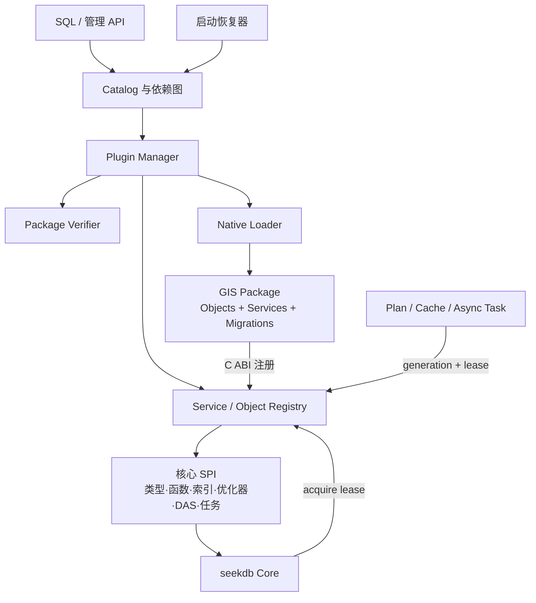
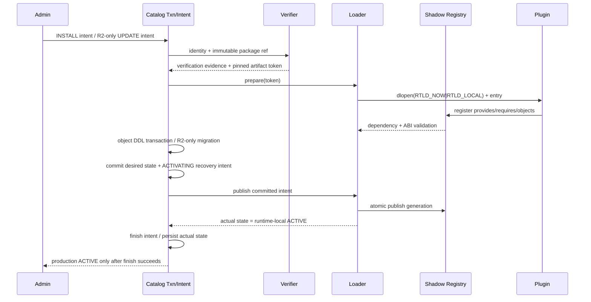

# seekdb 插件架构 RFC（v1）

| 项目 | 内容 |
| --- | --- |
| 状态 | **Normative v1（目标规范，迁移中）** |
| 适用范围 | seekdb 原生进程内插件，以及 GIS 作为首个迁移样板 |
| 兼容基线 | 单机 seekdb；已有数据、SQL 和存储格式不得被静默重解释 |
| 安全级别 | 可信原生代码；v1 不提供进程级沙箱 |

> 本文使用“必须”“禁止”“应”“可以”表达规范强度。本文描述的是 v1 的目标契约，
> 不代表所有机制已经实现。尤其是签名包 manifest parser、签名链验证和 manifest
> 全字段对账目前尚未完成；当前实现边界仅包括 verifier token 与核心 identity 对账。
> 在上述能力及本文验收矩阵全部通过前，禁止宣称插件系统 production complete。

### 规范层级与当前实现

本文把“可复用的完整理论”与“seekdb 当前必须携带的实现”分层，避免未来设计字段反向扩大
单机轻量版本的生产范围：

| 层级 | 范围 | 当前结论 |
| --- | --- | --- |
| R0 运行时地基 | C ABI、registry/lease/generation、loader、逻辑停用、构建边界、参考插件 | 已有开发预览实现；默认构建关闭，仍需接入 server/catalog 并完成门禁 |
| R1 GIS 插件 GA | 通用 SQL/类型/索引 SPI、catalog owner/RESTRICT、启动恢复、GIS 独立包、core-only 验收 | 目标规范，尚未实现 |
| R2 版本演进 profile | package update、migration DAG、side-by-side generation、跨版本恢复 | 仅保留理论契约；当前单机轻量版本不实现、不验收 |

R2 中的版本、迁移和 upgrade 字段是为协议可演进性预留，不能被解释为当前产品必须支持
升级，也不能据此把 updater、兼容旧版本分支或迁移框架带入默认核心。无持久状态的插件其
`MigrationGraph` 必须为空；当前发布流程只验证“随同一 seekdb 构建发布”的精确版本组合。
SDK CMake package 使用 `ExactVersion` 做构建期 discovery；发布流水线还必须锁定精确的
seekdb build/SDK 组合。未来若放宽 CMake version compatibility，不能替代运行时 ABI 矩阵。

R0 代码落点与诚实状态：

- `include/seekdb/plugin/seekdb_plugin_abi.h`：独立 C99/C++11 ABI SDK。
- `src/share/plugin/ob_plugin_registry.*`：版本服务、原子发布、generation 与 move-only lease。
- `src/share/plugin/ob_plugin_loader.*`：不可变 artifact token、路径约束、运行时 reservation、
  结构化 disable outcome、BLOCKED，以及已发布 generation 的 terminal-only physical
  close；从未发布且已证明安全回滚的 failed load 例外见第 7 节。
- `cmake/Plugin.cmake` 及两类检查脚本：显式插件 target、SDK package、源码/链接/二进制门禁。
- `plugins/reference` 与 `unittest/share/test_plugin_*`：conformance、回滚 stop 失败、运行时 stop
  失败、并发 drain/disable/shutdown 等夹具。

这些落点不包含 server 启动接线、真实签名 verifier、catalog 表/DDL、activation intent、恢复器
或 GIS SPI，后者仍是 R1 的阻断工作。

## 1. 背景与仓库事实

seekdb 的轻量化目标不是简单删除低频能力，而是让能力按需安装、按需激活，同时保持
核心可独立构建和运行。GIS 是首个样板，但插件架构必须能被全文检索、向量算法、外部
存储连接器等后续功能复用。

实施前基线不存在通用动态插件内核；本变更新增了 R0 开发预览，但尚未接入 server 启动和
catalog 管理面。下列事实解释了为何不能直接搬目录：

- `src/share/rc/ob_server_runtime.h` 明确把进程运行时定义为“无 registry”的单实例状态。
- `src/share/rc/ob_module_provider.h` 是固定 C++ 虚函数集合，不是带版本和租约的服务注册表。
- `src/observer/omt/ob_server_module_lifecycle.h` 及 runtime controller 提供固定模块的
  `init/start/stop/wait/destroy` 生命周期，可作为实现经验，但不能直接作为插件 ABI。
- `src/observer/main.cpp` 的 `dlopen` 仅用于 systemd；新增 loader 目前仍是独立运行时组件。
- 名称中已有的 vector “plugin service” 是编译期专用模块，不等于本文定义的可安装插件。
- 基线中的 `src/share/geo` 有约 179 个文件；GIS 还直接进入 SQL 表达式、类型转换、SRS
  服务、schema/DDL、优化器、DAS 与空间索引路径，不能仅把一个目录改成共享库。
- 原构建以对象库、静态聚合库及 `liboceanbase` 为主；本变更新增 plugin target/SDK/边界审计，
  但签名包、独立交付链和 core-only GIS 验收仍未完成。

因此，GIS 迁移必须先建立通用 SPI 和依赖倒置，再搬迁实现。任何“先把 GIS 编译为 `.so`，
再补接口”的方案都不符合本 RFC。

## 2. 目标与非目标

### 2.1 目标

GIS 插件 GA（R1）必须实现：

1. 核心不链接 GIS、S2、Boost.Geometry 等 GIS 实现依赖，也能独立构建、启动和处理非 GIS 数据。
2. 插件的安装、逻辑停用和卸载具有可恢复、可审计的 catalog 语义。
3. 核心和插件通过稳定的 C ABI、显式服务依赖和 lease 交互，不交换不稳定 C++ ABI 对象。
4. 插件贡献的类型、函数、cast/operator、索引访问方法、优化器/DAS hook、catalog 对象和
   后台任务均通过通用扩展点注册。
5. 缺少所需插件时显式失败，绝不把插件数据当成其他类型或悄悄退化为不同语义。
6. GIS 形成可复制的目录模板、开发清单、测试矩阵和发布流程。

### 2.2 非目标

v1 不承诺：

- 对不可信二进制提供安全沙箱；原生插件与数据库进程具有同等权限。
- 对已发布 generation 在线执行 `dlclose` 或卸载 Windows DLL；v1 只做逻辑停用，
  已发布或未安全回滚 module 的物理卸载以进程退出为边界。从未发布的 failed-load
  安全回滚例外见第 7 节。
- 跨节点分发与一致性协调；当前目标是单机 seekdb。
- 任意插件修改 SQL grammar。插件对象必须经通用名称解析和 catalog 解析接入。
- 自动兼容任意旧 ABI、任意跨版本降级，或自动猜测数据迁移路径。
- v1 不支持 `UNINSTALL ... CASCADE`；默认且首期只支持 `RESTRICT`。
- 通过插件机制解决原生代码崩溃隔离。未来可以另行评估子进程或 WASM 执行层。
- 当前产品不实现 package update、在线升级、降级或 side-by-side generation；这些仅属于 R2。

## 3. 术语与统一模型

一个插件不是单独的动态库，而是以下四元组：

```text
Plugin = Package + Objects + Services + MigrationGraph
```

- **Package（包）**：不可变的物理交付单元，包含 manifest/control、动态库、资源、
  哈希/签名材料、许可证/SBOM 和测试元数据；迁移脚本仅存在于显式启用 R2 的包。
- **Objects（对象）**：由插件拥有或贡献的持久化 catalog 对象，例如类型、函数、operator、
  索引访问方法、系统视图和 SRS 元数据；对象必须记录 owner plugin identity。
- **Services（服务）**：运行时可获取的、版本化的能力接口。消费者只能持 service lease
  调用，不能缓存裸函数指针或插件私有对象。
- **MigrationGraph（迁移图）**：以插件版本为节点、显式迁移为有向边的 DAG。升级必须选择
  唯一、受支持的路径，不允许通过目录排序猜测执行顺序。

其他术语：

- **Plugin identity**：稳定、全局唯一且不可复用的标识，如 `org.seekdb.gis`。
- **Generation**：同一 identity 每次成功发布运行时实现时递增的进程内代数。
- **Registry epoch**：任一可见服务集合变化时递增的全局世代，用于计划/cache 失效。
- **Lease**：一次已计数的服务引用，绑定 plugin identity、generation、vtable 和 context。
- **Desired state**：catalog 要求的版本及状态；**actual state** 是 loader 当前真实状态。
- **Capability**：插件提供的业务能力；**service** 是 capability 的具体、可调用 ABI。
- **SPI**：由核心定义、插件实现或消费的通用扩展接口。

## 4. 总体架构（三张规范图之一）



依赖方向是硬规则：

```text
plugin implementation -> public plugin SDK / core SPI -> stable core primitives
core business code     -> registry / SPI
core business code     -X-> plugin implementation header / symbol
```

核心不得 include 插件实现头文件，不得链接插件实现符号，不得按插件名写 factory switch。
如兼容层暂时保留 `GEOMETRY` 类型码或 SQL 名称，它只能表示稳定的持久化 token，并必须
通过 owner identity 和 registry 找到实现，不能包含几何算法。

## 5. 六类契约

六类契约是独立的发布门禁。本文区分两个不同层次的“ACTIVE”：

- **runtime-local `ACTIVE`**：`ObPluginState::ACTIVE` 的进程内状态，只说明该 generation
  已在 registry 原子发布并可发 lease；R0 开发预览可达到此状态。
- **production `ACTIVE`**：catalog 完成授权、durable intent 和 actual-state 收敛后对
  产品管理面公开的状态。某插件只有满足全部当前适用契约才能进入此状态。

R0/R1 未启用 R2 时，K6 只有在 `MigrationGraph` 为空且不存在 update 生产入口时
才视为满足；启用 R2 后则必须通过完整迁移契约。R0 的 runtime-local `ACTIVE`
不得写入产品状态表或对用户展示为 production `ACTIVE`。

### K1：包与信任契约

manifest 至少声明：

- identity、显示名、vendor、package version、SDK/ABI 范围和 build id；
- 平台、架构、动态库相对路径和唯一入口符号；
- `provides`、`requires`（含版本范围、必需/可选属性）；
- 对象清单、迁移图、持久格式版本和最低 seekdb 版本；
- 每个文件的长度和加密哈希、签名算法/key id、权限需求、许可证与 SBOM 引用。

包必须安装到核心配置的 canonical plugin root。禁止在 SQL 中加载绝对路径、`..`、符号链接
逃逸路径或任意网络 URL。包发布后内容不可原地覆盖；R0/R1 直接拒绝替换已安装
版本。仅启用 R2 时，新版本才可进入新 content-addressed 目录，再由 catalog
原子切换引用。

### K2：二进制 ABI 契约

插件只导出一个版本化 C 入口。v1 的规范签名与公开 SDK 完全一致：

```c
SEEKDB_PLUGIN_EXPORT const seekdb_plugin_manifest_v1_t *SEEKDB_PLUGIN_CALL
seekdb_plugin_entry_v1(void);
```

所有跨边界值必须是 POD。仅“可扩展结构”必须以 `struct_size` 开头；
`seekdb_plugin_semantic_version_t` 这类定长、按值嵌套且不可扩展的 value type 是明确例外，
其布局在当前 ABI major 内不得变更。manifest 至少包含 ABI major/minor、identity、
feature bits、服务描述符和生命周期回调；`init` 通过显式 out parameter 返回 opaque
plugin instance。边界两侧必须遵守以下规则：

- ABI major 必须完全相等；不等立即拒绝加载。
- minor 只允许向后兼容增长。调用者只访问 `struct_size` 覆盖且 feature bit 声明的字段。
- package version、service semantic version、ABI version 和 persistent format version 是四个
  独立版本，禁止混用。
- 跨边界只传定宽整数、字节 span、opaque handle、显式 allocator 和稳定 error 结构。
- 禁止传 STL、C++ class/vtable、异常、RTTI 对象、编译器私有 enum 或隐含所有权指针。
- 异常不得越过边界；插件必须捕获并转换为 seekdb error。
- 内存由分配方释放，或使用 host allocator 并记录 tag；线程、timer、FD、callback 的 owner
  必须显式登记并在 stop 阶段释放。
- 入口返回 manifest 的 identity 必须与 verifier token 和 catalog identity 相同，
  否则拒绝加载。

v1 不以模糊的“兼容 N-1”承诺代替测试。只有在 ABI 矩阵中实际测试且 manifest 明确声明的
minor 组合才受支持。

R0 当前唯一受支持的发布策略是 ABI `1.0` 精确组合：loader 要求 manifest
`abi_major == 1`、`abi_minor == 0`，且 `struct_size` 至少覆盖当前完整 v1 manifest。
预授权 verifier/发布流水线还必须只放行同一 build 的 artifact；跨 minor/截短 struct 尚未
实现或验收。
因此上述 minor 规则是 production ABI 目标，不得把它展示为 R0 已有兼容能力。

### K3：服务、registry 与 lease 契约

service key 使用命名空间和 major，例如 `seekdb.sql.scalar_function@1`。provider 声明精确版本，
consumer 声明可接受区间。registry 必须：

1. 在 shadow registry 中完成全量注册、依赖解析和循环检测。
2. 以一次不可失败的原子 publish 使新 generation 可见；禁止半注册。
3. 返回 `{vtable, context, plugin_id, generation}` 的 lease，并对插件和服务分别计数。
4. release 后才允许减少引用；active lease 非零时禁止完成 stop。
5. 每次 publish/unpublish 递增 registry epoch，并使依赖该能力的 plan/cache 失效。
6. 对 provider 消失返回稳定的 `PLUGIN_NOT_ACTIVE`/`SERVICE_NOT_FOUND`，不得调用旧地址。

plan、prepared statement、执行上下文、后台任务、异步 callback 和存储迭代器只要可能执行
插件代码，就必须持 lease；只记录 service 指针不合格。lease 不得跨进程退出。

依赖必须是显式 `requires`。初始化顺序采用拓扑序，停止顺序采用逆拓扑序；依赖环、版本
区间无解、多默认 provider 冲突均在 publish 前失败。

### K4：对象、catalog 与事务契约

catalog 是 desired state 和持久依赖关系的唯一事实源；运行时 registry 可重建，不是事实源。
实现至少要持久化：

- package identity/version/hash/signature status、desired/actual state、generation；
- plugin-to-plugin service 依赖；
- plugin-to-object 所有权及 object-to-plugin 使用依赖；
- 当前 persistent format、失败阶段和可诊断错误；已完成迁移边仅在 R2
  profile 启用时持久化；
- 操作者、时间、审批/审计标识。

规范管理语义为：

```sql
INSTALL EXTENSION gis VERSION '1.0.0';
UNINSTALL EXTENSION gis RESTRICT;
```

最终 SQL 拼写可以为兼容性增加别名，但所有入口必须归一到同一事务状态机。安装的对象 DDL
必须在数据库事务中执行；失败必须回滚 catalog 与对象变更。只有启用 R2 时才增加显式
`ALTER EXTENSION ... UPDATE`，其 migration 同样必须服从该事务约束。

`UNINSTALL ... RESTRICT` 必须拒绝以下情况：用户表仍有插件类型列或插件格式数据、索引仍
使用插件 access method、对象依赖存在、活跃 lease/plan/task 未清空、后台作业未停止；
若启用 R2，迁移状态不完整也必须拒绝。v1 禁止静默删除用户数据，也不支持隐式 CASCADE。

### K5：生命周期、并发与失败契约

loader 的实际状态机见第 7 节。所有 init 操作必须登记逆序 cleanup；插件构造函数和动态库
全局初始化禁止产生外部副作用。start 成功前不能发布服务。

插件管理使用两个不同锁域：catalog 协调锁和 loader mutex。必须遵循第 8 节的停用协议，
禁止同时持有两者，也禁止在持 loader mutex 时调用 catalog、RPC、SQL、调度器等外部协调器。

任何 load/init/start，以及仅 R2 才存在的 migration 回滚中的 stop 失败，都必须保留
该 plugin identity 为 `BLOCKED`；
它不得重新加载、升级或复用 identity，直到进程退出阶段再次执行 shutdown 重试且成功。
不得因为 catalog 回滚成功就宣称 runtime 已回滚。

### K6：迁移与数据兼容契约

本节是 R2 的未来 profile；R0/R1 不实现 update executor。保留此契约是为了避免 ABI 和 catalog
模型堵死未来演进，不构成当前产品范围。

迁移图的每条边必须声明 source、target、前置条件、事务属性、可重复性、回滚策略和 persistent
format 变化。升级器必须找到唯一受支持路径；无路径或多条同优先级路径时拒绝升级。

跨版本升级应采用 expand/migrate/contract：先发布能读旧格式且写受控格式的新 provider，
再迁移数据，最后收缩旧格式支持。不可事务化的长数据迁移必须有 checkpoint、幂等重入、
限流和中止恢复，且在完成前不得标记新版本 fully active。

插件缺失或 format 不兼容时，核心可以搬运/备份明确标记的 opaque bytes，但禁止求值、建索引、
修改或将其解释为普通二进制。是否允许受限只读恢复必须由显式 recovery mode 控制。

## 6. 安装、发布事务与未来升级（三张规范图之二）



物理包应先写入 staging，验证后以原子 rename 放入不可变目录，再开始 catalog 操作。动态加载
和数据库事务无法天然成为同一原子域，所以实现必须使用 WAL/持久 intent：catalog 为事实源，
publish 是已预检、不可失败的内存指针切换。若崩溃发生在 catalog commit 与 publish 之间，
启动恢复器必须在 server ready 前重放 intent，而不是对外暴露半安装状态。

若未来显式启用 R2，升级优先使用 side-by-side generation：新 generation 在 shadow registry 初始化并验证，catalog
迁移完成后切换新请求；旧 generation 在 lease 排空后逻辑 stop。v1 不 `dlclose` 旧 generation，
其地址空间保留到进程退出。当前产品不得进入此分支；未来若插件不支持 side-by-side，升级
必须进入维护窗口并显式声明。

## 7. 运行时稳定状态与管理操作阶段（三张规范图之三）

`ObPluginState` 表示一个 generation 的可稳定观测运行时状态。`VALIDATING`、
`STARTING`、`DISABLING`、`DRAINING`、`STOPPING` 和 `FINALIZING` 是管理操作/
journal phase，不是 `ObPluginState` 枚举值。两者必须分开记录，不得为了显示操作
进度而伪造稳定 runtime state。下图仅表示真实 `ObPluginState` 转换；图中 `ACTIVE`
均指 runtime-local `ACTIVE`。

```mermaid
stateDiagram-v2
  [*] --> DISCOVERED
  DISCOVERED --> VALIDATED: validation succeeds
  DISCOVERED --> FAILED: validation fails after generation exists
  VALIDATED --> LOADED: entry resolved
  VALIDATED --> FAILED: load fails safely
  LOADED --> INITIALIZING
  LOADED --> FAILED: initialization preparation fails safely
  INITIALIZING --> ACTIVE: atomic runtime publish
  INITIALIZING --> FAILED: rollback succeeds
  INITIALIZING --> BLOCKED: rollback stop fails
  ACTIVE --> QUIESCING: permit issued; reject new leases
  ACTIVE --> FAILED: terminal runtime fault
  ACTIVE --> BLOCKED: resource ownership becomes uncertain
  QUIESCING --> STOPPED: drain and stop succeed
  QUIESCING --> FAILED: safe terminal failure
  QUIESCING --> BLOCKED: stop fails
  FAILED --> QUIESCING: terminal cleanup preparation
  FAILED --> STOPPED: terminal cleanup succeeds
  BLOCKED --> STOPPED: process-shutdown retry succeeds
  STOPPED --> [*]: process exit only
```



操作 phase 与稳定状态的收敛关系为：

| 管理操作 | operation/journal phase | 稳定 runtime state 结果 |
| --- | --- | --- |
| load | `VALIDATING -> LOADING -> INITIALIZING -> STARTING -> PUBLISHING` | publish 前不可见；原子 publish 后才进入 runtime-local `ACTIVE` |
| R1 activation | `ACTIVATING -> FINISHING` | runtime-local `ACTIVE` 只是 candidate；catalog finish 成功后才是 production `ACTIVE` |
| disable | `DISABLING -> DRAINING -> STOPPING -> FINALIZING` | permit 在 quiesce 前 abort 时 runtime 始终是 `ACTIVE`；drain 超时为 `QUIESCING`，stop 失败为 `BLOCKED`，成功为 `STOPPED` |
| retry/shutdown | `VALIDATING` 或 terminal `STOPPING` | `FAILED` 不原地复活；显式重试创建新 generation。`BLOCKED` 只能由 process-shutdown retry 收敛到 `STOPPED` |

因此不存在 runtime `QUIESCING -> ACTIVE` 的隐式回转：只有在 runtime quiesce 之前
失败才可 abort catalog permit，此时 runtime 根本没有离开 `ACTIVE`。`FAILED` 表示已知
没有残余活跃资源，允许在修复后以**新 generation**重试；`BLOCKED` 表示 runtime
可能仍持资源或回调，禁止普通重试和 identity 复用。FAILED/BLOCKED 必须记录首次和最近
错误、operation phase、generation 和所有可观测 cleanup 结果。

R0/R1 不允许把同一进程内的 STOPPED generation 重新变为 runtime-local `ACTIVE`；
identity 与 DSO 一直保留到进程退出。只有未来启用 R2 activation intent 时，才可创建
并发布一个经过完整验证的**新**
generation，不能复活已经 stop 的旧 generation。

v1 的“卸载”严格表示逻辑卸载：停止新 lease、等待已存在 lease、停止任务、从 registry 取消
发布。即使 stop 成功也不在运行进程内 `dlclose`。原因是 C++ 静态对象、TLS、函数指针、异常
展开信息、第三方库线程和遗漏 callback 很难被完备证明已清空。从发布成功开始，
或回滚 stop 任一失败后，该 DSO 的物理 unmap 只能发生在进程退出。

唯一例外是**从未发布的 failed load**：如果 publication 尚未对外可见、已进入 start
时的 rollback stop 成功、v1 no-fail `deinit` 已返回，host 持有的 lease/registration
和依赖均已收回，loader 可以在失败回滚中关闭该 DSO。这是未发布 artifact 回收，
不是在线卸载。任一带 status 的回滚步骤（v1 当前就是 rollback `stop`）失败时，
都必须保留映射并进入 `BLOCKED`。

## 8. 规范性停用协议与锁序

停用/卸载必须使用 catalog 提供的按 plugin identity 串行 permit，不能用“先查依赖，再停
runtime，再写 catalog”的松散流程。

### 8.1 正确顺序

1. loader 先在短临界区内为 `(plugin_id, generation)` 登记 in-flight operation；这不是 catalog
   授权，但会阻止并发 load/disable 和 process shutdown 越过本次操作。
2. 调用 `catalog.begin_restricted_disable(plugin_id, generation)`。
3. catalog 在其事务/锁域中取得该 identity 唯一的 `DISABLING permit`，把 desired transition
   持久化为进行中，立即阻止创建新的持久化依赖，并执行完整 `RESTRICT` 检查。
4. `begin` 返回前释放 catalog 内部互斥；调用方只持 permit 这个协调 token。
5. loader 在短临界区内复核 operation/generation，然后释放全局 loader mutex。registry 原子
   进入 QUIESCING 并拒绝新 lease；drain、stop、deinit 和任何插件 callback 均在不持全局
   loader mutex、不持 catalog 内部互斥时执行。
6. 调用 `permit.finish(runtime_outcome)`。outcome 必须包含 status、phase、generation、actual
   state、是否已进入 stop 及独立 runtime error；finish 以 durable intent 幂等持久化真实结果。
   drain 超时保持 QUIESCING；stop 一旦进入且失败则为 BLOCKED；成功为 STOPPED/disabled。
7. finish 返回后，loader 才释放 in-flight operation。finish 的 catalog error 与 runtime error
   必须分别保留，不能互相覆盖。
8. 只有 finish 成功且记录 STOPPED 后，管理语句才能报告停用成功。后续 catalog 对象删除和
   包引用移除仍在独立事务中按 RESTRICT 语义完成。

锁序不变量为：

```text
loader mutex: reserve operation -> no loader mutex
catalog begin lock domain       -> no catalog internal mutex
loader mutex: revalidate        -> no loader mutex
registry quiesce + drain + plugin stop/deinit
catalog finish lock domain      -> no catalog internal mutex
loader mutex: release operation
```

任意时刻禁止同时持 catalog 内部互斥和 loader mutex；禁止持全局 loader mutex 等待 lease 或
调用插件。插件 callback 仍禁止重新进入管理面；需要管理面操作时只能投递延后事件。

### 8.2 abort、finish 失败与崩溃恢复

- permit 在 runtime quiesce 前因 RESTRICT 或准备错误退出，可以 `abort` catalog
  intent；runtime 在整个过程中始终保持 runtime-local `ACTIVE`，不发生状态“恢复”。
- permit 析构时若既未 finish 也未显式 abort，必须执行 no-throw abort/recovery 标记；禁止
  悄悄释放 identity 串行权。若无法持久化 abort，保留待恢复 intent，由启动恢复器处理。
- runtime stop 一旦开始或部分成功，不能仅靠 catalog abort 假装恢复 ACTIVE。只有在
  profile 显式允许时（当前仅指未来 R2），才可通过创建新 generation 并完成经验证的
  restart/publish 再次进入 runtime-local `ACTIVE`；对外恢复 production `ACTIVE`
  还必须完成 catalog activation finish。
- `permit.finish(runtime_result)` 持久化失败时，actual runtime 状态不变；必须保留 recovery
  intent 并向调用方返回“不确定/需恢复”，禁止报告已回滚 runtime。
- stop 失败时 identity 必须是 BLOCKED。即使 finish 本身失败，恢复器也必须根据 durable
  intent 和 runtime journal 收敛到 BLOCKED，而不是 ACTIVE。
- 进程退出时 shutdown 按逆依赖顺序重试 BLOCKED 插件的 stop；只有重试成功才可以清除
  blocked runtime 资源。若失败，进程仍应完成安全退出，但审计中保留失败记录供下次启动检查。
- process shutdown 先设置 terminal barrier；若仍有 in-flight operation，返回可重试 busy，
  禁止自行 stop/close DSO 越过 permit。调用方在 operation 收敛后重试 terminal shutdown。
- terminal shutdown 一旦成功就是不可逆边界；同一 loader 对象不得再次初始化或创建第二个
  runtime domain。
- 崩溃发生在任一阶段时，启动恢复器先恢复 permit/intents，再按 catalog desired state 和
  runtime journal 决定重新激活、继续停用或标记 BLOCKED；恢复完成前 server 不得 ready。

## 9. 启动恢复与失败回滚

启动时必须按以下顺序执行：

1. 读取 plugin catalog、unfinished intent、blocked record 和 immutable package reference。
2. 校验 identity、verifier token、包哈希/签名状态、ABI 和平台；v1 未实现的验证能力必须
   显示为 `NOT_VERIFIED`，不得视同通过。
3. 构造 required-service DAG，检测环和版本冲突，并按拓扑序加载。
4. 若显式启用 R2，恢复未完成 migration/checkpoint；事务 migration 依赖数据库回滚，
   长迁移按 checkpoint 重入。R0/R1 必须跳过此分支并验证 migration graph 为空。
5. 在 shadow registry 初始化，全部成功后原子 publish；按逆序清理任何失败步骤。
6. 检查插件持久化对象的 provider 均为 production `ACTIVE` 后，才允许正常
   server ready。

安装插件缺失、哈希不符或 ABI 不匹配时：只要 catalog 中存在其持久化对象/数据依赖，正常
启动必须 fail closed，或进入管理员显式指定的受限 recovery mode；禁止跳过插件后正常提供
可能触碰相关数据的服务。

回滚必须使用 cleanup stack，并遵守“只回滚已成功完成的步骤”。所有有状态
返回值的 fallible cleanup 都必须记录结果；任一这类 stop/cleanup 失败都立即把 identity
置为 `BLOCKED`，继续执行不依赖该失败资源的其余 cleanup，但不能重载该插件。

R0 ABI 的可检测范围必须如实表达：`stop` 返回 status，是插件报告 fallible 外部
资源清理失败的唯一生命周期通道；`deinit` 返回 `void`，必须是 no-throw、幂等且 no-fail
的最终内存/句柄释放。插件必须把所有可失败的线程、FD、timer、后台任务和外部资源
停止放入 `stop`，不得依赖 `deinit` 报错。host 不得声称能检测 v1 `deinit` 内部失败；
若未来引入可失败 deinit/cleanup，必须先扩展带 status 的 ABI 和结构化 outcome，其失败同样
收敛到 `BLOCKED`。

## 10. 安全、权限与供应链

原生插件是可信计算基的一部分。v1 必须至少具备：

- 独立的 `INSTALL_EXTENSION`、`ALTER_EXTENSION`、`UNINSTALL_EXTENSION` 权限；普通 SQL 用户
  不能提供路径或二进制。
- canonical root、目录 owner/mode 检查、防 symlink/path traversal、打开文件后的 fd/inode
  对账，以减少 TOCTOU。
- 包文件哈希、identity/build-id 对账、签名状态和信任 key id 进入审计记录。
- `RTLD_NOW | RTLD_LOCAL`（或平台等价策略），禁止无意导出全局符号。
- host API 采用最小权限 service，而不是向插件暴露整个 `ObServer` 或固定模块 provider。
- allocator tag、线程/FD/任务登记和资源配额；敏感配置通过受权限控制的 host service 获取。
- 安装、验证、激活、停用、失败和 recovery 全量审计；启用 R2 时再加入升级
  审计。日志不得包含 secret。

### 当前诚实边界

v1 设计要求签名 manifest parser、签名链、文件清单逐项校验，以及 package manifest/
binary-returned manifest/catalog 全字段
对账；**这些能力目前没有完整实现**。当前仅有 verifier token 与核心 identity 对账时，只能证明
一次 loader 调用绑定到了预期 identity，不能证明包内容、发布者、依赖和迁移图可信。产品文档、
错误码和状态表必须显示该差异，不能把 `token_ok` 命名或展示为 `signature_verified`。
在 R0 代码、测试、日志和错误文本中，该边界只能称为 `verified/pinned artifact`、
`verifier-provided metadata` 或“已对账 artifact identity”；在真实签名链实现并返回可审计
签名状态前，禁止使用 `signed metadata`、“已签名”或“签名验证通过”。

R0 loader 通过 `SEEKDB_ENABLE_EXPERIMENTAL_PLUGINS=ON` 才进入 `ob_share`，默认轻量构建不包含
该运行时代码。当前初次 `load()` 的 catalog authorization 仍由 verifier 的预授权 allow-list
契约承担，尚无完整 activation intent/permit，因此只能用于测试。R1 接入生产入口前必须让
activation 与 disable 对称：catalog 先签发绑定 package identity、generation 和 durable intent
的 permit，loader 才能 publish runtime-local `ACTIVE`；catalog finish 成功后才能对外标记
production `ACTIVE`。禁止仅把实验开关默认打开来绕过这一门禁。

## 11. 可观测性与运维接口

至少提供以下逻辑视图（具体系统表名可以实现时统一）：

- `DBA_PLUGINS`：identity、desired/actual state、版本、ABI、generation、registry epoch、包哈希、
  签名/验证级别、owner、安装时间、最近错误。
- `DBA_PLUGIN_SERVICES`：service key/version、provider、consumer、lease count、publish 状态。
- `DBA_PLUGIN_DEPENDENCIES`：插件依赖、对象依赖、版本范围、阻塞卸载的原因。
- `DBA_PLUGIN_MIGRATIONS`（仅 R2）：迁移图、当前节点、checkpoint、开始/完成时间和
  失败信息；R0/R1 不得因该理论视图携带 migration executor。
- `DBA_PLUGIN_OPERATIONS`：intent/permit id、阶段、操作者、runtime result、recovery 状态。

指标至少包含 load/init/start/stop latency、失败计数、活跃 lease、lease drain 时间、generation、
registry epoch、blocked 数量和恢复重放次数；迁移进度仅在 R2 启用时存在。每条插件
调用 trace 应标记 identity、service 与 generation。诊断命令应能 dry-run 安装/卸载并
列出完整阻塞依赖；启用 R2 后才增加 upgrade dry-run。

## 12. GIS 所有权边界

GIS 是首个 conformance plugin，不享有专用后门。

| 归属 | 内容 |
| --- | --- |
| 核心稳定原语 | 字节 span、allocator/error、catalog dependency、registry/lease/generation、opaque extension datum、稳定持久 type token/wire tag |
| 核心通用 SPI | 类型与 codec、scalar function/cast/operator、index access method、selectivity/cost、DAS scan/build/filter、catalog contribution、background task、配置/权限 |
| 兼容壳（过渡期） | `GEOMETRY`/`MYSQL_TYPE_GEOMETRY` 等已持久化类型码和必要 SQL 名称识别；只做 token 解析与 provider 查找，不包含算法 |
| GIS 插件 | `src/share/geo` 的几何模型、WKB/WKT、S2/Boost 算法、ST/SDO 函数、cast/validation、SRS 解析/cache/import、空间索引 cell/MBR/扫描、GIS cost/selectivity |
| GIS catalog 对象 | 函数、类型描述、operator/cast、空间索引 access method、SRS 表/视图和初始 seed；版本 migration 仅 R2 |
| 禁止残留核心 | GIS 实现头文件、SRS concrete service、按 GIS enum 的 factory switch、GIS 算法、S2/Boost 链接、直接插件函数指针 |

当 GIS 插件未达到 production `ACTIVE` 时：创建新的 GEOMETRY 列、调用 ST/SDO 函数、
创建/扫描空间索引必须
返回明确的 provider-not-active 错误。已有持久化值不能被重解释；受限备份是否允许 opaque
搬运由 recovery mode 决定。

## 13. GIS 分阶段迁移计划

下列阶段是依赖关系，不得跳序；当前状态不得标记为“GIS 插件化完成”。

### Phase 0：恢复基线与语义盘点

- 撤销原“删除 GIS”工作树变更，恢复可构建基线。
- 固化 GIS 类型、wire/storage、SQL、错误码、SRS 与空间索引兼容测试。
- 建立 include/symbol/dependency 清单，并加入核心反向依赖检查。

### Phase 1：插件内核

- 实现 C ABI SDK、package verifier、loader、shadow registry、lease/generation 和状态机。
- 实现 catalog activation/disable intent、restricted-disable permit、启动恢复及 BLOCKED 行为。
- 全局 loader 锁只保护短状态提交；drain 和任意插件 callback 均不得持有它。
- 提供 hello/conformance 插件覆盖失败注入，不先耦合 GIS。

### Phase 2：通用 SQL 与对象 SPI

- 把函数、类型、cast/operator 和 catalog contribution 从静态 factory/switch 抽成 registry。
- parser 只做通用名称解析；binding 时从 catalog 解析 owner/provider。
- plan/prepared statement/cache 持 generation/lease 并响应 epoch 失效。

### Phase 3：GIS 计算与 SRS

- 将 `src/share/geo`、ST/SDO 实现和 SRS concrete service 移入 GIS package。
- 核心仅保留兼容 type token、opaque datum 和通用 SPI。
- 让 GIS 函数测试在未安装、安装、逻辑停用、重启恢复四种模式运行。

### Phase 4：空间索引全链路

- 抽象 index access method、DDL/schema dependency、optimizer selectivity/cost、DAS build/scan/filter。
- 迁移 cell-id/MBR/generated-column 细节和空间索引实现。
- 验证插件停用 RESTRICT 能列出表、列、索引、plan 与任务依赖。

### Phase 5：构建与独立交付

- 核心构建不再发现 GIS/S2/Boost 符号或链接项。
- GIS 形成单独共享库、manifest、包、SBOM 和测试 artifact；R0/R1 的迁移图必须
  为空，启用 R2 后才能随包交付迁移边。
- 验证核心最小包、核心+GIS 包和恢复包；R2 启用后才增加升级包。

### Phase 6：兼容、故障与发布门禁

- 跑完第 15 节矩阵，进行逐文件边界审计和性能回归。
- 文档明确支持的 ABI/版本矩阵和卸载限制；仅启用 R2 时文档化 supported
  upgrade path。
- 只有全部 production gate 通过后才能宣布 GIS 插件 GA。

## 14. 插件开发模板与清单

推荐目录：

```text
plugins/<identity>/
  CMakeLists.txt
  plugin.toml
  include/                 # 仅插件自身；核心不得 include
  src/entry.cpp
  src/services/
  migrations/<from>--<to>.sql  # 仅 R2；R0/R1 必须为空
  objects/objects.yaml
  tests/unit/
  tests/integration/
  tests/upgrade/             # 仅 R2；R0/R1 不创建用例
  tests/fault/
  README.md
  SECURITY.md
  sbom.json
```

开发前：

- [ ] capability 是否真的需要进程内原生代码；纯 SQL/外部进程是否更合适。
- [ ] owner identity、对象清单、service provides/requires 和 persistent format 已定义。
- [ ] 核心 SPI 是通用能力，不包含插件名和插件 enum。
- [ ] 缺少 provider 和逻辑停用时的语义已定义；启用 R2 时再定义升级中语义。

实现时：

- [ ] 只使用 C ABI/POD/opaque handle；无异常和跨边界隐含所有权。
- [ ] 所有调用持 lease；plan、callback、任务和 iterator 无裸指针逃逸。
- [ ] init 每一步都有逆序 cleanup；可失败外部资源回收放在可重入 `stop`，
  失败进入 BLOCKED；v1 `deinit` 仅执行 no-fail 最终释放。
- [ ] 注册先进入 shadow registry，再原子 publish。
- [ ] 后台线程/FD/timer/allocator 均可列举、停止和观测。
- [ ] 无动态 grammar hook、无核心 include 插件实现、无插件专用 switch。

发布前：

- [ ] manifest、ABI、服务、对象和实际二进制逐项一致；R0/R1 的迁移图为空。
- [ ] R2 启用时，每条迁移边和 supported upgrade path 均有测试；否则 migration graph 为空。
- [ ] RESTRICT 能准确列出依赖，未实现 CASCADE 时明确拒绝。
- [ ] fault injection 覆盖 load/init/start/publish/quiesce/stop/finish/recovery；启用 R2 时再覆盖
  migrate。
- [ ] 核心不带插件仍能构建、启动和跑完核心测试。
- [ ] 安全审计、SBOM、签名/验证级别、权限和运维 runbook 已完成。

## 15. 测试矩阵与验收门槛

| 维度 | 必测场景 | 通过门槛 |
| --- | --- | --- |
| 核心独立性 | 不安装 GIS 构建/启动/核心 SQL | 无 GIS/S2/Boost link；无 GIS 实现 include/symbol |
| ABI（R0/R1） | major/minor 不同、截短 struct、未知 feature | 非精确 ABI 安全拒绝，无越界读取 |
| ABI 演进（仅 R2） | minor 前后兼容、追加字段、未知 feature | 只按已声明且已测试的矩阵兼容 |
| Registry | 缺服务、版本冲突、依赖环、重复 provider、半注册失败 | publish 前拒绝，旧 generation 不受影响 |
| Lease | 并发执行、plan/PS、异步任务、长 iterator | stop 等待/超时可诊断，无旧地址调用 |
| Catalog | install/uninstall 事务失败与崩溃点；仅 R2 增加 update | catalog/recovery 收敛，无半对象可见 |
| 停用锁序 | begin、quiesce、stop、finish 各点故障/并发 DDL | 无双锁持有；无新依赖越过 permit |
| BLOCKED/恢复 | rollback/stop 失败、runtime 与 finish 独立失败、shutdown retry | 保留真实 actual state 和两类错误；identity 不可复用，不虚报 production `ACTIVE`/`STOPPED` |
| 启动恢复 | 缺包、坏 hash、未完 intent、blocked record；仅 R2 增加未完 migration | fail closed 或显式 recovery mode |
| 升级（仅 R2） | 每条 migration edge、side-by-side、旧 lease 排空 | 未启用时无生产代码；启用后数据语义一致，generation/epoch 正确 |
| 安全 | 权限、路径逃逸、symlink、TOCTOU、错误 identity | 一律拒绝并审计 |
| GIS 语义 | 类型/codec/ST/SDO/SRS/空间索引/optimizer/DAS | 与冻结兼容基线一致 |
| 性能 | 未装插件核心路径、GIS 热路径、registry acquire | 达到项目设定预算，无隐式全局锁回退 |

production gate 是全体门槛而不是抽样通过：

1. 核心最小构建与测试完全不依赖 GIS 包。
2. 插件 ABI、package、catalog、registry、lease、状态机和恢复测试全部通过。
3. include-layer/symbol scan 阻止核心反向依赖回归。
4. GIS 完整兼容和空间索引链路在插件加载模式通过。
5. 未加载/停用/缺失/损坏 GIS 时均 fail closed 且可诊断。
6. `UNINSTALL ... RESTRICT` 的依赖和故障矩阵通过；仅在启用 R2 时增加升级矩阵。
7. 签名/manifest 全字段验证未完成时，只能作为开发预览，不能标记 production complete。

## 16. 反模式

以下做法必须在 review 中拒绝：

- 把目录编成 `.so` 就称为插件，而核心仍链接其符号或 include 实现头。
- 在核心添加 `if (plugin == GIS)`、GIS 专用 factory/switch 或固定 concrete accessor。
- 跨 ABI 传 C++ 对象、STL、异常、allocator-owned 裸指针或编译器 enum。
- 缓存 service vtable/function pointer 而不持 lease/generation。
- 允许插件回调在 loader mutex 内调用 catalog/SQL/RPC/调度器。
- 先 stop runtime 再做 RESTRICT，或检查依赖后没有 permit 阻止新依赖。
- `finish` 失败后把内存状态改写成“已回滚”，或 stop 失败后释放 identity。
- 对已发布 generation 或未安全回滚的 module 执行在线 `dlclose`，并以“当前测试没崩”
  作为安全证明。
- 插件缺失时把扩展类型当 BLOB、跳过校验、跳过索引或改变查询结果。
- 让插件动态修改 parser grammar；这会让解析、升级和卸载无法稳定治理。
- 启用 R2 时让迁移脚本靠文件名排序、可重复执行性未知、失败后人工改 catalog。
- 签名 parser/全字段对账未实现却展示“signature verified”或宣称已生产就绪。

## 17. 设计来源

本 RFC 采用“PostgreSQL 的 extension object/版本迁移语义 + MySQL/Percona Component 的显式
service registry/依赖/引用”组合，而不是照搬任一产品：

- PostgreSQL 的 [C-Language Functions](https://www.postgresql.org/docs/current/xfunc-c.html)
  使用模块 magic block 做兼容检查，并说明动态模块在会话内不卸载，支持 v1 的 ABI magic 与
  no-hot-dlclose 决策。
- PostgreSQL 的 [Packaging Related Objects into an Extension](https://www.postgresql.org/docs/current/extend-extensions.html)
  采用 control file、版本 SQL 与 extension-owned objects；
  [ALTER EXTENSION](https://www.postgresql.org/docs/current/sql-alterextension.html) 通过显式升级脚本
  管理版本和成员依赖。
- MySQL [Components](https://dev.mysql.com/doc/refman/8.4/en/components.html) 强调组件只通过
  provided services 交互；[Component Loading](https://dev.mysql.com/doc/refman/8.4/en/component-loading.html)
  使用持久 catalog 在重启时自动加载。
- MySQL [Component Registry](https://dev.mysql.com/doc/dev/mysql-server/8.0.46/PAGE_COMPONENTS_REGISTRY.html)
  以命名服务、acquire/release 和引用计数防止使用中卸载；
  [UNINSTALL COMPONENT](https://dev.mysql.com/doc/refman/8.4/en/uninstall-component.html) 提供依赖拒绝语义。
- Percona Server 的 [Install a component](https://docs.percona.com/percona-server/8.4/install-component.html)
  强调安装和激活的原子结果；
  [Upgrade plugins to components](https://docs.percona.com/percona-server/8.4/upgrade-components.html)
  提供从旧式插件向 component/service 模型迁移的工程参考。

这些机制只提供原则参考。seekdb 的 C ABI、catalog intent、restricted-disable permit、BLOCKED
状态和 GIS SPI 边界均以本 RFC 为规范。
